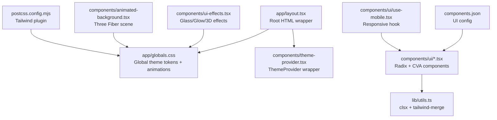
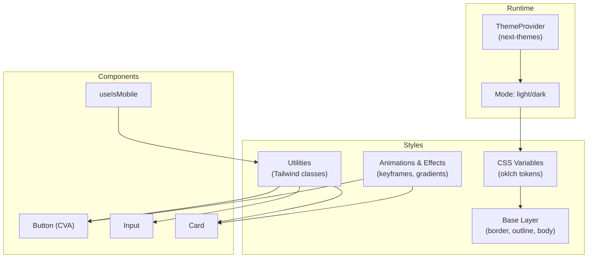
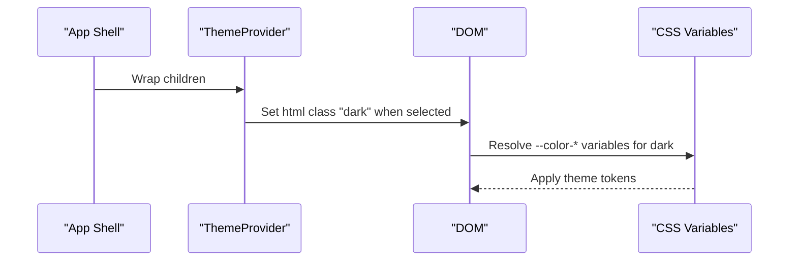
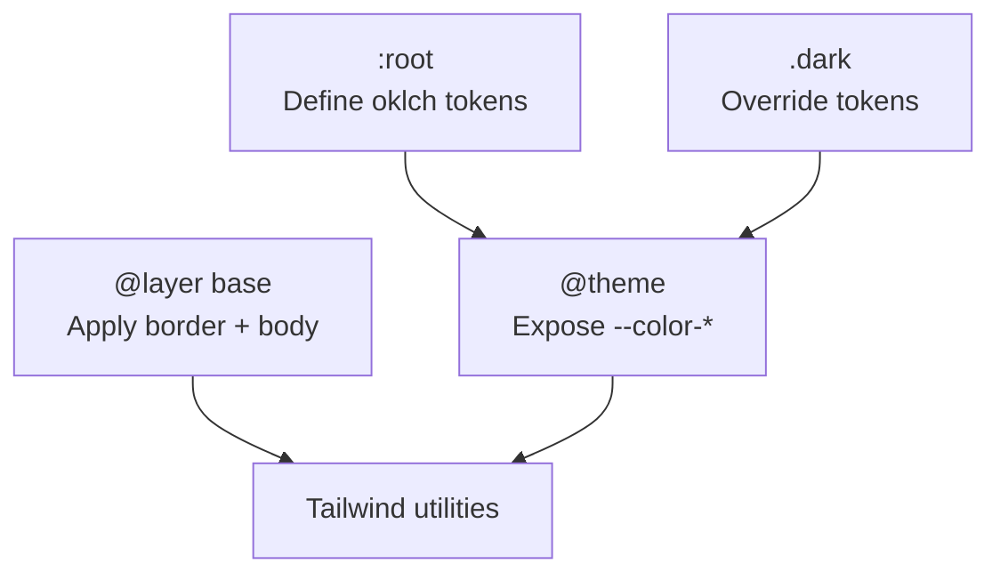
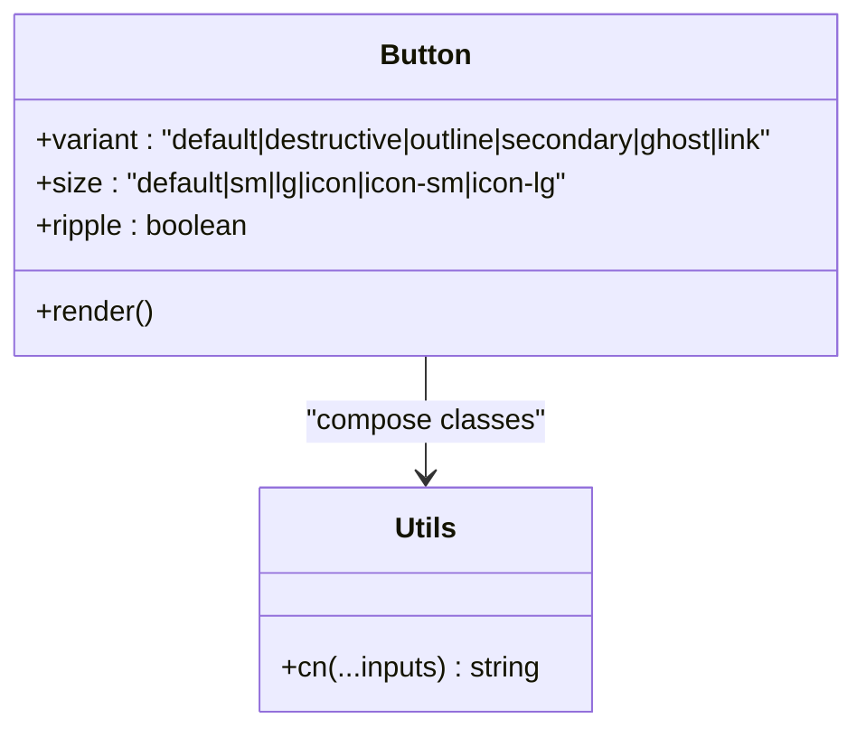
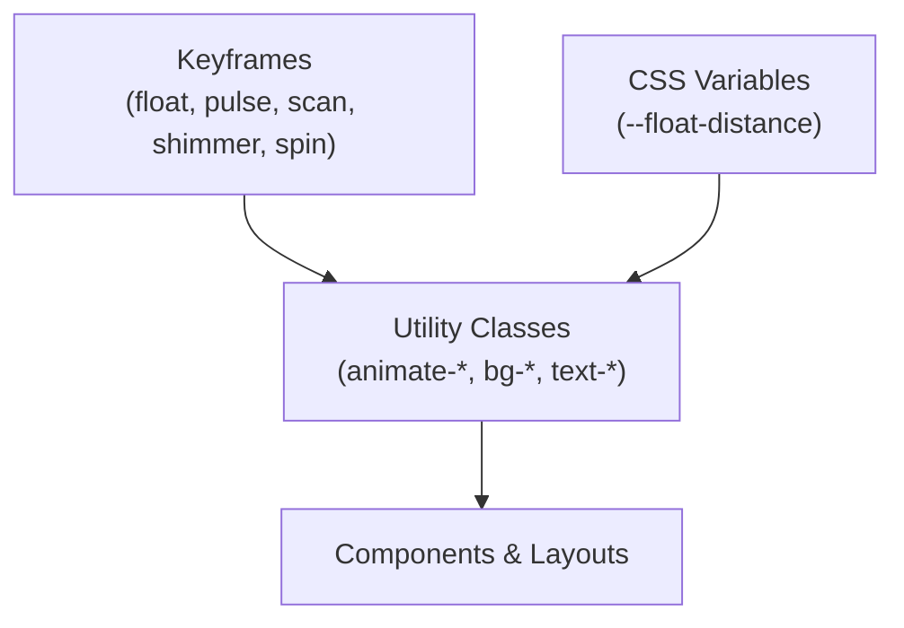
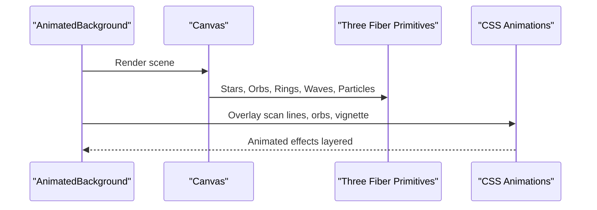
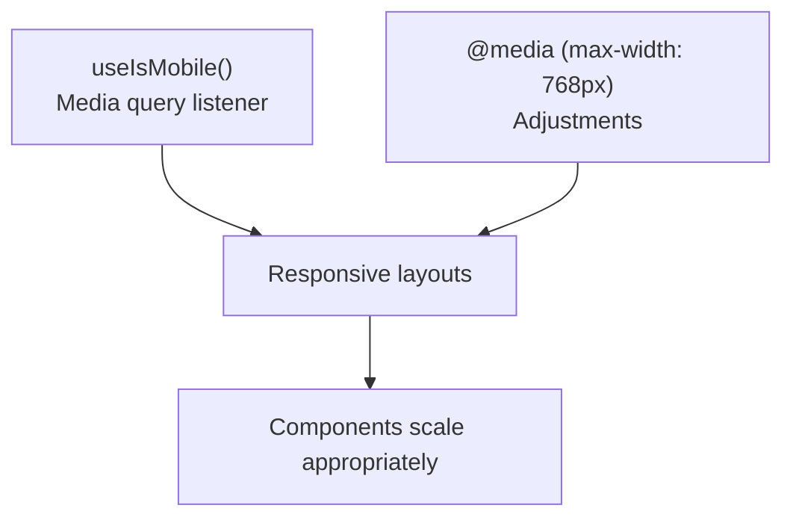
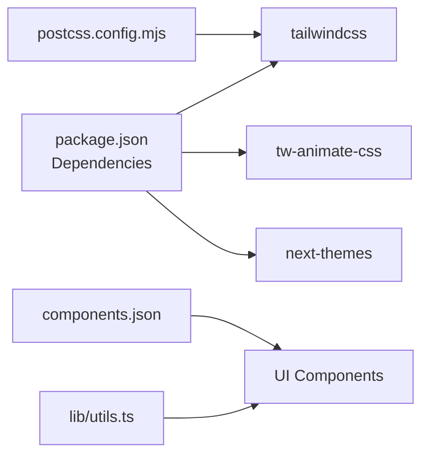

# Styling and Theming

<cite>
**Referenced Files in This Document**
- [app/layout.tsx](file://app/layout.tsx)
- [app/globals.css](file://app/globals.css)
- [styles/globals.css](file://styles/globals.css)
- [components/theme-provider.tsx](file://components/theme-provider.tsx)
- [components/ui/button.tsx](file://components/ui/button.tsx)
- [components/ui/input.tsx](file://components/ui/input.tsx)
- [components/ui/card.tsx](file://components/ui/card.tsx)
- [components/ui/use-mobile.tsx](file://components/ui/use-mobile.tsx)
- [components/ui-effects.tsx](file://components/ui-effects.tsx)
- [components/animated-background.tsx](file://components/animated-background.tsx)
- [lib/utils.ts](file://lib/utils.ts)
- [postcss.config.mjs](file://postcss.config.mjs)
- [next.config.mjs](file://next.config.mjs)
- [package.json](file://package.json)
- [components.json](file://components.json)
</cite>

## Table of Contents
1. [Introduction](#introduction)
2. [Project Structure](#project-structure)
3. [Core Components](#core-components)
4. [Architecture Overview](#architecture-overview)
5. [Detailed Component Analysis](#detailed-component-analysis)
6. [Dependency Analysis](#dependency-analysis)
7. [Performance Considerations](#performance-considerations)
8. [Troubleshooting Guide](#troubleshooting-guide)
9. [Conclusion](#conclusion)
10. [Appendices](#appendices)

## Introduction
This document explains the styling architecture and theming system of the project. It covers Tailwind CSS configuration, utility-first styling, custom animations and visual effects, theme provider integration for dark/light mode, responsive design patterns, component styling approaches, and performance/cross-browser considerations. Practical examples demonstrate theme implementation, custom component styling, and responsive patterns.

## Project Structure
The styling system is organized around:
- Global CSS and theme tokens
- Tailwind PostCSS pipeline
- Theme provider for mode switching
- Utility-first component library with variant-driven styling
- Custom animations and 3D effects
- Responsive utilities and hooks

**Diagram sources**
- [app/layout.tsx:33-47](file://app/layout.tsx#L33-L47)
- [app/globals.css:1-126](file://app/globals.css#L1-L126)
- [components/theme-provider.tsx:9-11](file://components/theme-provider.tsx#L9-L11)
- [lib/utils.ts:4-6](file://lib/utils.ts#L4-L6)
- [postcss.config.mjs:1-9](file://postcss.config.mjs#L1-L9)
- [components.json:6-12](file://components.json#L6-L12)
- [components/ui/use-mobile.tsx:5-19](file://components/ui/use-mobile.tsx#L5-L19)

**Section sources**
- [app/layout.tsx:33-47](file://app/layout.tsx#L33-L47)
- [app/globals.css:1-126](file://app/globals.css#L1-L126)
- [postcss.config.mjs:1-9](file://postcss.config.mjs#L1-L9)
- [components.json:6-12](file://components.json#L6-L12)

## Core Components
- Theme provider: wraps the app to enable theme switching and persistence.
- Global CSS: defines CSS variables, theme tokens, base layer, and custom animations.
- UI components: styled with Tailwind utilities and class variance authority (CVA).
- Utilities: clsx + tailwind-merge for safe class composition.
- Responsive helpers: use-mobile hook and CSS media queries.
- Effects: custom animations and Three Fiber-based animated backgrounds.

**Section sources**
- [components/theme-provider.tsx:9-11](file://components/theme-provider.tsx#L9-L11)
- [app/globals.css:6-126](file://app/globals.css#L6-L126)
- [components/ui/button.tsx:6-36](file://components/ui/button.tsx#L6-L36)
- [lib/utils.ts:4-6](file://lib/utils.ts#L4-L6)
- [components/ui/use-mobile.tsx:5-19](file://components/ui/use-mobile.tsx#L5-L19)

## Architecture Overview
The styling architecture follows a utility-first approach with Tailwind v4, CSS custom properties for theming, and a theme provider for runtime mode switching. Components use CVA for variants and sizes, while global CSS provides animations and 3D effects. The PostCSS pipeline integrates Tailwind, and the UI is configured via shadcn’s components.json.

**Diagram sources**
- [components/theme-provider.tsx:9-11](file://components/theme-provider.tsx#L9-L11)
- [app/globals.css:6-126](file://app/globals.css#L6-L126)
- [components/ui/button.tsx:6-36](file://components/ui/button.tsx#L6-L36)
- [components/ui/input.tsx:5-19](file://components/ui/input.tsx#L5-L19)
- [components/ui/card.tsx:5-16](file://components/ui/card.tsx#L5-L16)
- [components/ui/use-mobile.tsx:5-19](file://components/ui/use-mobile.tsx#L5-L19)

## Detailed Component Analysis

### Theme Provider and Mode Management
The theme provider enables switching between light and dark modes, persists the user’s choice, and respects OS preference. The root HTML element receives a dark class to activate dark-mode variants.

**Diagram sources**
- [components/theme-provider.tsx:9-11](file://components/theme-provider.tsx#L9-L11)
- [app/layout.tsx:39-40](file://app/layout.tsx#L39-L40)
- [app/globals.css:42-75](file://app/globals.css#L42-L75)

**Section sources**
- [components/theme-provider.tsx:9-11](file://components/theme-provider.tsx#L9-L11)
- [app/layout.tsx:39-40](file://app/layout.tsx#L39-L40)
- [app/globals.css:42-75](file://app/globals.css#L42-L75)

### Tailwind Configuration and CSS Variables
The global CSS defines oklch-based color tokens and maps them to Tailwind color variables. The base layer applies borders and outlines consistently. The theme block exposes tokens for Tailwind usage.

**Diagram sources**
- [app/globals.css:6-116](file://app/globals.css#L6-L116)

**Section sources**
- [app/globals.css:6-116](file://app/globals.css#L6-L116)

### Utility-First Component Styling (CVA + cn)
Components use class variance authority (CVA) to define variants and sizes, and combine them safely with clsx and tailwind-merge. This ensures predictable overrides and minimal CSS.

**Diagram sources**
- [components/ui/button.tsx:6-36](file://components/ui/button.tsx#L6-L36)
- [lib/utils.ts:4-6](file://lib/utils.ts#L4-L6)

**Section sources**
- [components/ui/button.tsx:6-36](file://components/ui/button.tsx#L6-L36)
- [lib/utils.ts:4-6](file://lib/utils.ts#L4-L6)

### Custom Animations and Visual Effects
Custom animations (floating, pulsing, scanning, shimmer, spinning) and visual enhancements (glass, neon borders, glowing shadows, gradient text) are defined in global CSS and applied via Tailwind classes. Some effects are parameterized via CSS variables.

**Diagram sources**
- [app/globals.css:131-594](file://app/globals.css#L131-L594)

**Section sources**
- [app/globals.css:131-594](file://app/globals.css#L131-L594)

### 3D Effects and Animated Backgrounds
The animated background component composes Three Fiber primitives with floating, distortion materials, and instanced particle systems. It also overlays CSS animations for scan lines, vignettes, and gradient orbs.

**Diagram sources**
- [components/animated-background.tsx:178-208](file://components/animated-background.tsx#L178-L208)

**Section sources**
- [components/animated-background.tsx:178-208](file://components/animated-background.tsx#L178-L208)

### Responsive Design Patterns
The project uses a mobile-first approach with:
- A responsive hook to detect mobile breakpoints.
- Media queries in global CSS to adapt animations and glass blur on small screens.
- Tailwind utilities for responsive layouts and typography.

**Diagram sources**
- [components/ui/use-mobile.tsx:5-19](file://components/ui/use-mobile.tsx#L5-L19)
- [app/globals.css:498-506](file://app/globals.css#L498-L506)

**Section sources**
- [components/ui/use-mobile.tsx:5-19](file://components/ui/use-mobile.tsx#L5-L19)
- [app/globals.css:498-506](file://app/globals.css#L498-L506)

### Practical Examples

- Applying theme tokens in a card:
  - Use Tailwind utilities bound to CSS variables for background, foreground, and borders.
  - Reference: [app/globals.css:100-116](file://app/globals.css#L100-L116), [components/ui/card.tsx:5-16](file://components/ui/card.tsx#L5-L16)

- Creating a glowing button:
  - Combine gradient classes, border utilities, and hover transitions.
  - Reference: [components/ui-effects.tsx:110-135](file://components/ui-effects.tsx#L110-L135)

- Floating elements with variable parameters:
  - Pass duration and distance via CSS variables to the animation class.
  - Reference: [components/ui-effects.tsx:182-194](file://components/ui-effects.tsx#L182-L194), [app/globals.css:131-143](file://app/globals.css#L131-L143)

- Ripple effect on buttons:
  - Animate concentric circles on click using CSS and controlled state.
  - Reference: [components/ui/button.tsx:54-98](file://components/ui/button.tsx#L54-L98), [app/globals.css:525-527](file://app/globals.css#L525-L527)

## Dependency Analysis
The styling stack relies on Tailwind v4, PostCSS, and next-themes for theming. The UI is configured via shadcn’s components.json, and class composition uses clsx and tailwind-merge.

**Diagram sources**
- [package.json:11-76](file://package.json#L11-L76)
- [postcss.config.mjs:1-9](file://postcss.config.mjs#L1-L9)
- [components.json:6-12](file://components.json#L6-L12)
- [lib/utils.ts:4-6](file://lib/utils.ts#L4-L6)

**Section sources**
- [package.json:11-76](file://package.json#L11-L76)
- [postcss.config.mjs:1-9](file://postcss.config.mjs#L1-L9)
- [components.json:6-12](file://components.json#L6-L12)
- [lib/utils.ts:4-6](file://lib/utils.ts#L4-L6)

## Performance Considerations
- Prefer CSS variables for theme tokens to minimize reflows and avoid duplicating color values.
- Use hardware-accelerated properties (transform/opacity) for animations to improve smoothness.
- Limit heavy 3D scenes on low-end devices; consider reducing dpr or disabling certain effects on smaller screens.
- Keep animations scoped and avoid excessive keyframes; reuse shared animations where possible.
- Minimize class churn by composing classes efficiently with clsx and tailwind-merge.

## Troubleshooting Guide
- Theme not applying:
  - Ensure the root HTML element has the correct class for the selected theme.
  - Verify CSS variables resolve in both light and dark contexts.
  - References: [app/layout.tsx:39-40](file://app/layout.tsx#L39-L40), [app/globals.css:42-75](file://app/globals.css#L42-L75)

- Animations not visible on mobile:
  - Confirm media query adjustments disable heavy animations on small screens.
  - Reference: [app/globals.css:498-506](file://app/globals.css#L498-L506)

- Ripple effect not appearing:
  - Check that the button handles click events and creates animated spans.
  - Reference: [components/ui/button.tsx:54-98](file://components/ui/button.tsx#L54-L98)

- Scrollbar styling not working:
  - Confirm vendor-prefixed selectors are present and not overridden by external styles.
  - Reference: [app/globals.css:429-446](file://app/globals.css#L429-L446)

## Conclusion
The project employs a robust, utility-first styling architecture powered by Tailwind v4, CSS variables for theming, and next-themes for seamless dark/light mode. Components are styled with CVA and clsx/tailwind-merge for maintainability, while global CSS provides rich animations and visual effects. Responsive patterns and a dedicated mobile hook ensure a consistent experience across devices.

## Appendices

### Accessibility Considerations
- Respect reduced motion preferences by allowing users to reduce animations.
- Ensure sufficient color contrast across both light and dark themes.
- Provide focus-visible indicators and keyboard navigation support in interactive components.
- Use semantic HTML and ARIA attributes where appropriate.

### Cross-Browser Compatibility Strategies
- Use Tailwind’s built-in prefixes and vendor-prefixed utilities where needed.
- Test animations across browsers; degrade gracefully for unsupported features.
- Validate scrollbar styling on WebKit-based browsers and provide fallbacks.

### Tailwind and PostCSS Setup
- Tailwind is integrated via the PostCSS plugin.
- The project ignores TypeScript errors during builds and disables optimized images for development convenience.
- References: [postcss.config.mjs:1-9](file://postcss.config.mjs#L1-L9), [next.config.mjs:1-15](file://next.config.mjs#L1-L15)