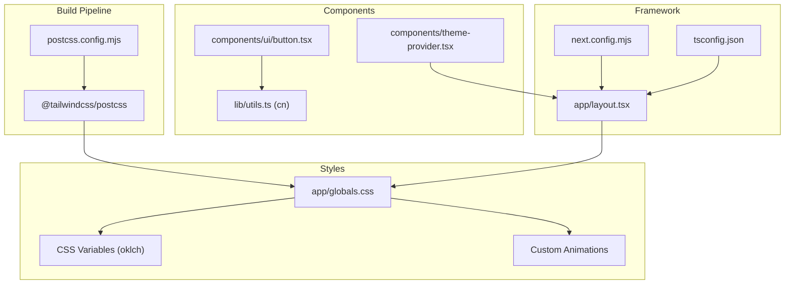
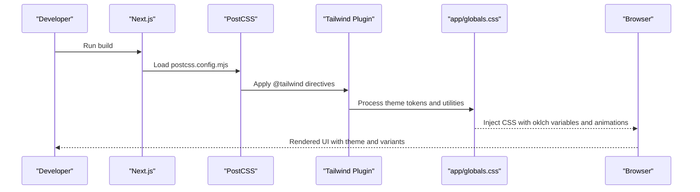
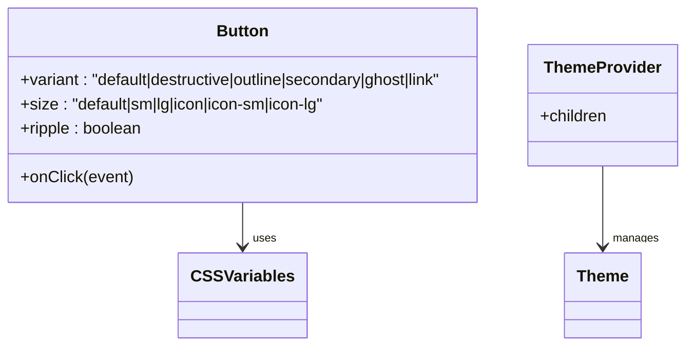
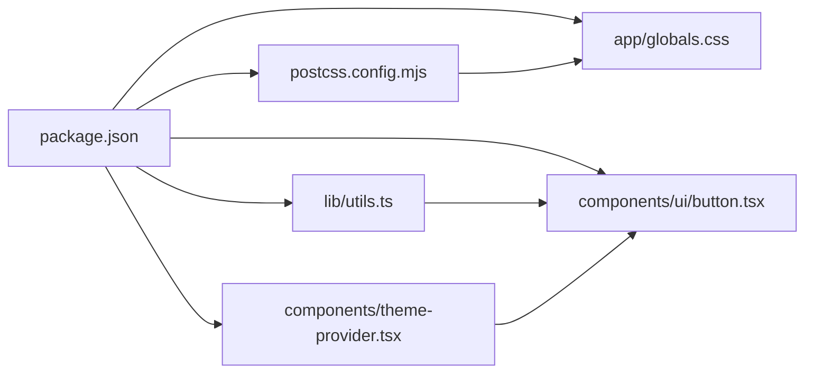

# Tailwind CSS Configuration

<cite>
**Referenced Files in This Document**
- [package.json](file://package.json)
- [postcss.config.mjs](file://postcss.config.mjs)
- [app/globals.css](file://app/globals.css)
- [components.json](file://components.json)
- [components/ui/button.tsx](file://components/ui/button.tsx)
- [components/theme-provider.tsx](file://components/theme-provider.tsx)
- [lib/utils.ts](file://lib/utils.ts)
- [app/layout.tsx](file://app/layout.tsx)
- [next.config.mjs](file://next.config.mjs)
- [tsconfig.json](file://tsconfig.json)
</cite>

## Table of Contents
1. [Introduction](#introduction)
2. [Project Structure](#project-structure)
3. [Core Components](#core-components)
4. [Architecture Overview](#architecture-overview)
5. [Detailed Component Analysis](#detailed-component-analysis)
6. [Dependency Analysis](#dependency-analysis)
7. [Performance Considerations](#performance-considerations)
8. [Troubleshooting Guide](#troubleshooting-guide)
9. [Conclusion](#conclusion)
10. [Appendices](#appendices)

## Introduction
This document explains the Tailwind CSS configuration and setup used in the project. It focuses on the custom color system leveraging oklch color space for perceptual color accuracy, CSS custom properties for theme variables, responsive design patterns, utility-first implementation, spacing and typography systems, component variants including dark mode, custom utility and animation classes, and build-time configuration via PostCSS. Practical examples show how to customize the design system, extend color palettes, and implement responsive patterns. Browser compatibility and fallback strategies are addressed alongside integration with other styling approaches.

## Project Structure
The project integrates Tailwind CSS through a PostCSS pipeline and a global stylesheet that defines theme tokens and animations. Key configuration points:
- Tailwind plugin loaded via PostCSS
- Global CSS file defining oklch-based theme tokens and animations
- Component library configured for shadcn/ui with CSS variables enabled
- Utility functions for merging Tailwind classes
- Next.js configuration for build behavior

**Diagram sources**
- [postcss.config.mjs:1-9](file://postcss.config.mjs#L1-L9)
- [app/globals.css:1-594](file://app/globals.css#L1-L594)
- [components/ui/button.tsx:1-101](file://components/ui/button.tsx#L1-L101)
- [components/theme-provider.tsx:1-12](file://components/theme-provider.tsx#L1-L12)
- [lib/utils.ts:1-7](file://lib/utils.ts#L1-L7)
- [app/layout.tsx:1-48](file://app/layout.tsx#L1-L48)
- [next.config.mjs:1-15](file://next.config.mjs#L1-L15)
- [tsconfig.json:1-43](file://tsconfig.json#L1-L43)

**Section sources**
- [postcss.config.mjs:1-9](file://postcss.config.mjs#L1-L9)
- [app/globals.css:1-594](file://app/globals.css#L1-L594)
- [components.json:1-22](file://components.json#L1-L22)
- [lib/utils.ts:1-7](file://lib/utils.ts#L1-L7)
- [app/layout.tsx:1-48](file://app/layout.tsx#L1-L48)
- [next.config.mjs:1-15](file://next.config.mjs#L1-L15)
- [tsconfig.json:1-43](file://tsconfig.json#L1-L43)

## Core Components
- Tailwind plugin via PostCSS: The build loads the Tailwind PostCSS plugin to process CSS.
- Theme tokens with oklch: CSS custom properties define a cohesive palette using oklch for perceptual uniformity, with separate values for light and dark modes.
- Typography and radius scales: Font families and radius tokens are exposed via CSS variables for consistent scaling.
- Base layer and layering: Tailwind base layer is applied globally, and custom utilities live in the same stylesheet.
- Component variants: Buttons use class variance authority (CVA) with variants for size and style, integrating with theme tokens.
- Dark mode: A custom dark variant selector and mode provider enable automatic dark/light switching.
- Utilities and animations: Custom animation utilities and effects are defined in the global stylesheet.
- Build configuration: Next.js and TypeScript configurations integrate Tailwind into the build pipeline.

**Section sources**
- [postcss.config.mjs:1-9](file://postcss.config.mjs#L1-L9)
- [app/globals.css:4-116](file://app/globals.css#L4-L116)
- [app/globals.css:118-594](file://app/globals.css#L118-L594)
- [components/ui/button.tsx:6-36](file://components/ui/button.tsx#L6-L36)
- [components/theme-provider.tsx:1-12](file://components/theme-provider.tsx#L1-L12)
- [lib/utils.ts:1-7](file://lib/utils.ts#L1-L7)
- [app/layout.tsx:33-47](file://app/layout.tsx#L33-L47)
- [next.config.mjs:1-15](file://next.config.mjs#L1-L15)
- [tsconfig.json:1-43](file://tsconfig.json#L1-L43)

## Architecture Overview
The Tailwind pipeline integrates with PostCSS and Next.js. The global stylesheet defines theme tokens and utilities, while components consume CVA and CSS variables. Dark mode is controlled by a provider and a custom dark variant selector.

**Diagram sources**
- [postcss.config.mjs:1-9](file://postcss.config.mjs#L1-L9)
- [app/globals.css:1-594](file://app/globals.css#L1-L594)
- [app/layout.tsx:33-47](file://app/layout.tsx#L33-L47)

## Detailed Component Analysis

### Theme Tokens and Color System (oklch)
- Color tokens: Defined as oklch values in :root and .dark blocks, enabling perceptually uniform lightness and chroma.
- CSS variable exposure: Theme tokens are mapped to Tailwind-compatible variables for use in utilities and components.
- Palette categories: Background, foreground, primary, secondary, muted, accent, destructive, borders, inputs, ring, and chart colors.
- Sidebar tokens: Additional tokens for sidebar components maintain consistent theming.

Implementation highlights:
- Light and dark mode tokens are distinct for contrast and readability.
- Chart tokens provide semantic color roles for data visualization.
- Radius tokens scale consistently across components.

**Section sources**
- [app/globals.css:6-40](file://app/globals.css#L6-L40)
- [app/globals.css:42-75](file://app/globals.css#L42-L75)
- [app/globals.css:77-116](file://app/globals.css#L77-L116)

### CSS Custom Properties and Theme Variables
- Token mapping: CSS variables expose theme tokens for Tailwind usage.
- Typography: Font families for sans and mono are defined and used in components.
- Radius scaling: Smaller, medium, large, and extra-large radii derived from a base token.

Integration points:
- Components reference theme variables for consistent styling.
- Utilities derive from variables for dynamic theming.

**Section sources**
- [app/globals.css:77-116](file://app/globals.css#L77-L116)
- [components/ui/button.tsx:7](file://components/ui/button.tsx#L7)

### Responsive Design and Breakpoints
- Media queries: Adjustments for smaller screens (e.g., reducing blur and disabling animations).
- Pattern: Use max-width media queries to tailor heavy effects on mobile devices.

Practical guidance:
- Prefer component-level adjustments for animations and effects.
- Keep breakpoint thresholds minimal and consistent with design system.

**Section sources**
- [app/globals.css:498-506](file://app/globals.css#L498-L506)

### Utility-First Implementation and Spacing Scale
- Utility-first: Components compose classes for padding, margin, rounded corners, shadows, and transitions.
- Spacing: Consistent sizing units across components; icon sizes and paddings adapt via utilities.
- Motion: Transitions and hover states use Tailwind utilities for smooth interactions.

Example usage:
- Button variants and sizes demonstrate compositional utility patterns.
- Ripple effect shows motion utility composition.

**Section sources**
- [components/ui/button.tsx:6-36](file://components/ui/button.tsx#L6-L36)
- [components/ui/button.tsx:54-97](file://components/ui/button.tsx#L54-L97)

### Typography Hierarchy
- Fonts: Sans and monospace families are defined and intended for consistent typography.
- Semantic usage: Components and layouts apply font classes for headings, body, and code contexts.
- Variable exposure: Typography tokens are available via CSS variables for reuse.

**Section sources**
- [app/globals.css:77-79](file://app/globals.css#L77-L79)
- [app/layout.tsx:7-8](file://app/layout.tsx#L7-L8)

### Component Variants and Dark Mode Support
- Variants: Buttons use CVA to define variant and size combinations with shared motion and focus utilities.
- Dark mode: A custom dark variant selector targets elements under a .dark ancestor, ensuring proper contrast and color mapping.
- Provider: Theme provider enables automatic detection and switching of themes.

**Diagram sources**
- [components/ui/button.tsx:6-36](file://components/ui/button.tsx#L6-L36)
- [components/theme-provider.tsx:1-12](file://components/theme-provider.tsx#L1-L12)

**Section sources**
- [components/ui/button.tsx:6-36](file://components/ui/button.tsx#L6-L36)
- [app/globals.css:4](file://app/globals.css#L4)
- [components/theme-provider.tsx:1-12](file://components/theme-provider.tsx#L1-L12)

### Custom Utility Classes and Animation Utilities
- Animations: Custom animation utilities include floating, slow pulse, scan, shimmer, spin, glow pulse, fade-in-up, staggered children, gradient shifts, and more.
- Effects: Glass, neon border, glow, gradient text, scrollbar styling, loading screen, ripple, and flash effects.
- Composition: Utilities combine motion, gradients, shadows, and transforms for rich UI effects.

Usage patterns:
- Animate utilities are applied directly to elements.
- Effects leverage CSS variables for dynamic theming.

**Section sources**
- [app/globals.css:131-294](file://app/globals.css#L131-L294)
- [app/globals.css:307-387](file://app/globals.css#L307-L387)
- [app/globals.css:408-423](file://app/globals.css#L408-L423)
- [app/globals.css:429-447](file://app/globals.css#L429-L447)
- [app/globals.css:452-493](file://app/globals.css#L452-L493)
- [app/globals.css:512-563](file://app/globals.css#L512-L563)
- [app/globals.css:580-593](file://app/globals.css#L580-L593)

### Build Configuration and Purging Strategies
- PostCSS plugin: Tailwind is loaded via the Tailwind PostCSS plugin.
- Next.js integration: Next.js handles CSS processing and asset bundling.
- Purge/preflight: Tailwind’s built-in purging removes unused styles; ensure all class usage is accounted for in templates/components.
- TypeScript paths: Path aliases simplify imports and improve DX.

Recommendations:
- Keep all Tailwind directives intact during development.
- Verify purge behavior in production builds to avoid removing essential utilities.

**Section sources**
- [postcss.config.mjs:1-9](file://postcss.config.mjs#L1-L9)
- [next.config.mjs:1-15](file://next.config.mjs#L1-L15)
- [tsconfig.json:25-29](file://tsconfig.json#L25-L29)

### Browser Compatibility and Fallback Strategies
- oklch support: Ensure target browsers support oklch; otherwise, provide fallback colors or transpile.
- CSS variables: Use CSS variables for theme tokens to enable runtime switching and fallbacks.
- Vendor prefixes: Some effects (e.g., backdrop-filter) may require vendor prefixes; test across browsers.
- Animations: Disable or degrade heavy animations on lower-powered devices via media queries.

Guidance:
- Test on supported browsers and provide conservative defaults.
- Use media queries to adjust effects on mobile devices.

**Section sources**
- [app/globals.css:6-40](file://app/globals.css#L6-L40)
- [app/globals.css:498-506](file://app/globals.css#L498-L506)

### Integration with Other Styling Approaches
- Utility-first + component composition: Combine Tailwind utilities with CVA-defined variants.
- CSS variables: Expose theme tokens for use in styled-components or other CSS-in-JS solutions.
- Global base styles: Apply base layer utilities to normalize and establish defaults.

**Section sources**
- [app/globals.css:118-125](file://app/globals.css#L118-L125)
- [lib/utils.ts:1-7](file://lib/utils.ts#L1-L7)

## Dependency Analysis
Key dependencies related to Tailwind and styling:
- Tailwind CSS and PostCSS plugin: Loaded via PostCSS configuration.
- Tailwind merge and clsx: Utility function merges classes deterministically.
- next-themes: Theme provider for dark mode.
- tw-animate-css: Additional animation utilities imported in global CSS.

**Diagram sources**
- [package.json:1-78](file://package.json#L1-L78)
- [postcss.config.mjs:1-9](file://postcss.config.mjs#L1-L9)
- [app/globals.css:1-2](file://app/globals.css#L1-L2)
- [lib/utils.ts:1-7](file://lib/utils.ts#L1-L7)
- [components/ui/button.tsx:1-5](file://components/ui/button.tsx#L1-L5)
- [components/theme-provider.tsx:1-12](file://components/theme-provider.tsx#L1-L12)

**Section sources**
- [package.json:1-78](file://package.json#L1-L78)
- [postcss.config.mjs:1-9](file://postcss.config.mjs#L1-L9)
- [lib/utils.ts:1-7](file://lib/utils.ts#L1-L7)
- [components/ui/button.tsx:1-5](file://components/ui/button.tsx#L1-L5)
- [components/theme-provider.tsx:1-12](file://components/theme-provider.tsx#L1-L12)

## Performance Considerations
- Purge unused CSS: Rely on Tailwind’s built-in purging in production builds.
- Minimize heavy animations on mobile: Disable or reduce animations via media queries.
- Use CSS variables sparingly: Prefer static values where possible to reduce reflows.
- Merge classes efficiently: Use the provided utility to avoid redundant classes.

[No sources needed since this section provides general guidance]

## Troubleshooting Guide
Common issues and resolutions:
- Missing Tailwind directives: Ensure @import and @theme directives are present in the global stylesheet.
- Dark mode not applying: Verify the custom dark variant selector and the theme provider setup.
- Animation conflicts: Confirm animation utilities are not overridden by conflicting styles.
- Build errors: Check PostCSS plugin configuration and ensure Tailwind is installed.

**Section sources**
- [app/globals.css:1-2](file://app/globals.css#L1-L2)
- [app/globals.css:4](file://app/globals.css#L4)
- [components/theme-provider.tsx:1-12](file://components/theme-provider.tsx#L1-L12)
- [postcss.config.mjs:1-9](file://postcss.config.mjs#L1-L9)

## Conclusion
The project implements a modern, perceptually accurate color system using oklch, exposes theme tokens via CSS variables, and leverages Tailwind’s utility-first approach with component variants and dark mode. The PostCSS pipeline integrates seamlessly with Next.js, while custom animations and effects enhance the UI. Following the outlined patterns ensures consistent theming, responsive behavior, and maintainable styling across the application.

[No sources needed since this section summarizes without analyzing specific files]

## Appendices

### Practical Examples

- Customizing the design system
  - Extend color tokens in :root and .dark blocks, then map them to CSS variables for Tailwind usage.
  - Add new chart or sidebar tokens following existing patterns.

- Extending color palettes
  - Define new oklch tokens with appropriate lightness/chroma for accessibility.
  - Expose new variables in @theme and use them in components.

- Implementing responsive design patterns
  - Use max-width media queries to adjust heavy effects on small screens.
  - Prefer component-level adjustments for motion and visual fidelity.

[No sources needed since this section provides general guidance]