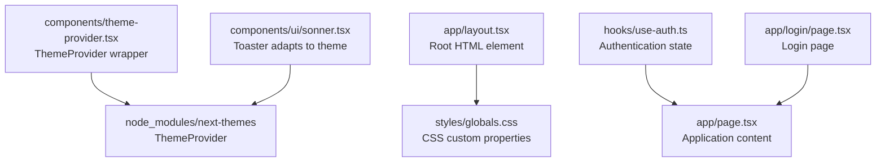
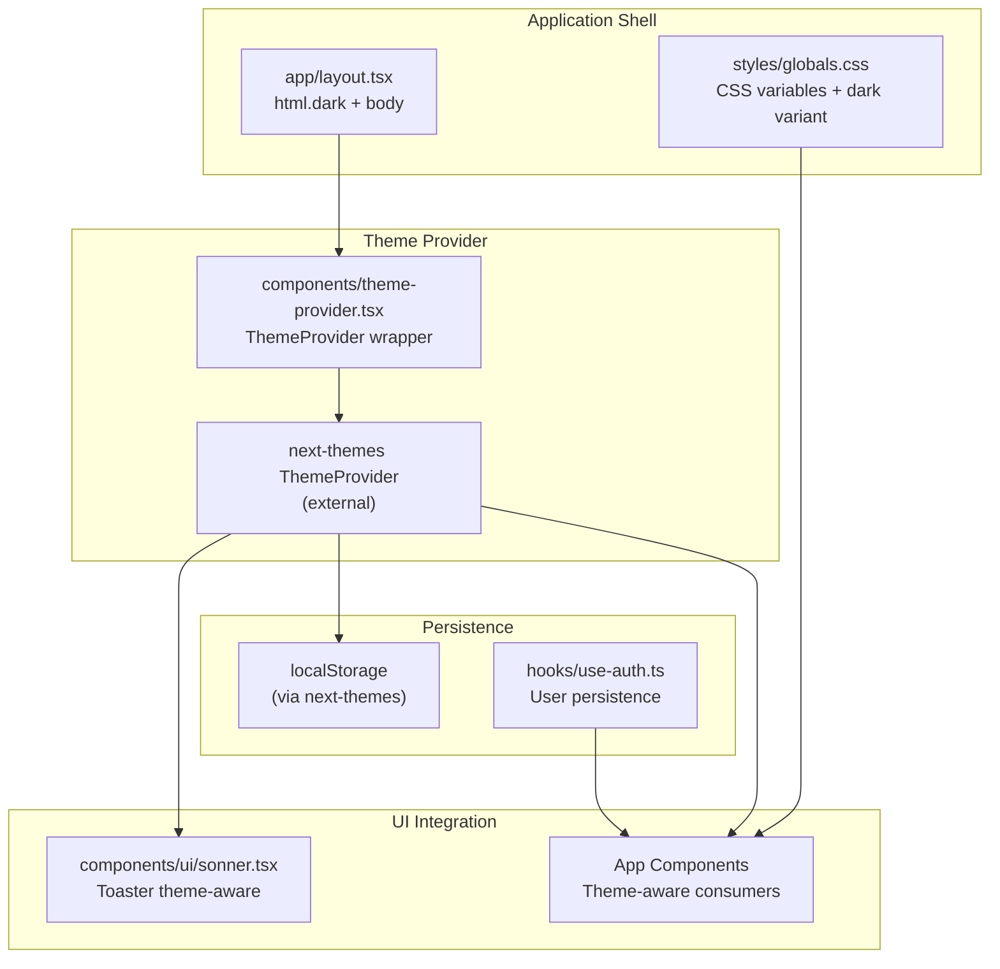
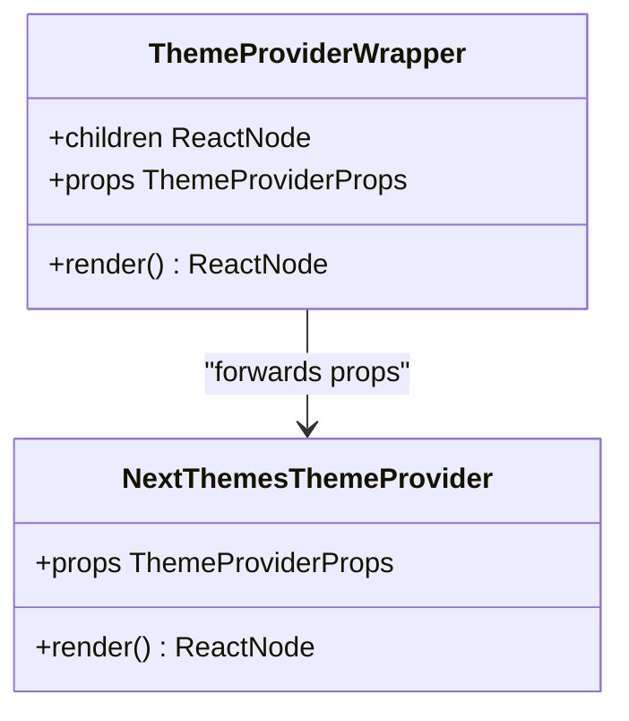
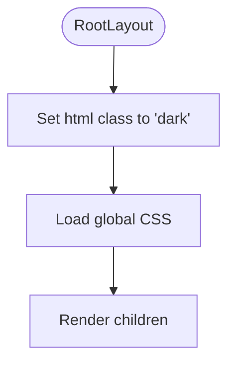
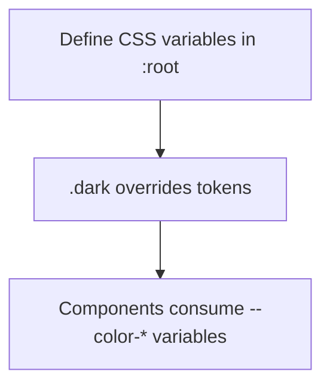
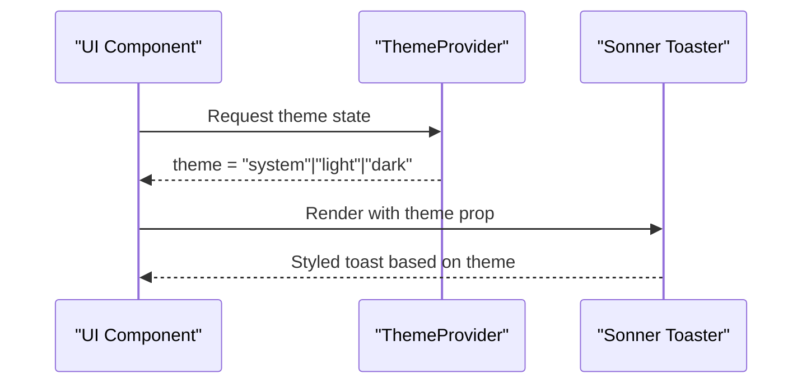
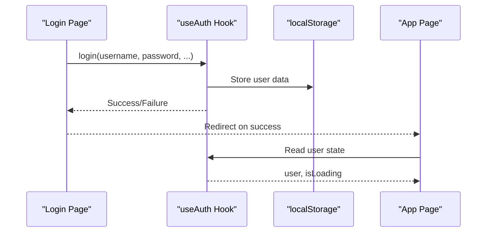
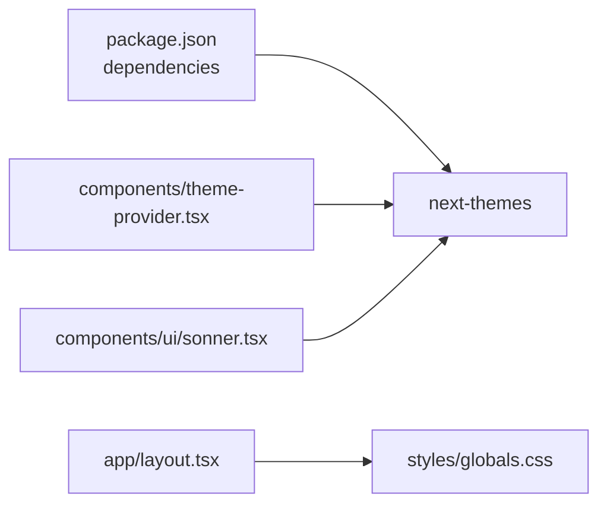

# Theme Provider System

<cite>
**Referenced Files in This Document**
- [theme-provider.tsx](file://components/theme-provider.tsx)
- [layout.tsx](file://app/layout.tsx)
- [globals.css](file://styles/globals.css)
- [sonner.tsx](file://components/ui/sonner.tsx)
- [package.json](file://package.json)
- [use-auth.ts](file://hooks/use-auth.ts)
- [page.tsx](file://app/page.tsx)
- [login/page.tsx](file://app/login/page.tsx)
</cite>

## Table of Contents
1. [Introduction](#introduction)
2. [Project Structure](#project-structure)
3. [Core Components](#core-components)
4. [Architecture Overview](#architecture-overview)
5. [Detailed Component Analysis](#detailed-component-analysis)
6. [Dependency Analysis](#dependency-analysis)
7. [Performance Considerations](#performance-considerations)
8. [Troubleshooting Guide](#troubleshooting-guide)
9. [Conclusion](#conclusion)

## Introduction
This document provides comprehensive documentation for the theme provider system using next-themes to enable dark/light mode switching. It covers theme persistence via localStorage, user preference detection, system theme awareness, component wrapper implementation, theme state management, automatic theme switching, integration with the authentication system, theme transition effects, performance considerations, accessibility implications, and practical examples for implementing theme-aware components.

## Project Structure
The theme system is implemented with a minimal wrapper around next-themes and integrated into the application layout. CSS custom properties define theme tokens, and toast notifications adapt to the current theme.

**Diagram sources**
- [theme-provider.tsx:1-12](file://components/theme-provider.tsx#L1-L12)
- [layout.tsx:33-47](file://app/layout.tsx#L33-L47)
- [globals.css:1-126](file://styles/globals.css#L1-L126)
- [sonner.tsx:1-26](file://components/ui/sonner.tsx#L1-L26)
- [use-auth.ts:28-166](file://hooks/use-auth.ts#L28-L166)
- [page.tsx:24-384](file://app/page.tsx#L24-L384)
- [login/page.tsx:209-668](file://app/login/page.tsx#L209-L668)

**Section sources**
- [theme-provider.tsx:1-12](file://components/theme-provider.tsx#L1-L12)
- [layout.tsx:33-47](file://app/layout.tsx#L33-L47)
- [globals.css:1-126](file://styles/globals.css#L1-L126)
- [sonner.tsx:1-26](file://components/ui/sonner.tsx#L1-L26)
- [use-auth.ts:28-166](file://hooks/use-auth.ts#L28-L166)
- [page.tsx:24-384](file://app/page.tsx#L24-L384)
- [login/page.tsx:209-668](file://app/login/page.tsx#L209-L668)

## Core Components
- ThemeProvider wrapper: A thin client-side wrapper around next-themes ThemeProvider that forwards props to the underlying provider.
- Root layout: Sets the html element class to "dark" and loads global styles.
- Global CSS: Defines CSS custom properties for theme tokens and applies dark variants.
- Toast integration: A Toaster component that reads the current theme from next-themes and adapts toast visuals accordingly.
- Authentication hook: Manages user state and persists it to localStorage; while not directly managing theme, it influences when and how theme-aware components render.

Key implementation references:
- ThemeProvider wrapper: [theme-provider.tsx:9-11](file://components/theme-provider.tsx#L9-L11)
- Root layout dark class: [layout.tsx:39](file://app/layout.tsx#L39)
- CSS custom properties and dark variant: [globals.css:6-75](file://styles/globals.css#L6-L75)
- Toaster theme adaptation: [sonner.tsx:7](file://components/ui/sonner.tsx#L7)
- Authentication persistence: [use-auth.ts:32-58](file://hooks/use-auth.ts#L32-L58)

**Section sources**
- [theme-provider.tsx:1-12](file://components/theme-provider.tsx#L1-L12)
- [layout.tsx:33-47](file://app/layout.tsx#L33-L47)
- [globals.css:1-126](file://styles/globals.css#L1-L126)
- [sonner.tsx:1-26](file://components/ui/sonner.tsx#L1-L26)
- [use-auth.ts:28-166](file://hooks/use-auth.ts#L28-L166)

## Architecture Overview
The theme system architecture centers on next-themes for state management and persistence, with CSS custom properties driving visual updates. The ThemeProvider wrapper exposes the provider to the application, while the layout ensures initial dark class presence. Toast notifications dynamically adopt the current theme.

**Diagram sources**
- [layout.tsx:33-47](file://app/layout.tsx#L33-L47)
- [globals.css:1-126](file://styles/globals.css#L1-L126)
- [theme-provider.tsx:1-12](file://components/theme-provider.tsx#L1-L12)
- [sonner.tsx:1-26](file://components/ui/sonner.tsx#L1-L26)
- [use-auth.ts:28-166](file://hooks/use-auth.ts#L28-L166)

## Detailed Component Analysis

### ThemeProvider Wrapper
The wrapper component imports next-themes and re-exports its ThemeProvider with the same props interface, enabling easy consumption across the application.

**Diagram sources**
- [theme-provider.tsx:9-11](file://components/theme-provider.tsx#L9-L11)

**Section sources**
- [theme-provider.tsx:1-12](file://components/theme-provider.tsx#L1-L12)

### Root Layout and Initial Dark Class
The root layout sets the html element class to "dark" and loads global styles. This establishes a baseline theme for the entire application.

**Diagram sources**
- [layout.tsx:33-47](file://app/layout.tsx#L33-L47)

**Section sources**
- [layout.tsx:33-47](file://app/layout.tsx#L33-L47)

### CSS Custom Properties and Dark Variant
Global CSS defines CSS custom properties for theme tokens and provides a dark variant that overrides these tokens when the "dark" class is present. This enables consistent theming across components.

**Diagram sources**
- [globals.css:6-75](file://styles/globals.css#L6-L75)

**Section sources**
- [globals.css:1-126](file://styles/globals.css#L1-L126)

### Toaster Theme Adaptation
The Toaster component reads the current theme from next-themes and applies it to toast visuals, ensuring consistent appearance regardless of user preference.

**Diagram sources**
- [sonner.tsx:7](file://components/ui/sonner.tsx#L7)

**Section sources**
- [sonner.tsx:1-26](file://components/ui/sonner.tsx#L1-L26)

### Authentication Integration
The authentication hook manages user state and persists it to localStorage. While not directly managing theme, it influences rendering of theme-aware components after login.

**Diagram sources**
- [use-auth.ts:60-88](file://hooks/use-auth.ts#L60-L88)
- [login/page.tsx:270-312](file://app/login/page.tsx#L270-L312)
- [page.tsx:34-38](file://app/page.tsx#L34-L38)

**Section sources**
- [use-auth.ts:28-166](file://hooks/use-auth.ts#L28-L166)
- [login/page.tsx:209-668](file://app/login/page.tsx#L209-L668)
- [page.tsx:24-384](file://app/page.tsx#L24-L384)

## Dependency Analysis
The theme system relies on next-themes for state management and persistence, with CSS custom properties for visual theming. The Toaster component depends on next-themes for theme-aware rendering.

**Diagram sources**
- [package.json:52](file://package.json#L52)
- [theme-provider.tsx:1-12](file://components/theme-provider.tsx#L1-L12)
- [sonner.tsx:1-26](file://components/ui/sonner.tsx#L1-L26)
- [layout.tsx:33-47](file://app/layout.tsx#L33-L47)

**Section sources**
- [package.json:1-78](file://package.json#L1-L78)
- [theme-provider.tsx:1-12](file://components/theme-provider.tsx#L1-L12)
- [sonner.tsx:1-26](file://components/ui/sonner.tsx#L1-L26)
- [layout.tsx:33-47](file://app/layout.tsx#L33-L47)

## Performance Considerations
- Minimize re-renders: Use the ThemeProvider wrapper to avoid unnecessary re-renders by keeping it near the root.
- CSS variable usage: Prefer CSS custom properties for theme tokens to reduce JavaScript overhead.
- Toast theme caching: The Toaster component reads theme once per render; keep renders efficient to maintain smooth transitions.
- Hydration: Ensure the html element class is set early to prevent flash-of-unstyled-content during hydration.

[No sources needed since this section provides general guidance]

## Troubleshooting Guide
Common issues and resolutions:
- Flash of wrong theme on initial load: Ensure the html element class is set to "dark" in the root layout to align server-rendered markup with client-side theme expectations.
- Toast not adapting to theme: Verify that the Toaster component reads the theme from next-themes and passes it to the Sonner component.
- Theme not persisting across sessions: Confirm that next-themes is configured to persist the theme in localStorage and that the ThemeProvider wrapper is properly placed in the application shell.

**Section sources**
- [layout.tsx:39](file://app/layout.tsx#L39)
- [sonner.tsx:7](file://components/ui/sonner.tsx#L7)
- [theme-provider.tsx:9-11](file://components/theme-provider.tsx#L9-L11)

## Conclusion
The theme provider system leverages next-themes for robust theme state management and persistence, with CSS custom properties enabling consistent theming across components. The ThemeProvider wrapper simplifies integration, while the Toaster component ensures visual coherence. The authentication system complements theme persistence by managing user state, influencing when theme-aware components render. Together, these components deliver a responsive, accessible, and performant theming experience.