# Visual Effects and Animations

<cite>
**Referenced Files in This Document**
- [app/globals.css](file://app/globals.css)
- [components/ui-effects.tsx](file://components/ui-effects.tsx)
- [components/animated-background.tsx](file://components/animated-background.tsx)
- [components/avatar-3d.tsx](file://components/avatar-3d.tsx)
- [components/stats-panel.tsx](file://components/stats-panel.tsx)
- [components/task-card.tsx](file://components/task-card.tsx)
- [components/premium-upgrade-banner.tsx](file://components/premium-upgrade-banner.tsx)
- [components/celebration-effect.tsx](file://components/celebration-effect.tsx)
- [app/login/page.tsx](file://app/login/page.tsx)
- [package.json](file://package.json)
- [next.config.mjs](file://next.config.mjs)
- [postcss.config.mjs](file://postcss.config.mjs)
- [tsconfig.json](file://tsconfig.json)
</cite>

## Table of Contents
1. [Introduction](#introduction)
2. [Project Structure](#project-structure)
3. [Core Components](#core-components)
4. [Architecture Overview](#architecture-overview)
5. [Detailed Component Analysis](#detailed-component-analysis)
6. [Dependency Analysis](#dependency-analysis)
7. [Performance Considerations](#performance-considerations)
8. [Troubleshooting Guide](#troubleshooting-guide)
9. [Conclusion](#conclusion)
10. [Appendices](#appendices)

## Introduction
This document describes the custom animation system and visual effects library used across the project. It covers:
- Built-in CSS animations and staggered child animations
- Gradient shift effects and 3D card transformations
- Glass morphism, neon borders, and glowing shadows
- Text effects including gradient text and glow
- Loading screen animations and scrollbar styling
- Responsive adjustments for mobile devices
- Practical examples for applying animations to components
- Creating custom animation sequences
- Browser compatibility, hardware acceleration, and performance best practices

## Project Structure
The animation system spans CSS utilities, reusable UI components, and a 3D animated background scene. Key areas:
- Global CSS defines keyframes, utilities, and responsive rules
- UI components encapsulate interactive and animated behaviors
- 3D scenes leverage Three.js/Fiber for immersive effects
- Additional effects use canvas-based animations

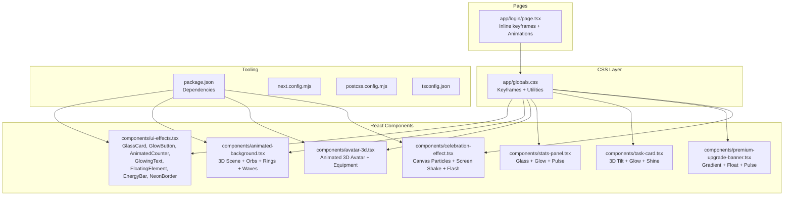

**Diagram sources**
- [app/globals.css:127-593](file://app/globals.css#L127-L593)
- [components/ui-effects.tsx:1-284](file://components/ui-effects.tsx#L1-L284)
- [components/animated-background.tsx:1-209](file://components/animated-background.tsx#L1-L209)
- [components/avatar-3d.tsx:1-1361](file://components/avatar-3d.tsx#L1-L1361)
- [components/stats-panel.tsx:1-145](file://components/stats-panel.tsx#L1-L145)
- [components/task-card.tsx:1-186](file://components/task-card.tsx#L1-L186)
- [components/premium-upgrade-banner.tsx:1-89](file://components/premium-upgrade-banner.tsx#L1-L89)
- [components/celebration-effect.tsx:1-249](file://components/celebration-effect.tsx#L1-L249)
- [app/login/page.tsx:649-667](file://app/login/page.tsx#L649-L667)
- [package.json:1-78](file://package.json#L1-L78)
- [next.config.mjs:1-15](file://next.config.mjs#L1-L15)
- [postcss.config.mjs:1-9](file://postcss.config.mjs#L1-L9)
- [tsconfig.json:1-43](file://tsconfig.json#L1-L43)

**Section sources**
- [app/globals.css:127-593](file://app/globals.css#L127-L593)
- [components/ui-effects.tsx:1-284](file://components/ui-effects.tsx#L1-L284)
- [components/animated-background.tsx:1-209](file://components/animated-background.tsx#L1-L209)
- [components/avatar-3d.tsx:1-1361](file://components/avatar-3d.tsx#L1-L1361)
- [components/stats-panel.tsx:1-145](file://components/stats-panel.tsx#L1-L145)
- [components/task-card.tsx:1-186](file://components/task-card.tsx#L1-L186)
- [components/premium-upgrade-banner.tsx:1-89](file://components/premium-upgrade-banner.tsx#L1-L89)
- [components/celebration-effect.tsx:1-249](file://components/celebration-effect.tsx#L1-L249)
- [app/login/page.tsx:649-667](file://app/login/page.tsx#L649-L667)
- [package.json:1-78](file://package.json#L1-L78)
- [next.config.mjs:1-15](file://next.config.mjs#L1-L15)
- [postcss.config.mjs:1-9](file://postcss.config.mjs#L1-L9)
- [tsconfig.json:1-43](file://tsconfig.json#L1-L43)

## Core Components
This section documents the built-in animations and visual effects:

- Float animation: Smooth vertical bobbing controlled by CSS variables
- Pulse slow: Gentle opacity and scale pulsing
- Scan: Vertical gradient movement for scan-line effects
- Shimmer: Horizontal translation overlay for metallic sheen
- Spin slow: Continuous rotation
- Glow pulse: Multi-layered box-shadow pulses
- Count-in: Fade-in with upward slide
- Gradient shift: Background-position cycling for animated gradients
- Fade-in-up: Staggered entrance with opacity and translateY
- Stagger children: Sequential fade-in-up per child with delays
- Background size utilities: Control gradient animation scale
- 3D card transforms: Perspective and rotateX/rotateY on hover
- Glass morphism: Backdrop blur, semi-transparent backgrounds, and thin borders
- Neon borders: Conic gradient spinning border with inner fill
- Glowing shadows: Predefined shadow classes for purple/orange/cyan/green
- Hover glow: Transitioned box-shadow on hover
- Text glow: Text-shadow for luminous typography
- Gradient text: Background-clip text with gradient fills
- Scrollbar styling: WebKit scrollbar customization
- Loading screen: Radial background with layered pulsing and spinning rings
- Ripple and flash: One-shot animations for feedback
- Mobile responsiveness: Reduced blur and disabled float on small screens

Practical usage examples:
- Apply `.animate-float` to any element to make it gently rise and fall
- Add `.glass` for frosted-glass panels
- Wrap content with `.neon-border` for animated neon framing
- Use `.glow-purple` or `.text-glow-purple` for luminous effects
- Combine `.animate-gradient` with background utilities for animated gradients
- Use `.stagger-children > *` to animate a list with staggered delays

**Section sources**
- [app/globals.css:131-271](file://app/globals.css#L131-L271)
- [app/globals.css:273-301](file://app/globals.css#L273-L301)
- [app/globals.css:307-320](file://app/globals.css#L307-L320)
- [app/globals.css:321-386](file://app/globals.css#L321-L386)
- [app/globals.css:388-423](file://app/globals.css#L388-L423)
- [app/globals.css:427-446](file://app/globals.css#L427-L446)
- [app/globals.css:448-493](file://app/globals.css#L448-L493)
- [app/globals.css:508-563](file://app/globals.css#L508-L563)
- [app/globals.css:565-593](file://app/globals.css#L565-L593)

## Architecture Overview
The animation system integrates CSS keyframes, Tailwind utilities, and React components. Some effects are purely CSS-based, while others use Three.js for 3D scenes and canvas for particle effects.

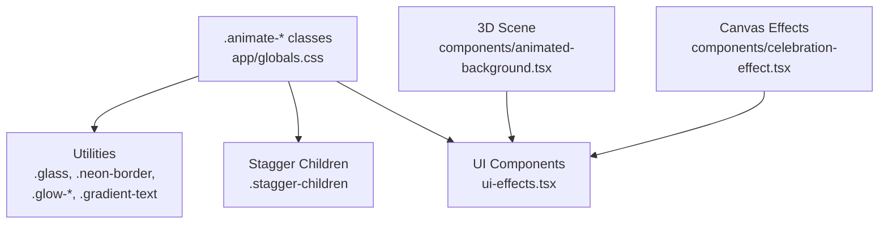

**Diagram sources**
- [app/globals.css:127-593](file://app/globals.css#L127-L593)
- [components/animated-background.tsx:1-209](file://components/animated-background.tsx#L1-L209)
- [components/celebration-effect.tsx:1-249](file://components/celebration-effect.tsx#L1-L249)
- [components/ui-effects.tsx:1-284](file://components/ui-effects.tsx#L1-L284)

## Detailed Component Analysis

### CSS Animation Collection
- Float: Vertical bounce with configurable distance and duration
- Pulse slow: Opacity and scale oscillation
- Scan: Animated background-position for scan-line effect
- Shimmer: Horizontal translate for a moving highlight
- Spin slow: Continuous 360° rotation
- Glow pulse: Multi-layered box-shadow animation
- Count-in: Fade-in with upward slide
- Gradient shift: Background-position cycling for animated gradients
- Fade-in-up: Entrance with opacity and translateY
- Stagger children: Sequential delays per child
- Background utilities: Control gradient animation scale
- 3D card: Perspective and rotateX/rotateY transitions
- Glass morphism: Backdrop blur and borders
- Neon border: Conic gradient spinning border
- Glowing shadows: Predefined shadow classes
- Hover glow: Transitioned box-shadow on hover
- Text glow: Text-shadow for luminous typography
- Gradient text: Background-clip text with gradient
- Scrollbar styling: WebKit scrollbar customization
- Loading screen: Radial background with layered pulsing and spinning rings
- Ripple and flash: One-shot animations
- Mobile responsiveness: Reduced blur and disabled float on small screens

```mermaid
flowchart TD
Start(["Apply Animation"]) --> Choose["Select Animation Type"]
Choose --> Float["Float"]
Choose --> Pulse["Pulse Slow"]
Choose --> Scan["Scan"]
Choose --> Shimmer["Shimmer"]
Choose --> Spin["Spin Slow"]
Choose --> Glow["Glow Pulse"]
Choose --> Count["Count-In"]
Choose --> Grad["Gradient Shift"]
Choose --> Fade["Fade-In-Up"]
Choose --> Stag["Stagger Children"]
Choose --> Glass["Glass Morphism"]
Choose --> Neon["Neon Border"]
Choose --> GlowTxt["Text Glow"]
Choose --> GradTxt["Gradient Text"]
Choose --> Scroll["Scrollbar Styling"]
Choose --> Load["Loading Screen"]
Choose --> Ripple["Ripple"]
Choose --> Flash["Flash"]
Choose --> Resp["Responsive Adjustments"]
Float --> End(["Render"])
Pulse --> End
Scan --> End
Shimmer --> End
Spin --> End
Glow --> End
Count --> End
Grad --> End
Fade --> End
Stag --> End
Glass --> End
Neon --> End
GlowTxt --> End
GradTxt --> End
Scroll --> End
Load --> End
Ripple --> End
Flash --> End
Resp --> End
```

**Diagram sources**
- [app/globals.css:131-593](file://app/globals.css#L131-L593)

**Section sources**
- [app/globals.css:131-593](file://app/globals.css#L131-L593)

### Staggered Child Animations
The staggered children pattern applies fade-in-up to immediate children with increasing delays. This creates a cascading entrance effect.

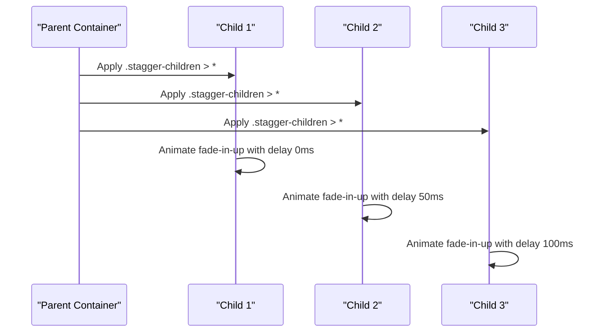

**Diagram sources**
- [app/globals.css:569-579](file://app/globals.css#L569-L579)

**Section sources**
- [app/globals.css:569-579](file://app/globals.css#L569-L579)

### Gradient Shift Effects
Two complementary approaches exist:
- CSS-based gradient shift: Uses background-size and background-position with keyframes
- Conic gradient spinning: Creates a rotating border using conic-gradient and animation

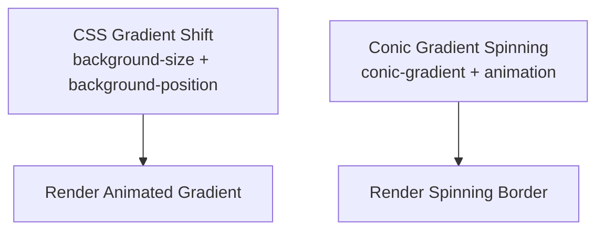

**Diagram sources**
- [app/globals.css:242-255](file://app/globals.css#L242-L255)
- [app/globals.css:341-350](file://app/globals.css#L341-L350)
- [components/ui-effects.tsx:271-282](file://components/ui-effects.tsx#L271-L282)

**Section sources**
- [app/globals.css:242-255](file://app/globals.css#L242-L255)
- [app/globals.css:341-350](file://app/globals.css#L341-L350)
- [components/ui-effects.tsx:271-282](file://components/ui-effects.tsx#L271-L282)

### 3D Card Transformations
Interactive 3D cards tilt based on mouse position using perspective and rotateX/rotateY. They also feature glow and shine overlays.

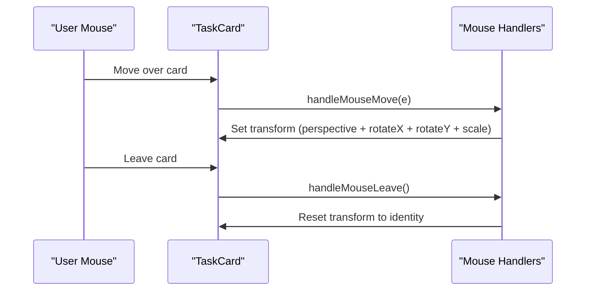

**Diagram sources**
- [components/task-card.tsx:45-63](file://components/task-card.tsx#L45-L63)

**Section sources**
- [components/task-card.tsx:45-63](file://components/task-card.tsx#L45-L63)

### Glass Morphism Effects
Glass morphism is achieved through:
- Backdrop blur and semi-transparent backgrounds
- Thin borders with low opacity
- Optional inner glow and shine overlays

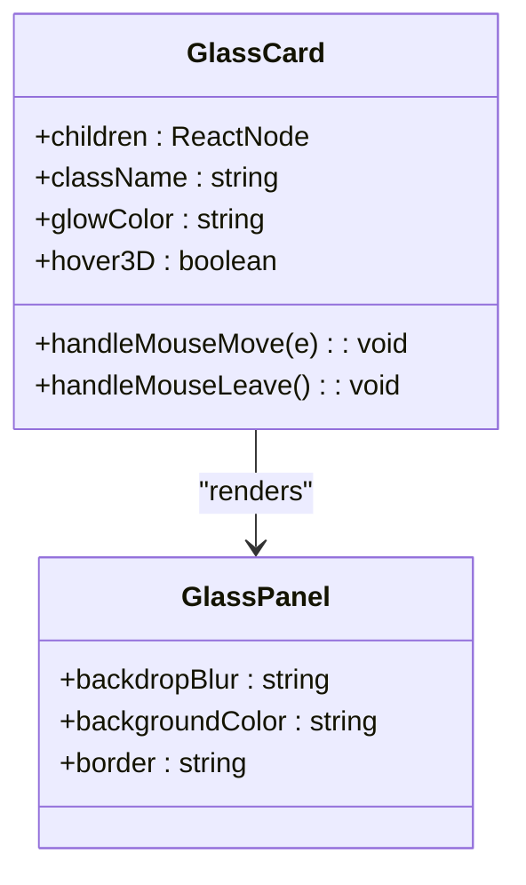

**Diagram sources**
- [components/ui-effects.tsx:13-65](file://components/ui-effects.tsx#L13-L65)
- [app/globals.css:321-334](file://app/globals.css#L321-L334)

**Section sources**
- [components/ui-effects.tsx:13-65](file://components/ui-effects.tsx#L13-L65)
- [app/globals.css:321-334](file://app/globals.css#L321-L334)

### Neon Borders and Glowing Shadows
Neon borders use conic gradients and pseudo-elements to simulate animated borders. Glowing shadows provide luminous outlines.

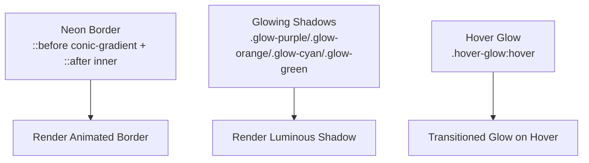

**Diagram sources**
- [app/globals.css:336-386](file://app/globals.css#L336-L386)
- [components/ui-effects.tsx:271-282](file://components/ui-effects.tsx#L271-L282)

**Section sources**
- [app/globals.css:336-386](file://app/globals.css#L336-L386)
- [components/ui-effects.tsx:271-282](file://components/ui-effects.tsx#L271-L282)

### Text Effects: Gradient Text and Glow
Gradient text uses background-clip to reveal gradient fills. Text glow adds layered text-shadows for luminosity.

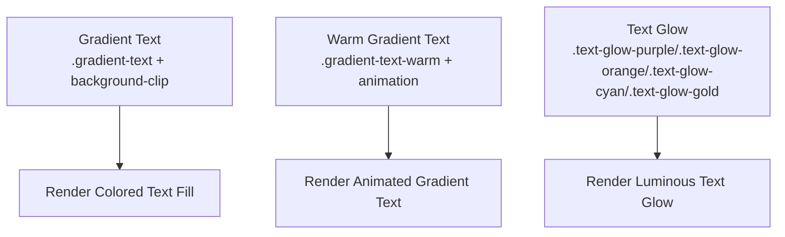

**Diagram sources**
- [app/globals.css:408-423](file://app/globals.css#L408-L423)
- [app/globals.css:392-406](file://app/globals.css#L392-L406)

**Section sources**
- [app/globals.css:408-423](file://app/globals.css#L408-L423)
- [app/globals.css:392-406](file://app/globals.css#L392-L406)

### Loading Screen Animations
The loading screen combines radial backgrounds, pulsing orbs, and spinning rings to create a cohesive intro experience.

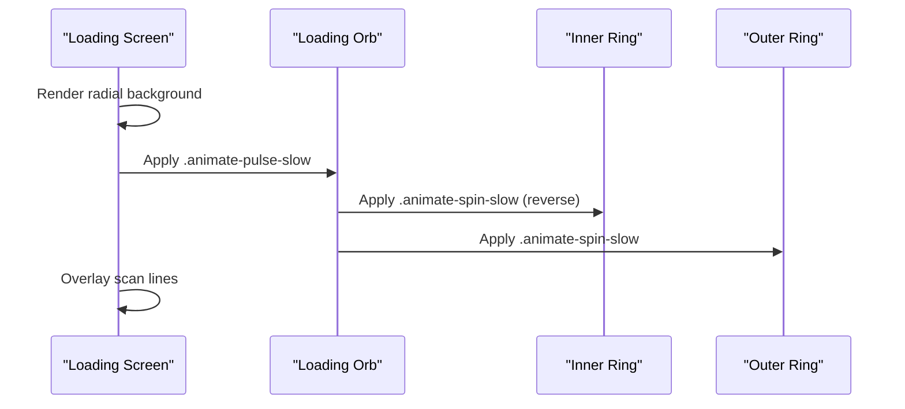

**Diagram sources**
- [app/globals.css:452-493](file://app/globals.css#L452-L493)

**Section sources**
- [app/globals.css:452-493](file://app/globals.css#L452-L493)

### Scrollbar Styling and Responsive Adjustments
WebKit scrollbars are customized with gradients and rounded corners. On mobile, blur is reduced and float animations are disabled.

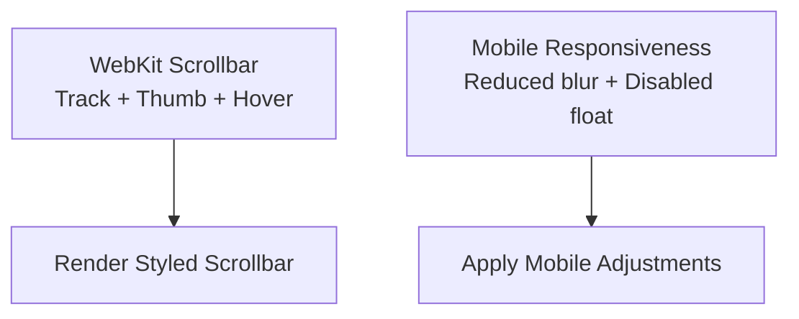

**Diagram sources**
- [app/globals.css:427-446](file://app/globals.css#L427-L446)
- [app/globals.css:498-506](file://app/globals.css#L498-L506)

**Section sources**
- [app/globals.css:427-446](file://app/globals.css#L427-L446)
- [app/globals.css:498-506](file://app/globals.css#L498-L506)

### UI Effects Library Components
Reusable components encapsulate common animated patterns:

- GlassCard: 3D hover with glow, glass background, inner shine
- GlowButton: Animated gradient border, glow, hover scaling
- AnimatedCounter: Count-up with fade-in
- GlowingText: Colorful glow text
- FloatingElement: Float animation with configurable duration and distance
- PulsingDot: Ping animation for indicators
- EnergyBar: Animated bar with shimmer overlay
- NeonBorder: Conic gradient spinning border

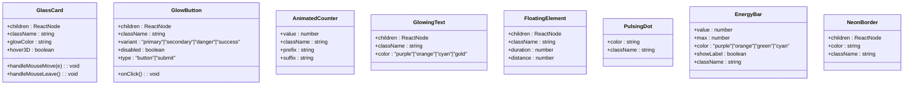

**Diagram sources**
- [components/ui-effects.tsx:13-284](file://components/ui-effects.tsx#L13-L284)

**Section sources**
- [components/ui-effects.tsx:13-284](file://components/ui-effects.tsx#L13-L284)

### Animated 3D Background Scene
The animated background scene uses Three.js/Fiber to render:
- Stars, energy orbs, glowing rings, particle fields, and central sparkles
- Lighting and materials with emissive properties
- Canvas configuration with device pixel ratio and antialiasing

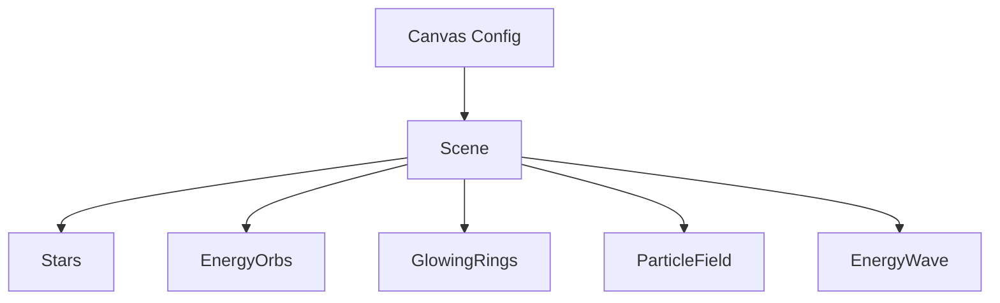

**Diagram sources**
- [components/animated-background.tsx:128-176](file://components/animated-background.tsx#L128-L176)
- [components/animated-background.tsx:178-208](file://components/animated-background.tsx#L178-L208)

**Section sources**
- [components/animated-background.tsx:1-209](file://components/animated-background.tsx#L1-L209)

### Canvas-Based Celebration Effects
Canvas-based effects include:
- Particle explosions with gravity and air resistance
- Screen shake and flash effects
- Global triggers for level-ups and celebrations

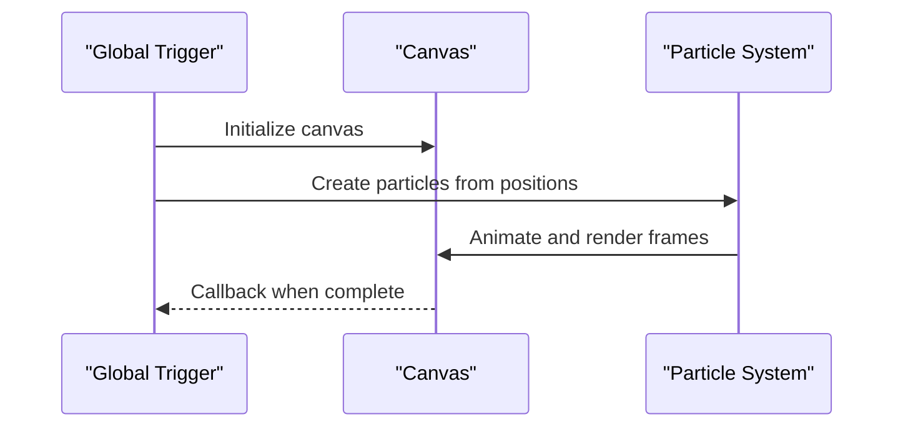

**Diagram sources**
- [components/celebration-effect.tsx:172-207](file://components/celebration-effect.tsx#L172-L207)

**Section sources**
- [components/celebration-effect.tsx:1-249](file://components/celebration-effect.tsx#L1-L249)

### Practical Examples
- Applying animations to components:
  - Add `.animate-float` to a container for vertical bobbing
  - Use `.glass` for frosted panels
  - Wrap content with `.neon-border` for animated framing
  - Use `.glow-purple` or `.text-glow-purple` for luminous effects
  - Combine `.animate-gradient` with background utilities for animated gradients
  - Use `.stagger-children > *` to animate a list with staggered delays
- Creating custom animation sequences:
  - Define a new keyframe in CSS and apply it via a utility class
  - Compose multiple animations by chaining classes
  - Use CSS variables to parameterize durations and distances
- Optimizing performance:
  - Prefer transform and opacity for GPU acceleration
  - Use reduced blur on mobile
  - Limit expensive effects on low-end devices

**Section sources**
- [app/globals.css:131-593](file://app/globals.css#L131-L593)
- [components/ui-effects.tsx:13-284](file://components/ui-effects.tsx#L13-L284)
- [components/animated-background.tsx:178-208](file://components/animated-background.tsx#L178-L208)
- [components/celebration-effect.tsx:172-207](file://components/celebration-effect.tsx#L172-L207)

## Dependency Analysis
External libraries and tooling supporting the animation system:
- Tailwind CSS and tw-animate-css for utility-first animations
- PostCSS with Tailwind plugin for CSS processing
- Next.js configuration for build and runtime behavior
- TypeScript for type safety
- Three.js and @react-three/fiber/@react-three/drei for 3D scenes
- Canvas APIs for particle effects

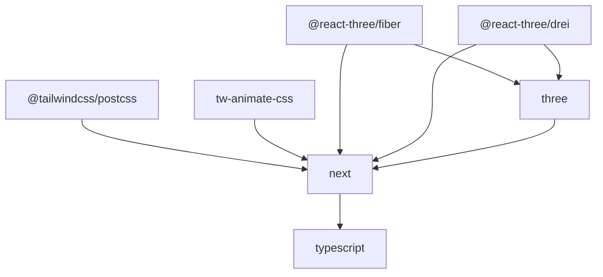

**Diagram sources**
- [package.json:11-76](file://package.json#L11-L76)
- [postcss.config.mjs:1-9](file://postcss.config.mjs#L1-L9)
- [next.config.mjs:1-15](file://next.config.mjs#L1-L15)
- [tsconfig.json:1-43](file://tsconfig.json#L1-L43)

**Section sources**
- [package.json:11-76](file://package.json#L11-L76)
- [postcss.config.mjs:1-9](file://postcss.config.mjs#L1-L9)
- [next.config.mjs:1-15](file://next.config.mjs#L1-L15)
- [tsconfig.json:1-43](file://tsconfig.json#L1-L43)

## Performance Considerations
- Hardware acceleration: Use transform and opacity for GPU-accelerated animations
- Frame rate: Keep animations under 60fps by avoiding layout thrashing
- Device-specific tuning: Reduce blur and disable heavy animations on mobile
- 3D rendering: Use instancing and optimized materials in Three.js scenes
- Canvas effects: Clear and reuse canvases; avoid unnecessary allocations
- CSS animations: Prefer transform and filter properties over layout-affecting ones

[No sources needed since this section provides general guidance]

## Troubleshooting Guide
Common issues and remedies:
- Animations not playing:
  - Verify CSS keyframes and class names are present
  - Ensure Tailwind utilities are generated and not purged unintentionally
- 3D scene not rendering:
  - Confirm Three.js and fiber/drei are installed and imported
  - Check for errors in the scene components and boundaries
- Canvas effects not visible:
  - Ensure canvas is appended to the DOM and sized appropriately
  - Verify animation loop is started and cleared on unmount
- Mobile performance:
  - Disable float animations and reduce blur on small screens
  - Test on target devices and adjust complexity accordingly

**Section sources**
- [components/animated-background.tsx:128-176](file://components/animated-background.tsx#L128-L176)
- [components/celebration-effect.tsx:154-170](file://components/celebration-effect.tsx#L154-L170)
- [app/globals.css:498-506](file://app/globals.css#L498-L506)

## Conclusion
The project’s animation system blends CSS-driven effects with React components and Three.js scenes to deliver immersive visuals. By leveraging utilities, keyframes, and modern web APIs, it achieves smooth, performant animations across devices. The included components and patterns provide a foundation for extending and customizing the visual experience.

[No sources needed since this section summarizes without analyzing specific files]

## Appendices

### Browser Compatibility and Tooling Notes
- Tailwind and PostCSS pipeline process CSS utilities and animations
- Next.js configuration supports the build and runtime environment
- TypeScript configuration ensures type-safe development

**Section sources**
- [postcss.config.mjs:1-9](file://postcss.config.mjs#L1-L9)
- [next.config.mjs:1-15](file://next.config.mjs#L1-L15)
- [tsconfig.json:1-43](file://tsconfig.json#L1-L43)