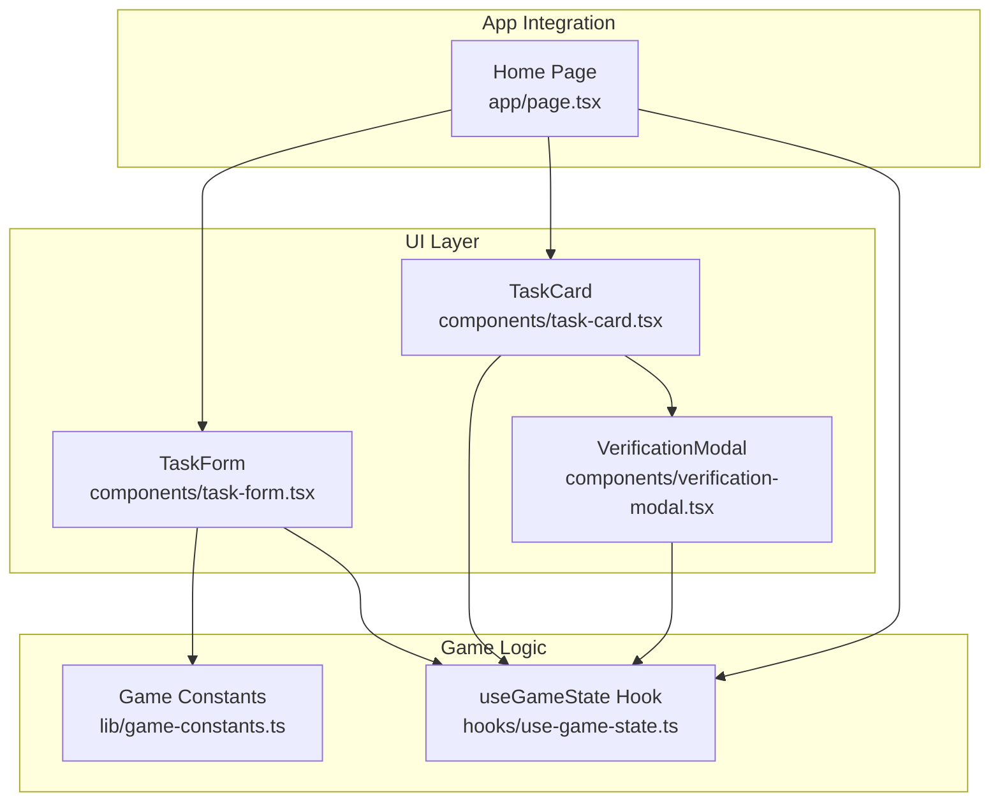
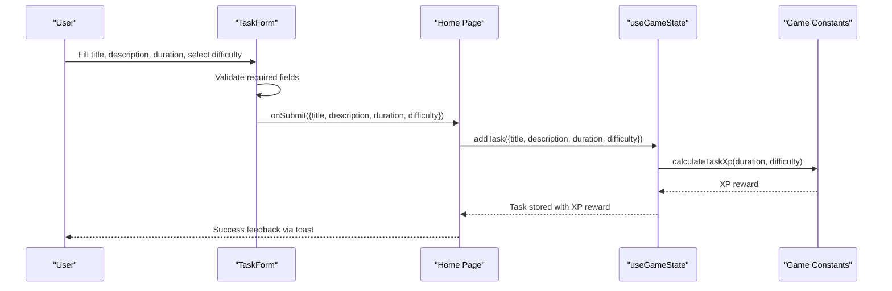
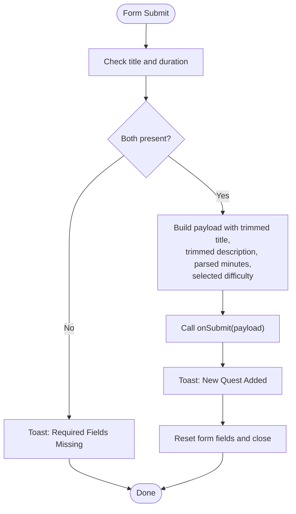
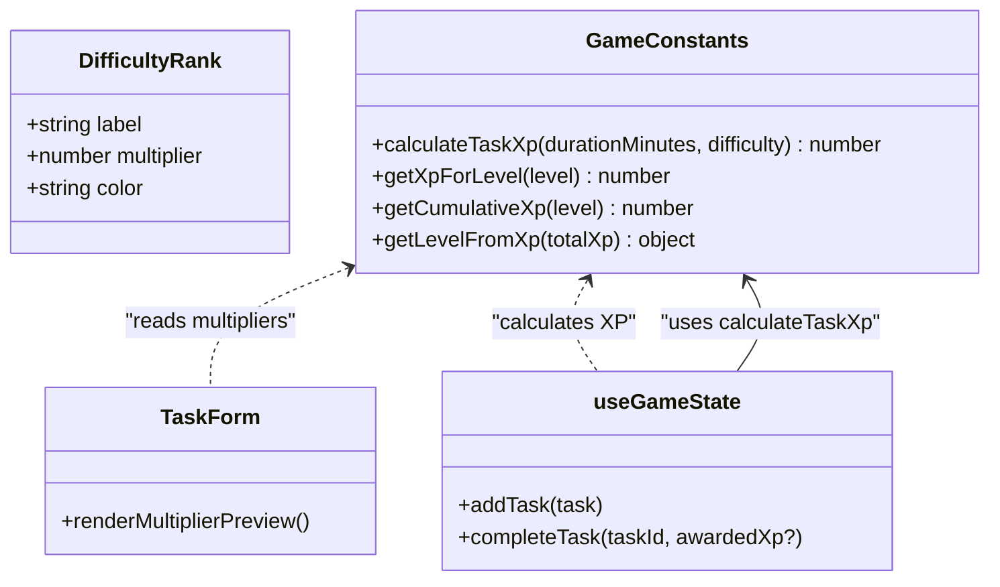
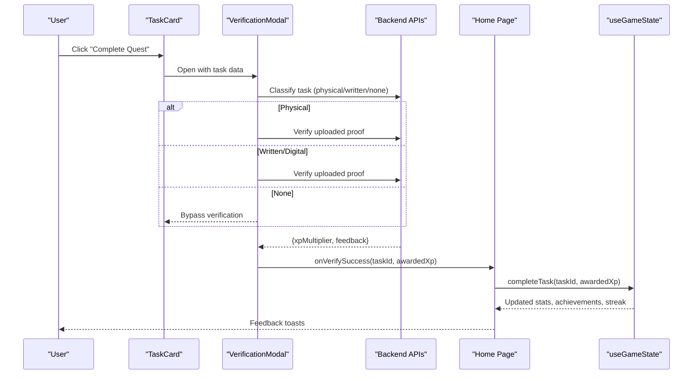
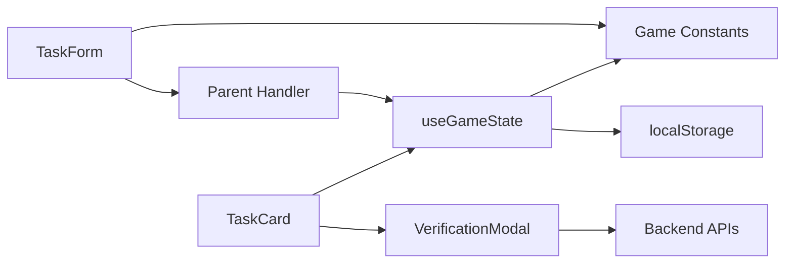

# Task Creation and Editing

<cite>
**Referenced Files in This Document**
- [task-form.tsx](file://components/task-form.tsx)
- [game-constants.ts](file://lib/game-constants.ts)
- [use-game-state.ts](file://hooks/use-game-state.ts)
- [task-card.tsx](file://components/task-card.tsx)
- [verification-modal.tsx](file://components/verification-modal.tsx)
- [page.tsx](file://app/page.tsx)
</cite>

## Table of Contents
1. [Introduction](#introduction)
2. [Project Structure](#project-structure)
3. [Core Components](#core-components)
4. [Architecture Overview](#architecture-overview)
5. [Detailed Component Analysis](#detailed-component-analysis)
6. [Dependency Analysis](#dependency-analysis)
7. [Performance Considerations](#performance-considerations)
8. [Troubleshooting Guide](#troubleshooting-guide)
9. [Conclusion](#conclusion)

## Introduction
This document explains the task creation and editing system, focusing on the TaskForm component, form validation, difficulty rating selection using the E-S rank system, task duration inputs, XP reward calculations, and the end-to-end workflow from form submission to state persistence. It also covers integration with game constants, task lifecycle transitions, verification mechanics, and user feedback mechanisms.

## Project Structure
The task system spans several key areas:
- UI form component for task creation
- Game constants defining difficulty ranks and XP calculation
- Game state hook managing tasks, XP, and persistence
- Task display and completion flow
- Verification modal for task validation

**Diagram sources**
- [task-form.tsx:1-191](file://components/task-form.tsx#L1-L191)
- [task-card.tsx:1-186](file://components/task-card.tsx#L1-L186)
- [verification-modal.tsx:1-331](file://components/verification-modal.tsx#L1-L331)
- [game-constants.ts:1-95](file://lib/game-constants.ts#L1-L95)
- [use-game-state.ts:1-252](file://hooks/use-game-state.ts#L1-L252)
- [page.tsx:1-200](file://app/page.tsx#L1-L200)

**Section sources**
- [task-form.tsx:1-191](file://components/task-form.tsx#L1-L191)
- [game-constants.ts:1-95](file://lib/game-constants.ts#L1-L95)
- [use-game-state.ts:1-252](file://hooks/use-game-state.ts#L1-L252)
- [task-card.tsx:1-186](file://components/task-card.tsx#L1-L186)
- [verification-modal.tsx:1-331](file://components/verification-modal.tsx#L1-L331)
- [page.tsx:1-200](file://app/page.tsx#L1-L200)

## Core Components
- TaskForm: Collects title, description, duration, and difficulty; validates inputs; submits to parent handler; clears form on success.
- Game Constants: Defines difficulty ranks with labels, colors, and multipliers; provides XP calculation and level progression helpers.
- useGameState Hook: Manages tasks and player stats, persists to localStorage, computes XP rewards, handles task lifecycle, and triggers achievements.
- TaskCard: Renders tasks, initiates verification flow, and supports deletion.
- VerificationModal: Guides users through classification and proof submission; calculates rewarded XP based on verification outcome.

**Section sources**
- [task-form.tsx:18-51](file://components/task-form.tsx#L18-L51)
- [game-constants.ts:2-48](file://lib/game-constants.ts#L2-L48)
- [use-game-state.ts:15-47](file://hooks/use-game-state.ts#L15-L47)
- [task-card.tsx:18-43](file://components/task-card.tsx#L18-L43)
- [verification-modal.tsx:18-147](file://components/verification-modal.tsx#L18-L147)

## Architecture Overview
The system follows a unidirectional data flow:
- TaskForm collects user input and invokes a parent-provided submit handler.
- Parent integrates with useGameState to compute XP reward and persist the new task.
- TaskCard displays tasks and starts the verification flow.
- VerificationModal communicates with backend APIs to validate completion and adjust XP.
- useGameState updates player stats, streaks, and achievements.

**Diagram sources**
- [task-form.tsx:25-41](file://components/task-form.tsx#L25-L41)
- [use-game-state.ts:127-141](file://hooks/use-game-state.ts#L127-L141)
- [game-constants.ts:44-48](file://lib/game-constants.ts#L44-L48)
- [page.tsx:112-126](file://app/page.tsx#L112-L126)

## Detailed Component Analysis

### TaskForm Component
- Purpose: Provide a form to create new tasks with validation and user feedback.
- Validation:
  - Requires non-empty title and duration.
  - Triggers toast notifications for missing fields.
- Difficulty Selection:
  - Uses a select dropdown populated from difficulty rank constants.
  - Displays current XP multiplier preview based on selected rank.
- Submission:
  - Calls parent onSubmit with normalized data.
  - Clears form fields and closes the form.
  - Provides success toast confirming addition.

**Diagram sources**
- [task-form.tsx:25-51](file://components/task-form.tsx#L25-L51)

**Section sources**
- [task-form.tsx:18-51](file://components/task-form.tsx#L18-L51)
- [task-form.tsx:145-167](file://components/task-form.tsx#L145-L167)

### Difficulty Rank System and XP Calculation
- Difficulty Ranks: E, D, C, B, A, S with associated labels, colors, and multipliers.
- XP Calculation: Base reward equals duration in minutes multiplied by difficulty multiplier, rounded up.
- Integration: TaskForm reads multiplier for preview; useGameState computes XP reward during creation.

**Diagram sources**
- [game-constants.ts:2-9](file://lib/game-constants.ts#L2-L9)
- [game-constants.ts:44-48](file://lib/game-constants.ts#L44-L48)
- [task-form.tsx:160-167](file://components/task-form.tsx#L160-L167)
- [use-game-state.ts:127-141](file://hooks/use-game-state.ts#L127-L141)

**Section sources**
- [game-constants.ts:2-9](file://lib/game-constants.ts#L2-L9)
- [game-constants.ts:44-48](file://lib/game-constants.ts#L44-L48)
- [task-form.tsx:160-167](file://components/task-form.tsx#L160-L167)
- [use-game-state.ts:127-141](file://hooks/use-game-state.ts#L127-L141)

### Task Lifecycle and State Persistence
- Creation:
  - Parent receives form submission and delegates to useGameState.addTask.
  - useGameState computes XP reward using calculateTaskXp and stores the new task with generated ID and timestamp.
- Completion:
  - TaskCard opens VerificationModal to validate completion.
  - VerificationModal calls backend APIs to evaluate proof and returns a multiplier.
  - Parent completes task via useGameState.completeTask with either base or adjusted XP.
  - useGameState updates player stats, checks level-ups and achievements, and persists state to localStorage.
- Deletion:
  - TaskCard supports removing completed tasks or deleting active tasks.

**Diagram sources**
- [task-card.tsx:25-36](file://components/task-card.tsx#L25-L36)
- [verification-modal.tsx:39-64](file://components/verification-modal.tsx#L39-L64)
- [verification-modal.tsx:112-140](file://components/verification-modal.tsx#L112-L140)
- [page.tsx:112-126](file://app/page.tsx#L112-L126)
- [use-game-state.ts:143-210](file://hooks/use-game-state.ts#L143-L210)

**Section sources**
- [task-card.tsx:18-43](file://components/task-card.tsx#L18-L43)
- [verification-modal.tsx:18-147](file://components/verification-modal.tsx#L18-L147)
- [page.tsx:112-126](file://app/page.tsx#L112-L126)
- [use-game-state.ts:143-210](file://hooks/use-game-state.ts#L143-L210)

### Practical Examples

- Creating tasks with different difficulty levels:
  - Select difficulty rank in TaskForm; multiplier preview updates automatically.
  - Submitting a 60-minute task:
    - E rank: 60 × 1 = 60 XP
    - D rank: 60 × 1.5 = 90 XP
    - C rank: 60 × 2.5 = 150 XP
    - B rank: 60 × 4 = 240 XP
    - A rank: 60 × 6 = 360 XP
    - S rank: 60 × 10 = 600 XP
- Handling form errors:
  - Missing title or duration triggers a toast notification; form remains open for correction.
- Managing task lifecycle transitions:
  - After successful completion, the task moves to completed state with XP applied and streak updated.
  - Deleting tasks removes them from the active list; completed tasks can be removed via the card.

**Section sources**
- [task-form.tsx:28-33](file://components/task-form.tsx#L28-L33)
- [game-constants.ts:44-48](file://lib/game-constants.ts#L44-L48)
- [use-game-state.ts:143-210](file://hooks/use-game-state.ts#L143-L210)

## Dependency Analysis
- TaskForm depends on:
  - Game constants for difficulty rank definitions and multiplier previews.
  - Parent component for submission handling.
- useGameState depends on:
  - Game constants for XP calculations and level computations.
  - Local storage for persistence.
- TaskCard depends on:
  - useGameState for task state and completion callbacks.
  - VerificationModal for validation flow.
- VerificationModal depends on:
  - Backend APIs for classification and verification.

**Diagram sources**
- [task-form.tsx:6](file://components/task-form.tsx#L6)
- [game-constants.ts:1-13](file://lib/game-constants.ts#L1-L13)
- [use-game-state.ts:3-13](file://hooks/use-game-state.ts#L3-L13)
- [task-card.tsx:3-9](file://components/task-card.tsx#L3-L9)
- [verification-modal.tsx:41-140](file://components/verification-modal.tsx#L41-L140)

**Section sources**
- [task-form.tsx:6](file://components/task-form.tsx#L6)
- [game-constants.ts:1-13](file://lib/game-constants.ts#L1-L13)
- [use-game-state.ts:3-13](file://hooks/use-game-state.ts#L3-L13)
- [task-card.tsx:3-9](file://components/task-card.tsx#L3-L9)
- [verification-modal.tsx:41-140](file://components/verification-modal.tsx#L41-L140)

## Performance Considerations
- Prefer minimal re-renders by using callbacks and memoization in hooks.
- Keep form state local to avoid unnecessary prop drilling.
- Persist to localStorage efficiently by batching state updates.
- Use numeric inputs with sensible min/max constraints to reduce invalid submissions.

## Troubleshooting Guide
- Form validation fails:
  - Ensure both title and duration are provided; otherwise a toast informs the user.
- Verification errors:
  - If camera access fails or verification API calls fail, the system falls back to awarding base XP and closes the modal.
- State not persisting:
  - Confirm localStorage availability and that the game state hook is mounted and initialized.
- Streak anomalies:
  - Streak resets if a day passes without a completed task; verify date comparisons and time zone handling.

**Section sources**
- [task-form.tsx:28-33](file://components/task-form.tsx#L28-L33)
- [verification-modal.tsx:73-77](file://components/verification-modal.tsx#L73-L77)
- [verification-modal.tsx:135-139](file://components/verification-modal.tsx#L135-L139)
- [use-game-state.ts:62-82](file://hooks/use-game-state.ts#L62-L82)
- [use-game-state.ts:84-125](file://hooks/use-game-state.ts#L84-L125)

## Conclusion
The task creation and editing system centers around a robust form with validation, a clear difficulty rank system with XP calculations, and a seamless completion flow backed by verification and persistent state management. The architecture cleanly separates concerns between UI, game logic, and persistence, enabling predictable behavior and extensible enhancements.