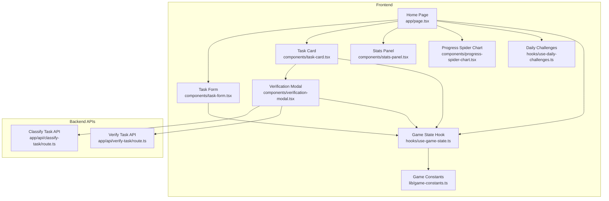
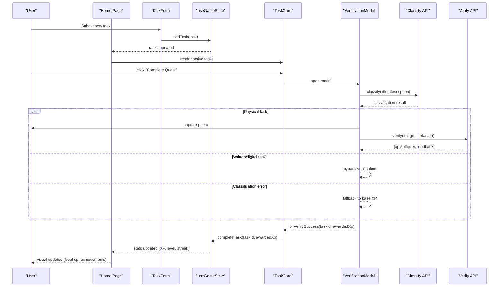
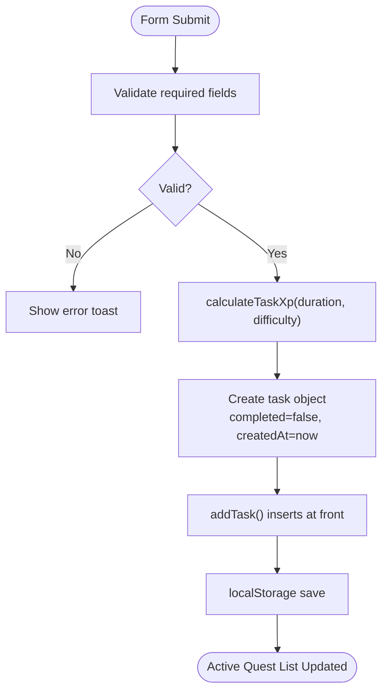
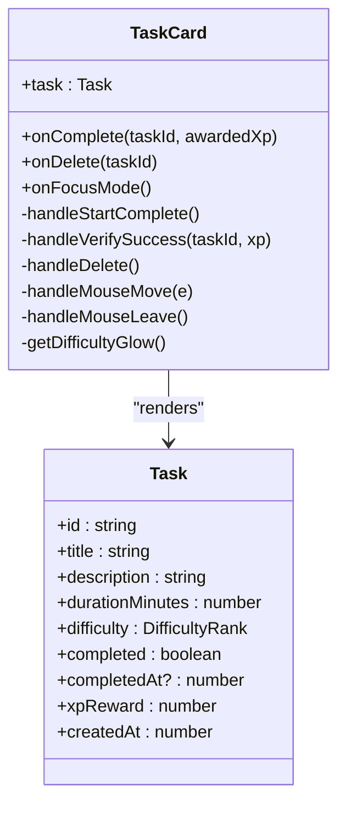
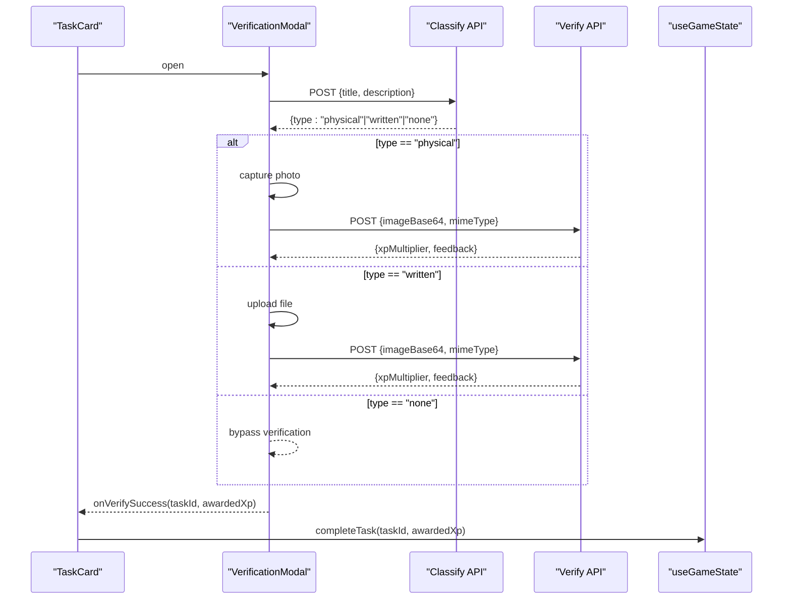
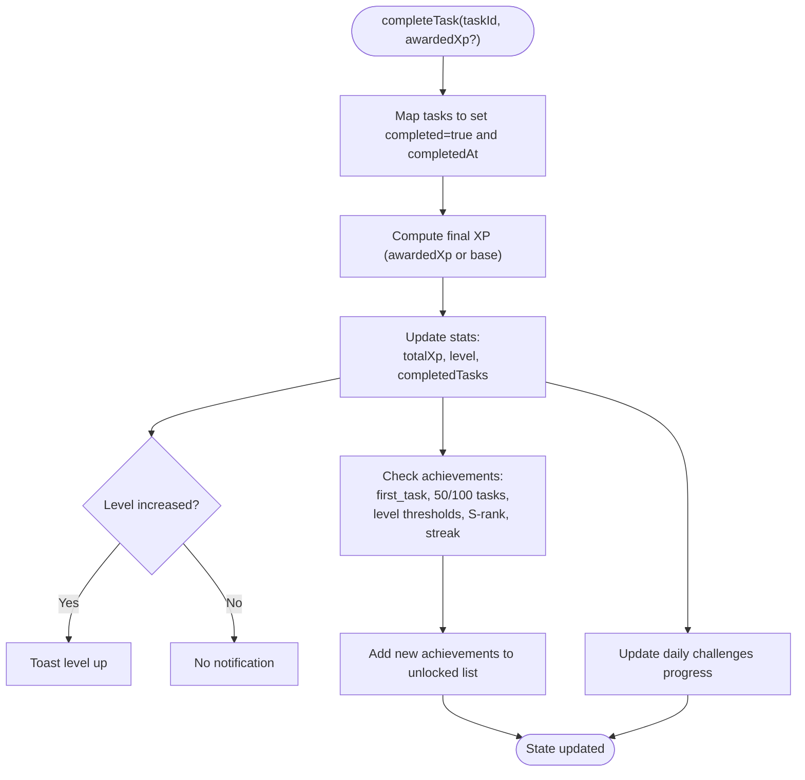
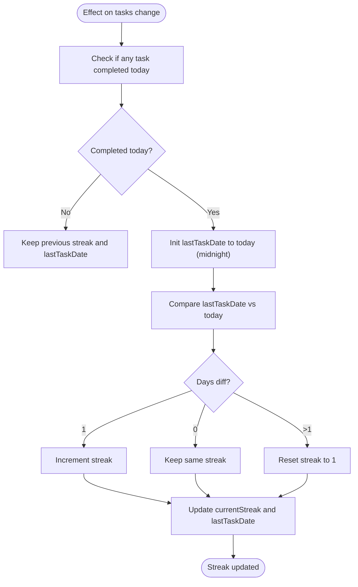
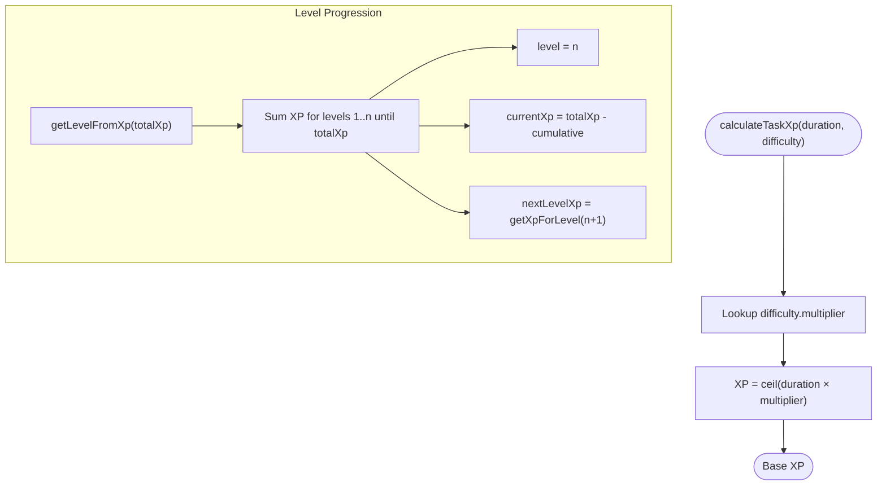
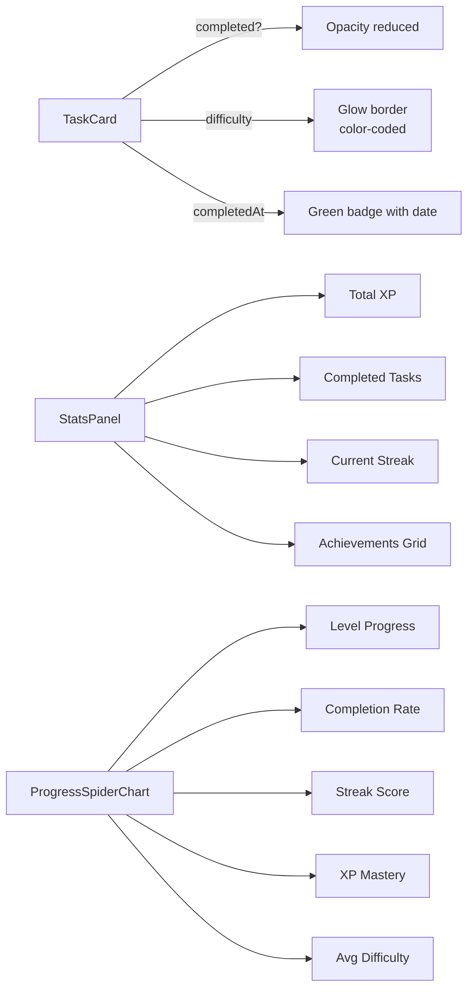
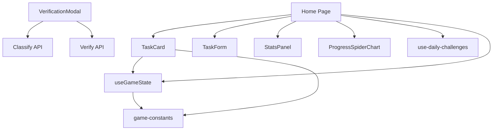

# Task Lifecycle and Progress Tracking

<cite>
**Referenced Files in This Document**
- [task-card.tsx](file://components/task-card.tsx)
- [use-game-state.ts](file://hooks/use-game-state.ts)
- [game-constants.ts](file://lib/game-constants.ts)
- [task-form.tsx](file://components/task-form.tsx)
- [verification-modal.tsx](file://components/verification-modal.tsx)
- [page.tsx](file://app/page.tsx)
- [route.ts](file://app/api/classify-task/route.ts)
- [route.ts](file://app/api/verify-task/route.ts)
- [use-daily-challenges.ts](file://hooks/use-daily-challenges.ts)
- [stats-panel.tsx](file://components/stats-panel.tsx)
- [progress-spider-chart.tsx](file://components/progress-spider-chart.tsx)
</cite>

## Table of Contents
1. [Introduction](#introduction)
2. [Project Structure](#project-structure)
3. [Core Components](#core-components)
4. [Architecture Overview](#architecture-overview)
5. [Detailed Component Analysis](#detailed-component-analysis)
6. [Dependency Analysis](#dependency-analysis)
7. [Performance Considerations](#performance-considerations)
8. [Troubleshooting Guide](#troubleshooting-guide)
9. [Conclusion](#conclusion)

## Introduction
This document explains the complete task lifecycle and progress tracking system in the Solo Leveling game. It covers task creation, active state management, completion workflows, archived task handling, XP award mechanics, streak calculations, and visual indicators. It also documents the TaskCard component's role in displaying task status, difficulty, and progress, along with the verification flow that determines final XP rewards.

## Project Structure
The task lifecycle spans several frontend components and backend APIs:
- Frontend state management: game state hook and constants
- UI components: task creation form, task cards, verification modal, statistics panels, and progress charts
- Backend APIs: task classification and verification services
- Daily challenges integration for contextual progression

**Diagram sources**
- [page.tsx:24-384](file://app/page.tsx#L24-L384)
- [task-form.tsx:18-191](file://components/task-form.tsx#L18-L191)
- [task-card.tsx:18-186](file://components/task-card.tsx#L18-L186)
- [verification-modal.tsx:18-331](file://components/verification-modal.tsx#L18-L331)
- [use-game-state.ts:51-252](file://hooks/use-game-state.ts#L51-L252)
- [game-constants.ts:1-95](file://lib/game-constants.ts#L1-L95)
- [route.ts:8-43](file://app/api/classify-task/route.ts#L8-L43)
- [route.ts:8-55](file://app/api/verify-task/route.ts#L8-L55)
- [use-daily-challenges.ts:66-153](file://hooks/use-daily-challenges.ts#L66-L153)

**Section sources**
- [page.tsx:24-384](file://app/page.tsx#L24-L384)
- [task-form.tsx:18-191](file://components/task-form.tsx#L18-L191)
- [task-card.tsx:18-186](file://components/task-card.tsx#L18-L186)
- [verification-modal.tsx:18-331](file://components/verification-modal.tsx#L18-L331)
- [use-game-state.ts:51-252](file://hooks/use-game-state.ts#L51-L252)
- [game-constants.ts:1-95](file://lib/game-constants.ts#L1-L95)
- [route.ts:8-43](file://app/api/classify-task/route.ts#L8-L43)
- [route.ts:8-55](file://app/api/verify-task/route.ts#L8-L55)
- [use-daily-challenges.ts:66-153](file://hooks/use-daily-challenges.ts#L66-L153)

## Core Components
- Task lifecycle management: creation, completion, deletion, and persistence
- XP award system: base XP calculation, difficulty multipliers, and verification-based adjustments
- Streak tracking: daily completion streak with reset logic
- Visual indicators: difficulty badges, completion timestamps, and UI state changes
- Verification flow: automatic classification and AI-powered verification

Key implementation references:
- Task interface and state transitions: [use-game-state.ts:15-47](file://hooks/use-game-state.ts#L15-L47)
- XP calculation and level progression: [game-constants.ts:44-48](file://lib/game-constants.ts#L44-L48), [game-constants.ts:28-42](file://lib/game-constants.ts#L28-L42)
- Streak computation: [use-game-state.ts:84-125](file://hooks/use-game-state.ts#L84-L125)
- TaskCard rendering and actions: [task-card.tsx:18-186](file://components/task-card.tsx#L18-L186)
- Verification modal flow: [verification-modal.tsx:18-331](file://components/verification-modal.tsx#L18-L331)

**Section sources**
- [use-game-state.ts:15-47](file://hooks/use-game-state.ts#L15-L47)
- [game-constants.ts:44-48](file://lib/game-constants.ts#L44-L48)
- [game-constants.ts:28-42](file://lib/game-constants.ts#L28-L42)
- [use-game-state.ts:84-125](file://hooks/use-game-state.ts#L84-L125)
- [task-card.tsx:18-186](file://components/task-card.tsx#L18-L186)
- [verification-modal.tsx:18-331](file://components/verification-modal.tsx#L18-L331)

## Architecture Overview
The task lifecycle is orchestrated by the game state hook, persisted to local storage, and surfaced through UI components. The verification modal integrates with backend APIs to classify tasks and evaluate completion proofs, adjusting XP accordingly.

**Diagram sources**
- [page.tsx:270-282](file://app/page.tsx#L270-L282)
- [task-form.tsx:25-51](file://components/task-form.tsx#L25-L51)
- [task-card.tsx:25-43](file://components/task-card.tsx#L25-L43)
- [verification-modal.tsx:39-140](file://components/verification-modal.tsx#L39-L140)
- [route.ts:8-43](file://app/api/classify-task/route.ts#L8-L43)
- [route.ts:8-55](file://app/api/verify-task/route.ts#L8-L55)
- [use-game-state.ts:143-210](file://hooks/use-game-state.ts#L143-L210)

## Detailed Component Analysis

### Task Creation and Initial State
- The TaskForm collects title, description, duration, and difficulty, validates inputs, and triggers addTask.
- addTask calculates base XP using difficulty multipliers and creates a new task with completed=false and createdAt timestamp.
- The task is inserted at the head of the list and persisted to local storage.

**Diagram sources**
- [task-form.tsx:25-51](file://components/task-form.tsx#L25-L51)
- [use-game-state.ts:127-141](file://hooks/use-game-state.ts#L127-L141)
- [game-constants.ts:44-48](file://lib/game-constants.ts#L44-L48)

**Section sources**
- [task-form.tsx:25-51](file://components/task-form.tsx#L25-L51)
- [use-game-state.ts:127-141](file://hooks/use-game-state.ts#L127-L141)
- [game-constants.ts:44-48](file://lib/game-constants.ts#L44-L48)

### TaskCard Component: Status, Difficulty, and Progress Indicators
- Renders task title, description, duration, and base XP reward.
- Displays difficulty label with color-coded glow based on rank.
- Shows completion timestamp badge when completed.
- Provides "Complete Quest" button for active tasks and "Delete" for all tasks.
- Implements 3D hover tilt effect and shine animations for interactive feedback.
- On completion, opens VerificationModal and calls onComplete with awarded XP.

**Diagram sources**
- [task-card.tsx:11-16](file://components/task-card.tsx#L11-L16)
- [use-game-state.ts:15-25](file://hooks/use-game-state.ts#L15-L25)

**Section sources**
- [task-card.tsx:18-186](file://components/task-card.tsx#L18-L186)
- [use-game-state.ts:15-25](file://hooks/use-game-state.ts#L15-L25)

### Verification Workflow and XP Adjustment
- The modal classifies tasks automatically via the classification API. If physical, it captures a photo; if written, it accepts file upload; otherwise, verification is bypassed.
- The verification API evaluates the proof image and returns an XP multiplier and feedback.
- The final awarded XP is calculated as floor(base XP × multiplier), with a minimum of zero.
- The modal displays the multiplier and awarded XP before confirming completion.

**Diagram sources**
- [verification-modal.tsx:39-140](file://components/verification-modal.tsx#L39-L140)
- [route.ts:8-43](file://app/api/classify-task/route.ts#L8-L43)
- [route.ts:8-55](file://app/api/verify-task/route.ts#L8-L55)
- [use-game-state.ts:143-210](file://hooks/use-game-state.ts#L143-L210)

**Section sources**
- [verification-modal.tsx:18-331](file://components/verification-modal.tsx#L18-L331)
- [route.ts:8-43](file://app/api/classify-task/route.ts#L8-L43)
- [route.ts:8-55](file://app/api/verify-task/route.ts#L8-L55)
- [use-game-state.ts:143-210](file://hooks/use-game-state.ts#L143-L210)

### Task Completion and State Transitions
- Completing a task sets completed=true and completedAt to the current timestamp.
- Updates total XP, level, completedTasks count, and checks for new achievements.
- Triggers level-up notifications and achievement unlocks.
- Updates daily challenges progress (tasks, XP, difficulty tiers, streak).

**Diagram sources**
- [use-game-state.ts:143-210](file://hooks/use-game-state.ts#L143-L210)

**Section sources**
- [use-game-state.ts:143-210](file://hooks/use-game-state.ts#L143-L210)

### Streak Calculation and Reset Logic
- Streak is computed daily based on completed tasks’ completion dates.
- If a task was completed today, streak increments if yesterday was also completed; otherwise resets to 1.
- lastTaskDate is normalized to midnight UTC-equivalent for date comparison.

**Diagram sources**
- [use-game-state.ts:84-125](file://hooks/use-game-state.ts#L84-L125)

**Section sources**
- [use-game-state.ts:84-125](file://hooks/use-game-state.ts#L84-L125)

### XP Award System and Level Progression
- Base XP per task: ceil(duration × difficulty.multiplier)
- Level progression uses exponential XP requirement per level.
- getLevelFromXp computes current level, remaining XP to next level, and next level XP threshold.
- Achievements unlock based on milestones and thresholds.

**Diagram sources**
- [game-constants.ts:44-48](file://lib/game-constants.ts#L44-L48)
- [game-constants.ts:28-42](file://lib/game-constants.ts#L28-L42)
- [game-constants.ts:13-42](file://lib/game-constants.ts#L13-L42)

**Section sources**
- [game-constants.ts:44-48](file://lib/game-constants.ts#L44-L48)
- [game-constants.ts:28-42](file://lib/game-constants.ts#L28-L42)
- [game-constants.ts:13-42](file://lib/game-constants.ts#L13-L42)

### Visual Indicators and UI State Changes
- TaskCard opacity and styling change when completed.
- Difficulty glow and color scheme vary by rank.
- Completion timestamp badge appears below task details.
- StatsPanel shows total XP, completed tasks, current streak, and achievements.
- ProgressSpiderChart visualizes normalized scores across level, completion rate, streak, XP, and mastery.

**Diagram sources**
- [task-card.tsx:76-151](file://components/task-card.tsx#L76-L151)
- [stats-panel.tsx:13-145](file://components/stats-panel.tsx#L13-L145)
- [progress-spider-chart.tsx:14-218](file://components/progress-spider-chart.tsx#L14-L218)

**Section sources**
- [task-card.tsx:76-151](file://components/task-card.tsx#L76-L151)
- [stats-panel.tsx:13-145](file://components/stats-panel.tsx#L13-L145)
- [progress-spider-chart.tsx:14-218](file://components/progress-spider-chart.tsx#L14-L218)

### Task Deletion and Archived Management
- Deleting a task removes it from the list immediately.
- Completed tasks are still visible in the completed section with reduced opacity and remove option.
- No separate archive storage is implemented; completed tasks remain in memory and persist locally.

Best practice: If future expansion requires archival, introduce a separate archive list and move completed tasks there after a configurable retention period.

**Section sources**
- [use-game-state.ts:212-214](file://hooks/use-game-state.ts#L212-L214)
- [page.tsx:332-358](file://app/page.tsx#L332-L358)

## Dependency Analysis
- TaskCard depends on Task interface and game constants for difficulty visuals.
- useGameState orchestrates all task operations and maintains stats.
- verification-modal coordinates with backend APIs for classification and verification.
- page.tsx composes UI, wires events, and manages overlays and daily challenges.
- use-daily-challenges provides contextual progression linked to task completion.

**Diagram sources**
- [task-card.tsx:3-7](file://components/task-card.tsx#L3-L7)
- [use-game-state.ts:3-13](file://hooks/use-game-state.ts#L3-L13)
- [verification-modal.tsx:3-7](file://components/verification-modal.tsx#L3-L7)
- [page.tsx:3-22](file://app/page.tsx#L3-L22)
- [use-daily-challenges.ts:3-4](file://hooks/use-daily-challenges.ts#L3-L4)

**Section sources**
- [task-card.tsx:3-7](file://components/task-card.tsx#L3-L7)
- [use-game-state.ts:3-13](file://hooks/use-game-state.ts#L3-L13)
- [verification-modal.tsx:3-7](file://components/verification-modal.tsx#L3-L7)
- [page.tsx:3-22](file://app/page.tsx#L3-L22)
- [use-daily-challenges.ts:3-4](file://hooks/use-daily-challenges.ts#L3-L4)

## Performance Considerations
- Local storage persistence occurs on every state change; consider debouncing saves for high-frequency updates.
- Verification modal performs network requests; cache classification results when feasible.
- Large task lists can impact rendering; virtualization or pagination may help for very long histories.
- Image processing in verification modal can be heavy; limit resolution and provide previews.

## Troubleshooting Guide
Common issues and resolutions:
- Verification fails silently: The modal falls back to base XP and closes on errors. Ensure API keys are configured or mock behavior is acceptable.
- Streak not updating: Verify that completedAt timestamps are set and that date normalization logic runs correctly.
- XP not increasing: Confirm that awardedXp is passed to completeTask and that achievements do not override expected XP.
- Duplicate streak resets: Ensure lastTaskDate is normalized to midnight-equivalent and that daily boundary logic is consistent.

Operational references:
- Verification fallback and error handling: [verification-modal.tsx:59-64](file://components/verification-modal.tsx#L59-L64), [verification-modal.tsx:135-140](file://components/verification-modal.tsx#L135-L140)
- Streak computation edge cases: [use-game-state.ts:84-125](file://hooks/use-game-state.ts#L84-L125)
- Achievement unlock conditions: [use-game-state.ts:169-201](file://hooks/use-game-state.ts#L169-L201)

**Section sources**
- [verification-modal.tsx:59-64](file://components/verification-modal.tsx#L59-L64)
- [verification-modal.tsx:135-140](file://components/verification-modal.tsx#L135-L140)
- [use-game-state.ts:84-125](file://hooks/use-game-state.ts#L84-L125)
- [use-game-state.ts:169-201](file://hooks/use-game-state.ts#L169-L201)

## Conclusion
The task lifecycle integrates robust state management, visual feedback, and contextual progression. Tasks begin with creation, progress through active and completed states, and are visually represented with difficulty indicators and completion timestamps. The XP system balances base rewards with difficulty multipliers and AI-driven verification, while streaks and achievements reinforce sustained engagement. The modular architecture enables easy extension for advanced features like archiving, richer verification, and expanded daily challenges.