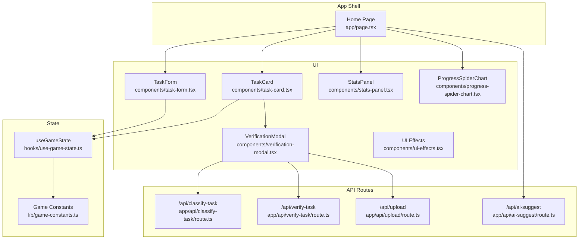
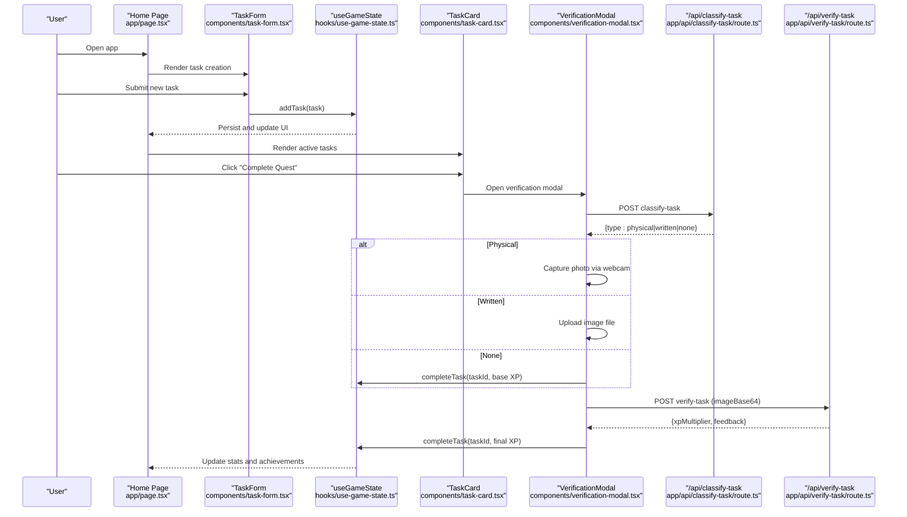
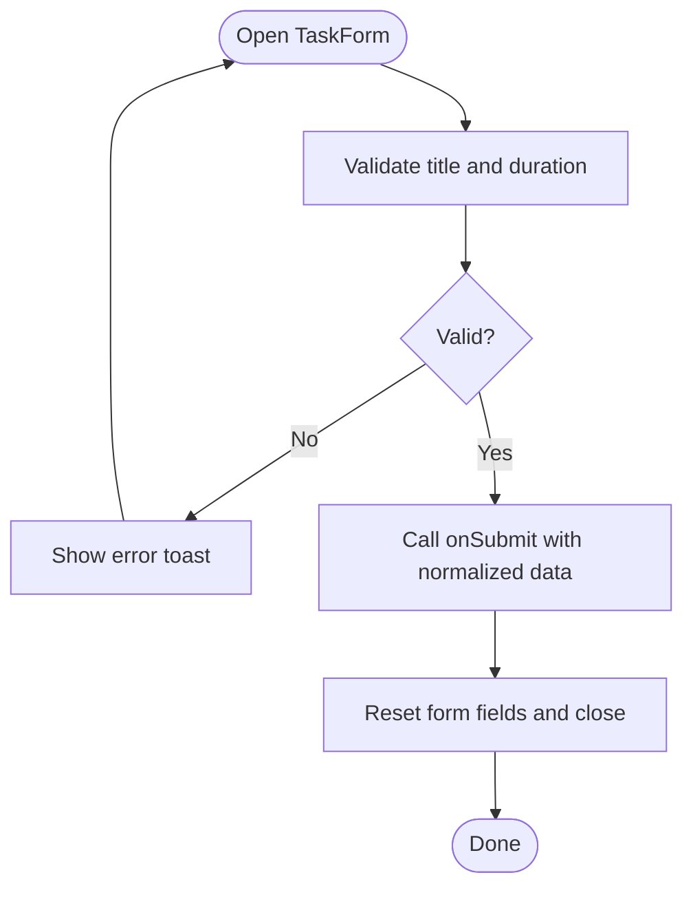
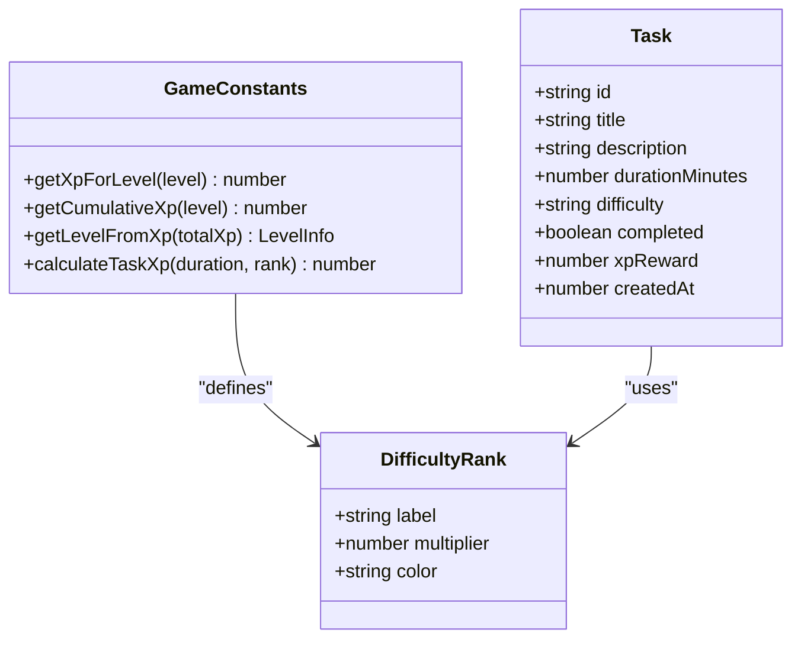
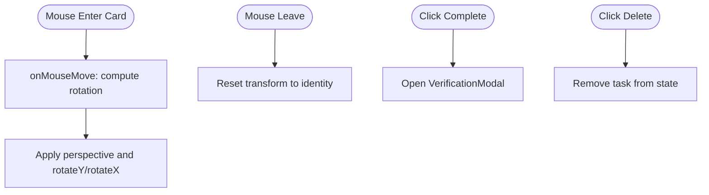
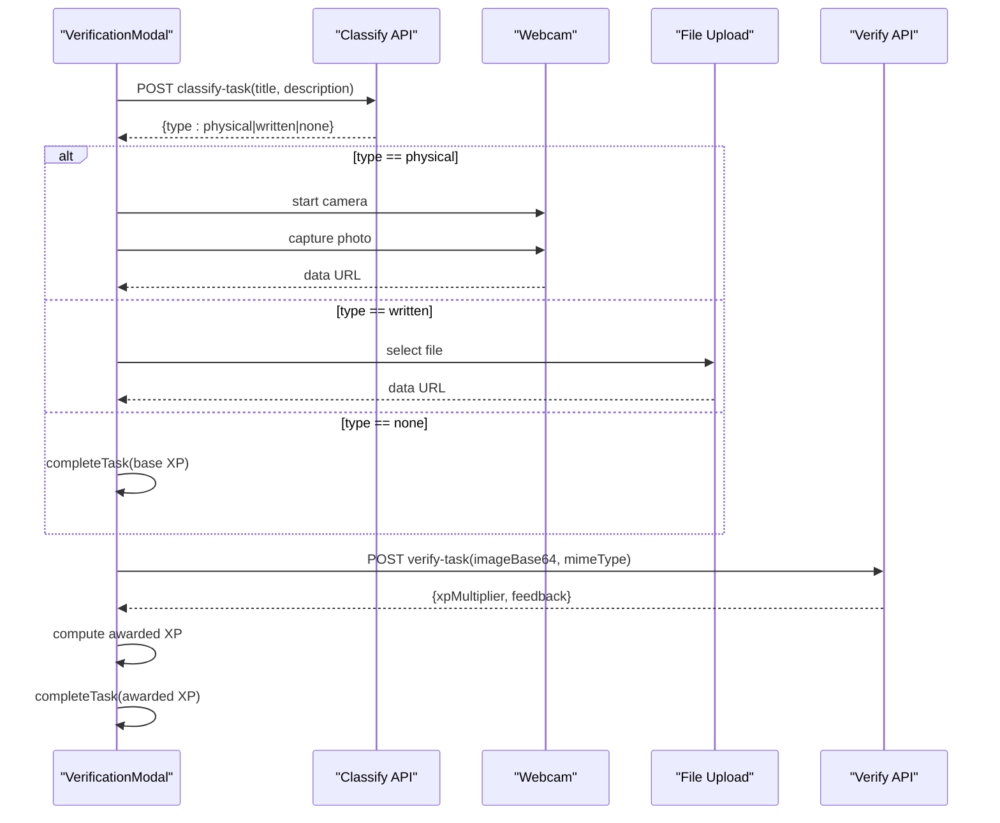
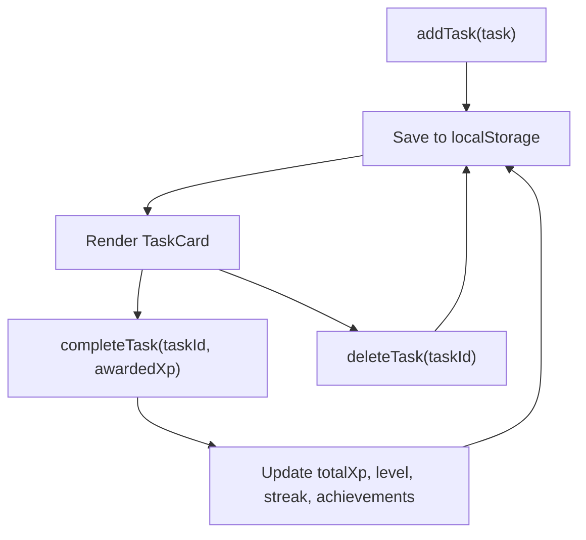
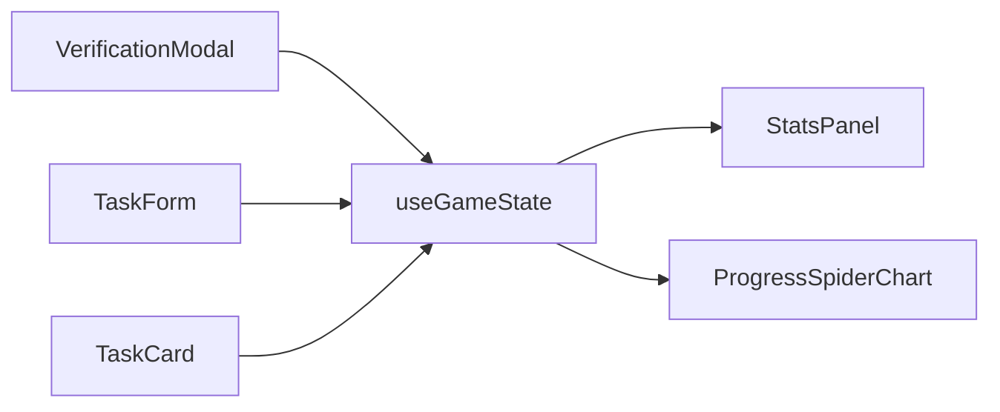
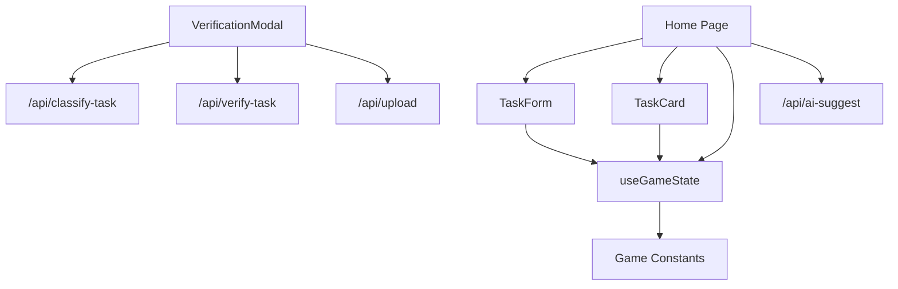

# Task Management

<cite>
**Referenced Files in This Document**
- [task-form.tsx](file://components/task-form.tsx)
- [task-card.tsx](file://components/task-card.tsx)
- [verification-modal.tsx](file://components/verification-modal.tsx)
- [use-game-state.ts](file://hooks/use-game-state.ts)
- [game-constants.ts](file://lib/game-constants.ts)
- [route.ts](file://app/api/classify-task/route.ts)
- [route.ts](file://app/api/verify-task/route.ts)
- [route.ts](file://app/api/upload/route.ts)
- [route.ts](file://app/api/ai-suggest/route.ts)
- [page.tsx](file://app/page.tsx)
- [stats-panel.tsx](file://components/stats-panel.tsx)
- [progress-spider-chart.tsx](file://components/progress-spider-chart.tsx)
- [ui-effects.tsx](file://components/ui-effects.tsx)
- [package.json](file://package.json)
</cite>

## Table of Contents
1. [Introduction](#introduction)
2. [Project Structure](#project-structure)
3. [Core Components](#core-components)
4. [Architecture Overview](#architecture-overview)
5. [Detailed Component Analysis](#detailed-component-analysis)
6. [Dependency Analysis](#dependency-analysis)
7. [Performance Considerations](#performance-considerations)
8. [Troubleshooting Guide](#troubleshooting-guide)
9. [Conclusion](#conclusion)
10. [Appendices](#appendices)

## Introduction
This document explains the task management system, covering how tasks are created and edited, difficulty ranking and XP calculation, task categorization, interactive TaskCard rendering, verification workflows, and lifecycle management from creation to completion. It also documents the API integrations for classification, verification, and AI suggestions, along with user feedback and progress visualization.

## Project Structure
The task management system spans UI components, game state management, constants, and API routes:
- UI: TaskForm, TaskCard, VerificationModal, StatsPanel, ProgressSpiderChart, UI effects
- State: useGameState hook managing tasks, stats, persistence, and achievements
- Constants: difficulty ranks, XP formulas, and achievements
- APIs: classify-task, verify-task, upload, ai-suggest

**Diagram sources**
- [page.tsx:24-384](file://app/page.tsx#L24-L384)
- [task-form.tsx:1-191](file://components/task-form.tsx#L1-L191)
- [task-card.tsx:1-186](file://components/task-card.tsx#L1-L186)
- [verification-modal.tsx:1-331](file://components/verification-modal.tsx#L1-L331)
- [use-game-state.ts:1-252](file://hooks/use-game-state.ts#L1-L252)
- [game-constants.ts:1-95](file://lib/game-constants.ts#L1-L95)
- [route.ts:1-43](file://app/api/classify-task/route.ts#L1-L43)
- [route.ts:1-55](file://app/api/verify-task/route.ts#L1-L55)
- [route.ts:1-43](file://app/api/upload/route.ts#L1-L43)
- [route.ts:1-34](file://app/api/ai-suggest/route.ts#L1-L34)

**Section sources**
- [page.tsx:24-384](file://app/page.tsx#L24-L384)
- [task-form.tsx:1-191](file://components/task-form.tsx#L1-L191)
- [task-card.tsx:1-186](file://components/task-card.tsx#L1-L186)
- [verification-modal.tsx:1-331](file://components/verification-modal.tsx#L1-L331)
- [use-game-state.ts:1-252](file://hooks/use-game-state.ts#L1-L252)
- [game-constants.ts:1-95](file://lib/game-constants.ts#L1-L95)
- [route.ts:1-43](file://app/api/classify-task/route.ts#L1-L43)
- [route.ts:1-55](file://app/api/verify-task/route.ts#L1-L55)
- [route.ts:1-43](file://app/api/upload/route.ts#L1-L43)
- [route.ts:1-34](file://app/api/ai-suggest/route.ts#L1-L34)

## Core Components
- TaskForm: Handles task creation with validation, difficulty selection, and XP multiplier preview. Emits submission events to add tasks to state.
- TaskCard: Renders individual tasks with 3D hover effects, difficulty color coding, XP display, completion status, and actions.
- VerificationModal: Guides users through task verification steps depending on classification (physical/written/none), captures images, uploads proofs, and integrates AI verification.
- useGameState: Central state for tasks and player stats, persistence to localStorage, XP/level calculations, streak tracking, and achievements.
- game-constants: Defines difficulty ranks, XP formulas, and achievements.

**Section sources**
- [task-form.tsx:18-51](file://components/task-form.tsx#L18-L51)
- [task-card.tsx:18-43](file://components/task-card.tsx#L18-L43)
- [verification-modal.tsx:18-64](file://components/verification-modal.tsx#L18-L64)
- [use-game-state.ts:127-210](file://hooks/use-game-state.ts#L127-L210)
- [game-constants.ts:1-95](file://lib/game-constants.ts#L1-L95)

## Architecture Overview
The system follows a React client with a local state store and serverless API routes. The home page orchestrates components and state, delegating verification to AI endpoints.

**Diagram sources**
- [page.tsx:270-327](file://app/page.tsx#L270-L327)
- [task-form.tsx:35-50](file://components/task-form.tsx#L35-L50)
- [use-game-state.ts:127-210](file://hooks/use-game-state.ts#L127-L210)
- [task-card.tsx:25-36](file://components/task-card.tsx#L25-L36)
- [verification-modal.tsx:39-64](file://components/verification-modal.tsx#L39-L64)
- [route.ts:8-42](file://app/api/classify-task/route.ts#L8-L42)
- [route.ts:10-50](file://app/api/verify-task/route.ts#L10-L50)

## Detailed Component Analysis

### Task Creation and Editing Workflow (TaskForm)
- Validation: Requires title and duration; shows user-facing errors via toast.
- Difficulty Rating: Uses E–S ranks from constants; displays XP multiplier preview.
- Submission: Calls parent callback with normalized data and resets form state.

**Diagram sources**
- [task-form.tsx:25-51](file://components/task-form.tsx#L25-L51)

**Section sources**
- [task-form.tsx:18-51](file://components/task-form.tsx#L18-L51)
- [game-constants.ts:1-95](file://lib/game-constants.ts#L1-L95)

### Task Categorization and Difficulty System
- Difficulty Ranks: E, D, C, B, A, S with increasing multipliers and distinct colors.
- XP Calculation: Base on duration × difficulty multiplier.
- Level Progression: Exponential XP thresholds; cumulative XP computed for level checks.

**Diagram sources**
- [game-constants.ts:1-95](file://lib/game-constants.ts#L1-L95)
- [use-game-state.ts:15-25](file://hooks/use-game-state.ts#L15-L25)

**Section sources**
- [game-constants.ts:1-95](file://lib/game-constants.ts#L1-L95)
- [use-game-state.ts:127-141](file://hooks/use-game-state.ts#L127-L141)

### TaskCard: Interactive 3D Effects, Status, and Completion
- 3D Tilt: Mouse move rotates the card for immersive feel; disabled when completed.
- Visual Cues: Difficulty-specific glow and color; XP and duration badges; completion stamp.
- Actions: Complete (opens verification), Delete (removes task), optional focus mode trigger.

**Diagram sources**
- [task-card.tsx:45-63](file://components/task-card.tsx#L45-L63)
- [task-card.tsx:177-182](file://components/task-card.tsx#L177-L182)

**Section sources**
- [task-card.tsx:18-43](file://components/task-card.tsx#L18-L43)
- [task-card.tsx:45-63](file://components/task-card.tsx#L45-L63)
- [task-card.tsx:177-182](file://components/task-card.tsx#L177-L182)

### Verification System: Classification, Image Upload, AI Evaluation
- Classification: Determines whether verification requires physical proof, written proof, or none.
- Physical Quest: Captures webcam image; converts to data URL; sends to verification endpoint.
- Written Quest: File upload; reads as data URL; sends to verification endpoint.
- AI Verification: Sends image to OpenAI; receives XP multiplier and feedback; computes awarded XP.
- Result: Claims reward with final XP and shows evaluation summary.

**Diagram sources**
- [verification-modal.tsx:39-145](file://components/verification-modal.tsx#L39-L145)
- [route.ts:8-42](file://app/api/classify-task/route.ts#L8-L42)
- [route.ts:10-50](file://app/api/verify-task/route.ts#L10-L50)

**Section sources**
- [verification-modal.tsx:18-64](file://components/verification-modal.tsx#L18-L64)
- [verification-modal.tsx:112-140](file://components/verification-modal.tsx#L112-L140)
- [route.ts:8-42](file://app/api/classify-task/route.ts#L8-L42)
- [route.ts:10-50](file://app/api/verify-task/route.ts#L10-L50)

### Task Lifecycle Management and Progress Tracking
- States: Active (not completed) vs Completed (with completion timestamp).
- Persistence: Local storage key stores tasks and stats; loaded on mount and saved on changes.
- Progress: Streak computed per day; achievements unlocked based on milestones and difficulty.
- XP Awards: Base XP calculated from task; final XP adjusted by AI multiplier; level-ups detected and toasted.

**Diagram sources**
- [use-game-state.ts:127-210](file://hooks/use-game-state.ts#L127-L210)
- [use-game-state.ts:77-82](file://hooks/use-game-state.ts#L77-L82)

**Section sources**
- [use-game-state.ts:49-82](file://hooks/use-game-state.ts#L49-L82)
- [use-game-state.ts:143-210](file://hooks/use-game-state.ts#L143-L210)

### User Feedback and Progress Visualization
- Toasts: Success/error notifications for task actions and verification outcomes.
- Stats Panel: XP, tasks completed, current streak with animated cards.
- Progress Spider Chart: Radar visualization of level, completion rate, streak, XP, and mastery metrics.

**Diagram sources**
- [stats-panel.tsx:13-144](file://components/stats-panel.tsx#L13-L144)
- [progress-spider-chart.tsx:14-217](file://components/progress-spider-chart.tsx#L14-L217)
- [use-game-state.ts:127-210](file://hooks/use-game-state.ts#L127-L210)

**Section sources**
- [stats-panel.tsx:13-144](file://components/stats-panel.tsx#L13-L144)
- [progress-spider-chart.tsx:14-217](file://components/progress-spider-chart.tsx#L14-L217)

## Dependency Analysis
- UI depends on state and constants; state persists to localStorage.
- VerificationModal depends on classification and verification APIs; both use OpenAI.
- Home page composes UI, state, and triggers AI suggestions.

**Diagram sources**
- [task-form.tsx:18-51](file://components/task-form.tsx#L18-L51)
- [task-card.tsx:18-43](file://components/task-card.tsx#L18-L43)
- [verification-modal.tsx:39-145](file://components/verification-modal.tsx#L39-L145)
- [page.tsx:270-327](file://app/page.tsx#L270-L327)
- [use-game-state.ts:127-210](file://hooks/use-game-state.ts#L127-L210)
- [game-constants.ts:1-95](file://lib/game-constants.ts#L1-L95)
- [route.ts:8-42](file://app/api/classify-task/route.ts#L8-L42)
- [route.ts:10-50](file://app/api/verify-task/route.ts#L10-L50)
- [route.ts:1-43](file://app/api/upload/route.ts#L1-L43)
- [route.ts:1-34](file://app/api/ai-suggest/route.ts#L1-L34)

**Section sources**
- [package.json:11-64](file://package.json#L11-L64)

## Performance Considerations
- UI responsiveness: 3D transforms and animations are lightweight; avoid excessive re-renders by passing memoized callbacks.
- API latency: Verification involves network requests; show loading states and disable controls during async operations.
- Storage: Local storage writes occur on state changes; batch updates where possible to reduce I/O.
- Images: Prefer compressed formats and moderate resolutions for verification to minimize payload sizes.

## Troubleshooting Guide
- Missing Required Fields: TaskForm validates title and duration; ensure both are present before submission.
- Camera Access: If camera fails, the modal falls back to file upload; check permissions and device availability.
- Verification Failure: If verification API fails, the system grants base XP and shows an error toast; retry after ensuring image clarity.
- No OpenAI Key: Mock responses are returned; configure environment variables for real AI evaluation.
- Streak Not Updating: Ensure tasks are marked completed; streak logic checks completion timestamps.

**Section sources**
- [task-form.tsx:25-33](file://components/task-form.tsx#L25-L33)
- [verification-modal.tsx:66-84](file://components/verification-modal.tsx#L66-L84)
- [verification-modal.tsx:135-139](file://components/verification-modal.tsx#L135-L139)
- [route.ts:16-22](file://app/api/verify-task/route.ts#L16-L22)

## Conclusion
The task management system blends a polished UI with robust state management and AI-driven verification. Users can quickly create tasks, visualize progress, and complete quests with engaging feedback loops. The modular design allows easy extension for new task types, verification modes, and analytics.

## Appendices

### Practical Examples
- Creating a task:
  - Open TaskForm, fill title and duration, choose difficulty, submit. Observe success toast and new task in Active Quests.
- Verifying a physical task:
  - Start verification, allow camera access, capture proof, wait for AI evaluation, claim reward.
- Verifying a written task:
  - Start verification, upload an image, wait for evaluation, claim reward.
- Progress visualization:
  - View Stats Panel and Progress Spider Chart to review XP, streaks, and completion metrics.

### API Definitions
- POST /api/classify-task
  - Body: { title, description }
  - Response: { type: "physical" | "written" | "none" }
- POST /api/verify-task
  - Body: { title, description, imageBase64, mimeType }
  - Response: { xpMultiplier: number, feedback: string }
- POST /api/upload
  - Form-Data: file (image)
  - Response: { feedback: string }
- POST /api/ai-suggest
  - Body: { progress: object }
  - Response: { suggestion: string }

**Section sources**
- [route.ts:8-42](file://app/api/classify-task/route.ts#L8-L42)
- [route.ts:10-50](file://app/api/verify-task/route.ts#L10-L50)
- [route.ts:8-42](file://app/api/upload/route.ts#L8-L42)
- [route.ts:8-32](file://app/api/ai-suggest/route.ts#L8-L32)