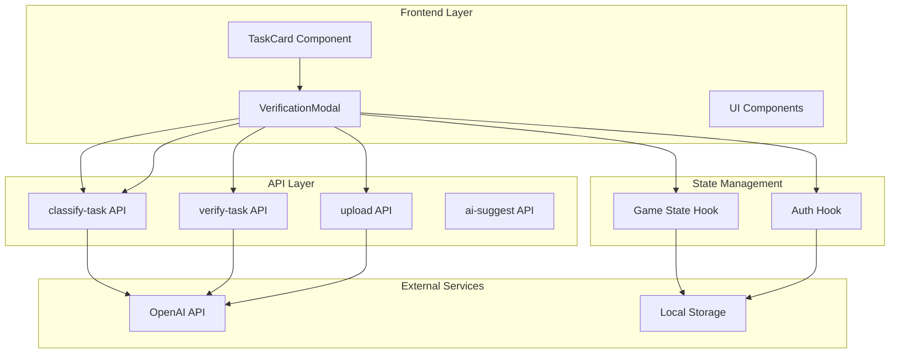
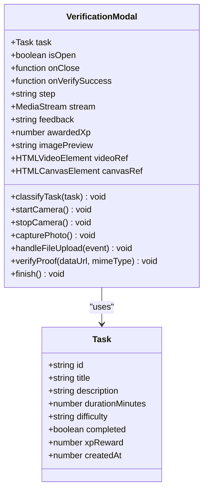
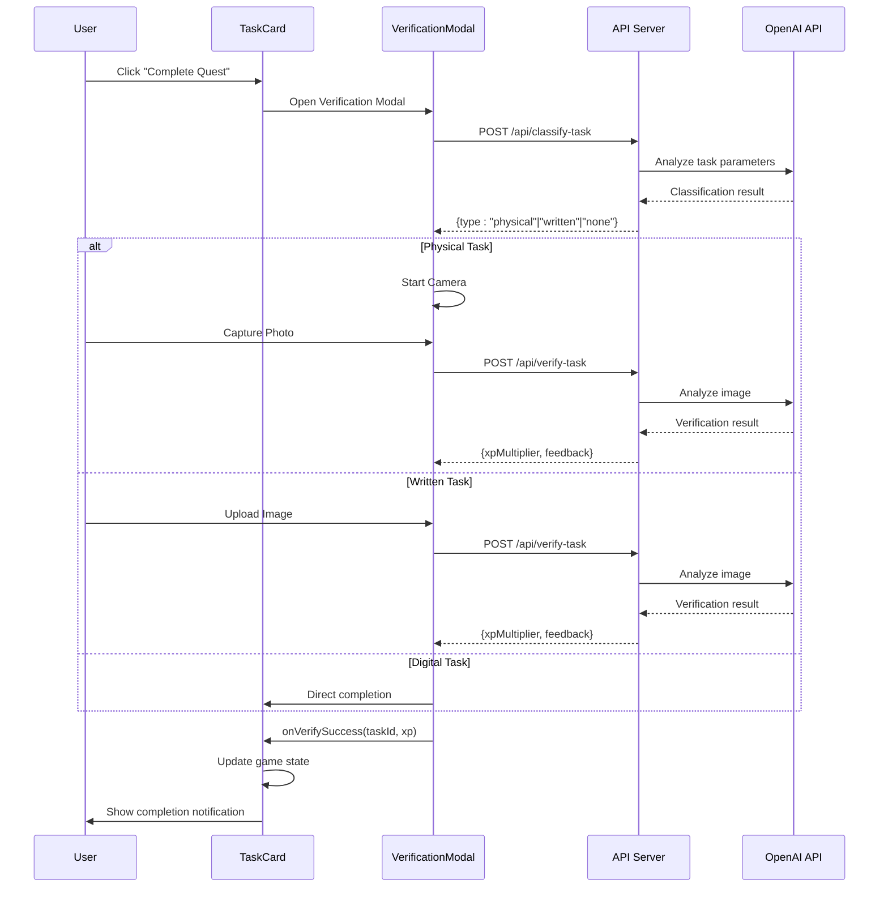
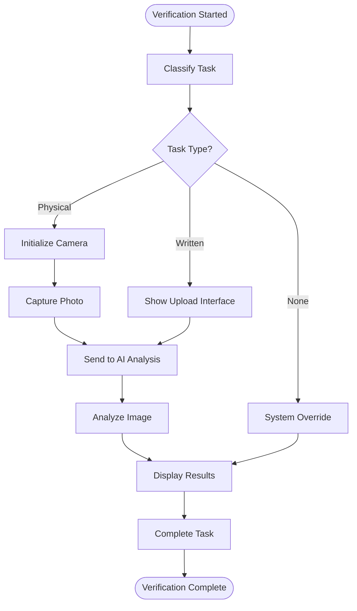
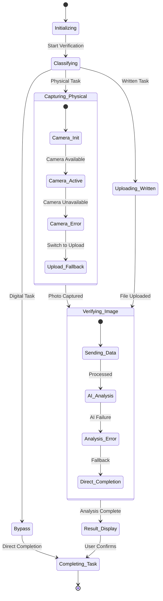

# Task Verification System

<cite>
**Referenced Files in This Document**
- [verification-modal.tsx](file://components/verification-modal.tsx)
- [task-card.tsx](file://components/task-card.tsx)
- [use-game-state.ts](file://hooks/use-game-state.ts)
- [use-auth.ts](file://hooks/use-auth.ts)
- [verify-task/route.ts](file://app/api/verify-task/route.ts)
- [classify-task/route.ts](file://app/api/classify-task/route.ts)
- [upload/route.ts](file://app/api/upload/route.ts)
- [ai-suggest/route.ts](file://app/api/ai-suggest/route.ts)
- [page.tsx](file://app/page.tsx)
- [button.tsx](file://components/ui/button.tsx)
- [game-constants.ts](file://lib/game-constants.ts)
- [package.json](file://package.json)
</cite>

## Table of Contents
1. [Introduction](#introduction)
2. [Project Structure](#project-structure)
3. [Core Components](#core-components)
4. [Architecture Overview](#architecture-overview)
5. [Detailed Component Analysis](#detailed-component-analysis)
6. [API Integration Details](#api-integration-details)
7. [Verification Workflow](#verification-workflow)
8. [UI/UX Design Elements](#uiux-design-elements)
9. [Performance Considerations](#performance-considerations)
10. [Troubleshooting Guide](#troubleshooting-guide)
11. [Conclusion](#conclusion)

## Introduction

The Task Verification System is a sophisticated gamification component that integrates AI-powered verification into a productivity and habit-tracking application. This system transforms traditional task completion into an immersive gaming experience by incorporating real-time AI analysis, visual feedback mechanisms, and dynamic XP reward systems.

The system operates through a multi-step verification process that adapts to different task types (physical, written/digital, or bypass scenarios). It leverages OpenAI's GPT models for intelligent task classification and verification, while providing users with engaging visual feedback and immediate XP rewards based on their performance quality.

## Project Structure

The verification system is built around several key architectural layers:



**Diagram sources**
- [verification-modal.tsx:1-331](file://components/verification-modal.tsx#L1-L331)
- [task-card.tsx:1-186](file://components/task-card.tsx#L1-L186)
- [use-game-state.ts:1-252](file://hooks/use-game-state.ts#L1-L252)

**Section sources**
- [verification-modal.tsx:1-331](file://components/verification-modal.tsx#L1-L331)
- [task-card.tsx:1-186](file://components/task-card.tsx#L1-L186)
- [use-game-state.ts:1-252](file://hooks/use-game-state.ts#L1-L252)

## Core Components

### VerificationModal Component

The VerificationModal serves as the primary interface for the verification system, providing an immersive experience with multiple verification modes:

**Key Features:**
- **Multi-step Verification Process**: Classifies tasks, captures physical proof, accepts written submissions, and displays AI analysis results
- **Adaptive UI**: Dynamically adjusts based on task type and verification stage
- **Real-time Feedback**: Provides instant visual and textual feedback throughout the process
- **Camera Integration**: Supports webcam capture for physical task verification
- **Image Preview**: Allows users to review submitted proof before finalization

**Component Architecture:**


**Diagram sources**
- [verification-modal.tsx:9-331](file://components/verification-modal.tsx#L9-L331)
- [use-game-state.ts:15-25](file://hooks/use-game-state.ts#L15-L25)

**Section sources**
- [verification-modal.tsx:18-331](file://components/verification-modal.tsx#L18-L331)

### TaskCard Integration

The TaskCard component acts as the entry point for the verification workflow, providing seamless integration with the broader game system:

**Integration Features:**
- **Event Propagation**: Passes verification results back to the parent component
- **Visual Feedback**: Updates task status and displays completion notifications
- **State Management**: Coordinates with game state for XP distribution and achievement tracking
- **3D Effects**: Implements interactive 3D transformations for enhanced user experience

**Section sources**
- [task-card.tsx:18-186](file://components/task-card.tsx#L18-L186)

## Architecture Overview

The verification system follows a client-server architecture with AI-powered processing:



**Diagram sources**
- [verification-modal.tsx:39-140](file://components/verification-modal.tsx#L39-L140)
- [task-card.tsx:25-36](file://components/task-card.tsx#L25-L36)

## Detailed Component Analysis

### VerificationModal Implementation

The VerificationModal implements a sophisticated state machine with five distinct verification stages:

**State Management:**
- **Classifying**: Initial AI analysis of task parameters
- **Capture Physical**: Webcam-based proof capture for physical tasks
- **Upload Written**: File upload interface for written/digital tasks
- **Verifying**: AI analysis of submitted proof
- **Result**: Display of verification results and XP awards

**Interactive Elements:**


**Diagram sources**
- [verification-modal.tsx:39-140](file://components/verification-modal.tsx#L39-L140)

**Section sources**
- [verification-modal.tsx:18-331](file://components/verification-modal.tsx#L18-L331)

### Camera Integration and Image Processing

The system provides robust camera support for physical task verification:

**Camera Features:**
- **Device Access**: Secure camera initialization with error handling
- **Real-time Preview**: Live video feed with visual indicators
- **Photo Capture**: Canvas-based image capture with JPEG compression
- **Fallback Mechanism**: Automatic switch to file upload if camera fails

**Image Processing Pipeline:**


**Diagram sources**
- [verification-modal.tsx:66-97](file://components/verification-modal.tsx#L66-L97)

**Section sources**
- [verification-modal.tsx:66-97](file://components/verification-modal.tsx#L66-L97)

### AI-Powered Verification Engine

The verification system leverages OpenAI's GPT models for intelligent analysis:

**Verification Capabilities:**
- **Task Classification**: Determines appropriate verification method based on task characteristics
- **Proof Analysis**: Evaluates submitted evidence for authenticity and completeness
- **XP Multiplier Calculation**: Provides dynamic XP rewards based on proof quality
- **Character-Driven Feedback**: Delivers engaging, in-universe responses

**Section sources**
- [verify-task/route.ts:8-55](file://app/api/verify-task/route.ts#L8-L55)
- [classify-task/route.ts:8-43](file://app/api/classify-task/route.ts#L8-L43)

## API Integration Details

### Verification Endpoint (/api/verify-task)

The `/api/verify-task` endpoint serves as the core verification service:

**Request Format:**
```json
{
  "title": "string",
  "description": "string",
  "imageBase64": "string",
  "mimeType": "string"
}
```

**Response Format:**
```json
{
  "xpMultiplier": 1.5,
  "feedback": "string"
}
```

**Authentication Requirements:**
- No authentication required for local development
- Requires OpenAI API key in production environment

**Error Handling:**
- Returns 400 for missing image data
- Returns 500 for AI processing errors
- Provides graceful fallback with mock responses

**Section sources**
- [verify-task/route.ts:8-55](file://app/api/verify-task/route.ts#L8-L55)

### Task Classification Endpoint (/api/classify-task)

The classification system determines the appropriate verification method:

**Classification Logic:**
- **Physical Tasks**: Workouts, exercises, physical activities
- **Written Tasks**: Reading, writing, coding, studying
- **Digital Tasks**: Tasks requiring no visual proof

**Section sources**
- [classify-task/route.ts:8-43](file://app/api/classify-task/route.ts#L8-L43)

### Upload Endpoint (/api/upload)

The upload endpoint provides alternative AI analysis for proof images:

**Section sources**
- [upload/route.ts:8-43](file://app/api/upload/route.ts#L8-L43)

## Verification Workflow

### Complete Verification Process

The verification workflow encompasses multiple stages with comprehensive error handling:



**Diagram sources**
- [verification-modal.tsx:28-140](file://components/verification-modal.tsx#L28-L140)

### Success Scenarios

**Successful Physical Verification:**
1. Camera initializes successfully
2. User captures clear photo of physical activity
3. AI confirms authenticity and quality
4. User receives appropriate XP multiplier
5. Task marked as completed in game state

**Successful Written Verification:**
1. User uploads clear screenshot/document
2. AI analyzes content and context
3. System provides encouraging feedback
4. XP distributed based on quality assessment

### Common Failure Cases

**Camera Issues:**
- Permission denied by browser
- Camera device unavailable
- Browser compatibility issues
- Fallback to file upload mechanism

**AI Analysis Failures:**
- OpenAI API key not configured
- Network connectivity issues
- Image quality insufficient for analysis
- Mock system activation for development

**Section sources**
- [verification-modal.tsx:59-64](file://components/verification-modal.tsx#L59-L64)
- [verification-modal.tsx:73-76](file://components/verification-modal.tsx#L73-L76)

## UI/UX Design Elements

### Visual Feedback System

The verification system employs a comprehensive visual feedback mechanism:

**Progress Indicators:**
- **Scan Line Effect**: Animated scanning overlay during verification
- **Pulsing Animations**: Visual cues for active states
- **Gradient Borders**: Dynamic color transitions based on verification status
- **3D Transformations**: Interactive elements with depth effects

**Color Scheme:**
- **Purple/Cyan Theme**: Consistent with game branding
- **Dynamic Glowing Effects**: Visual emphasis on important actions
- **Transparent Glass Effects**: Modern UI aesthetic

**Section sources**
- [verification-modal.tsx:149-331](file://components/verification-modal.tsx#L149-L331)

### Interactive Elements

**Button System:**
- **Custom Button Component**: Enhanced with ripple effects and animations
- **Gradient Backgrounds**: Visual hierarchy indication
- **Hover States**: Responsive feedback for user interactions

**Section sources**
- [button.tsx:44-101](file://components/ui/button.tsx#L44-L101)

## Performance Considerations

### Optimization Strategies

**Client-Side Optimizations:**
- **Lazy Loading**: Images and components loaded on demand
- **Memory Management**: Proper cleanup of camera streams and event listeners
- **State Optimization**: Efficient state updates to minimize re-renders

**API Performance:**
- **Request Batching**: Consolidated API calls where possible
- **Error Caching**: Graceful degradation with cached responses
- **Timeout Handling**: Configurable timeouts for external API calls

**Section sources**
- [verification-modal.tsx:79-84](file://components/verification-modal.tsx#L79-L84)

## Troubleshooting Guide

### Common Issues and Solutions

**Camera Not Working:**
1. **Permission Denied**: Check browser permissions for camera access
2. **Device Issues**: Verify camera hardware and drivers
3. **HTTPS Requirement**: Ensure application runs over HTTPS for camera access
4. **Fallback Method**: System automatically switches to file upload mode

**AI Analysis Failures:**
1. **API Key Configuration**: Verify OPENAI_API_KEY environment variable
2. **Network Connectivity**: Test internet connection stability
3. **Rate Limiting**: Check for API quota limits
4. **Mock Mode**: System falls back to mock responses for development

**Image Upload Problems:**
1. **File Size Limits**: Ensure images under 10MB limit
2. **Format Compatibility**: Support for PNG, JPG, JPEG formats
3. **Browser Compatibility**: Test with supported browsers
4. **Memory Issues**: Clear browser cache if experiencing memory problems

**Section sources**
- [verification-modal.tsx:73-76](file://components/verification-modal.tsx#L73-L76)
- [verify-task/route.ts:16-22](file://app/api/verify-task/route.ts#L16-L22)

### Development Environment Setup

**Required Dependencies:**
- OpenAI SDK for TypeScript integration
- React hooks for state management
- Tailwind CSS for styling framework
- Lucide React for iconography

**Environment Variables:**
- OPENAI_API_KEY: Required for AI-powered features
- NEXT_PUBLIC_SITE_NAME: Application branding configuration

**Section sources**
- [package.json:53-64](file://package.json#L53-L64)

## Conclusion

The Task Verification System represents a comprehensive solution that seamlessly integrates AI-powered verification into a gamified productivity platform. Through its multi-modal approach, adaptive UI, and robust error handling, it provides users with an engaging and rewarding experience while maintaining technical reliability.

The system's modular architecture ensures scalability and maintainability, while its immersive design elements create a compelling user experience that encourages continued engagement. The integration with the broader game ecosystem demonstrates thoughtful consideration of user progression and achievement systems.

Future enhancements could include expanded AI capabilities, additional verification methods, and enhanced analytics for user behavior insights. The current implementation provides a solid foundation for these potential improvements while delivering a polished user experience today.