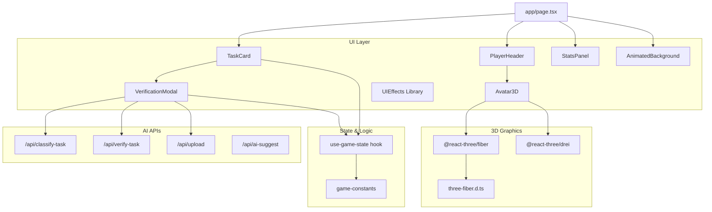
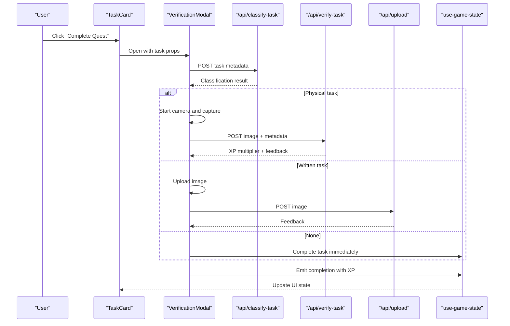
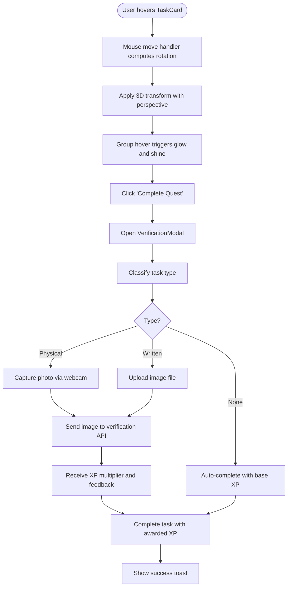
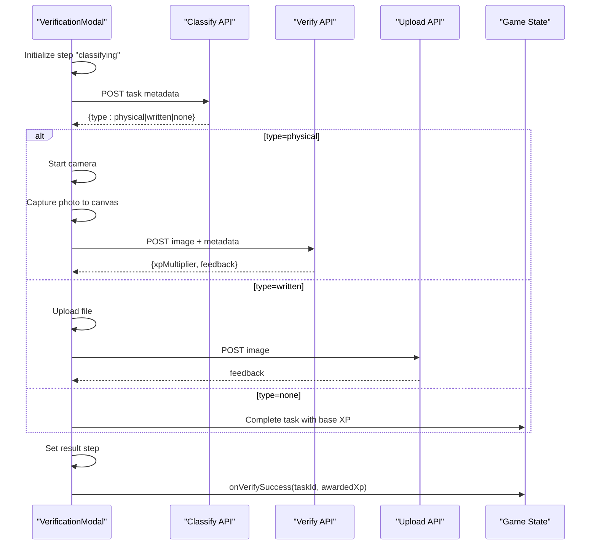
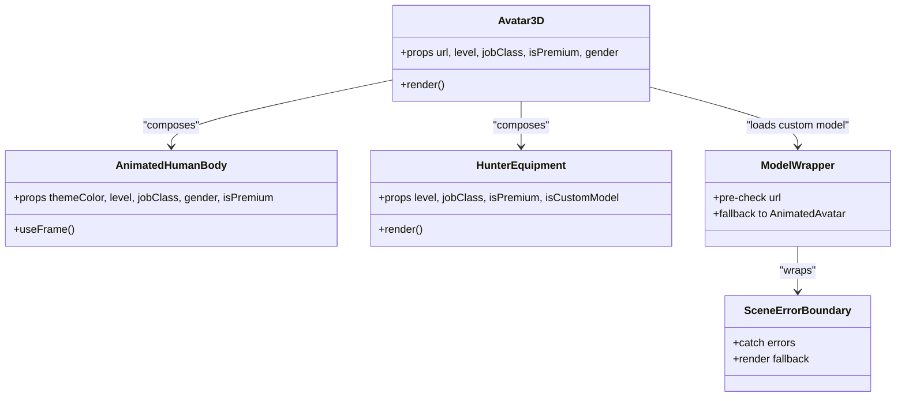
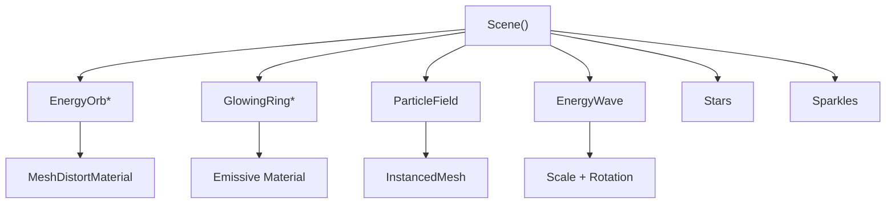
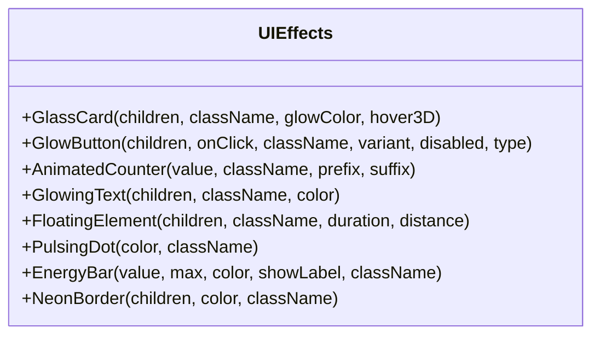
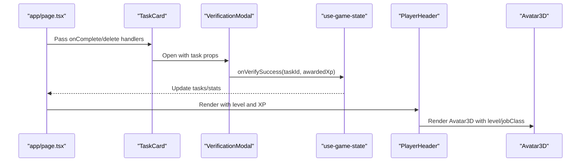
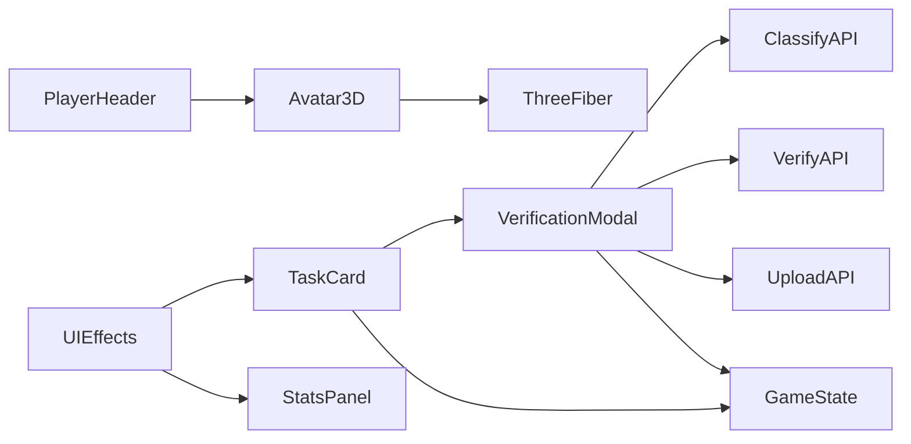

# Interactive Elements and Effects

<cite>
**Referenced Files in This Document**
- [task-card.tsx](file://components/task-card.tsx)
- [verification-modal.tsx](file://components/verification-modal.tsx)
- [avatar-3d.tsx](file://components/avatar-3d.tsx)
- [animated-background.tsx](file://components/animated-background.tsx)
- [ui-effects.tsx](file://components/ui-effects.tsx)
- [use-game-state.ts](file://hooks/use-game-state.ts)
- [game-constants.ts](file://lib/game-constants.ts)
- [route.ts](file://app/api/classify-task/route.ts)
- [route.ts](file://app/api/verify-task/route.ts)
- [route.ts](file://app/api/upload/route.ts)
- [route.ts](file://app/api/ai-suggest/route.ts)
- [page.tsx](file://app/page.tsx)
- [player-header.tsx](file://components/player-header.tsx)
- [stats-panel.tsx](file://components/stats-panel.tsx)
- [three-fiber.d.ts](file://types/three-fiber.d.ts)
</cite>

## Table of Contents
1. [Introduction](#introduction)
2. [Project Structure](#project-structure)
3. [Core Components](#core-components)
4. [Architecture Overview](#architecture-overview)
5. [Detailed Component Analysis](#detailed-component-analysis)
6. [Dependency Analysis](#dependency-analysis)
7. [Performance Considerations](#performance-considerations)
8. [Troubleshooting Guide](#troubleshooting-guide)
9. [Conclusion](#conclusion)

## Introduction
This document focuses on interactive UI elements and visual effects across the application’s task management and avatar systems. It covers:
- TaskCard: 3D transformations, hover states, click interactions, and task verification workflows
- VerificationModal: image upload integration, AI-powered verification, and modal state management
- Avatar3D: Three.js integration, interactive 3D models, and animation systems
- AnimatedBackground: particle systems, gradient animations, and performance optimization
- UIEffects: reusable component library for custom animations, transitions, and visual enhancements
It also explains component composition patterns, event handling, state synchronization, and integration with the 3D graphics system, with examples of interactive behaviors, accessibility considerations, and performance optimization techniques.

## Project Structure
The interactive UI and visual effects are implemented primarily in the components directory, integrated with game state hooks and API routes for AI classification and verification. The main application page orchestrates these components and manages state synchronization.

**Diagram sources**
- [page.tsx:24-384](file://app/page.tsx#L24-L384)
- [task-card.tsx:18-186](file://components/task-card.tsx#L18-L186)
- [verification-modal.tsx:18-331](file://components/verification-modal.tsx#L18-L331)
- [avatar-3d.tsx:1304-1361](file://components/avatar-3d.tsx#L1304-L1361)
- [animated-background.tsx:178-209](file://components/animated-background.tsx#L178-L209)
- [player-header.tsx:16-183](file://components/player-header.tsx#L16-L183)
- [stats-panel.tsx:13-145](file://components/stats-panel.tsx#L13-L145)
- [use-game-state.ts:51-252](file://hooks/use-game-state.ts#L51-L252)
- [game-constants.ts:1-95](file://lib/game-constants.ts#L1-L95)
- [route.ts:1-43](file://app/api/classify-task/route.ts#L1-L43)
- [route.ts:1-55](file://app/api/verify-task/route.ts#L1-L55)
- [route.ts:1-43](file://app/api/upload/route.ts#L1-L43)
- [route.ts:1-34](file://app/api/ai-suggest/route.ts#L1-L34)
- [three-fiber.d.ts:1-8](file://types/three-fiber.d.ts#L1-L8)

**Section sources**
- [page.tsx:24-384](file://app/page.tsx#L24-L384)
- [task-card.tsx:18-186](file://components/task-card.tsx#L18-L186)
- [verification-modal.tsx:18-331](file://components/verification-modal.tsx#L18-L331)
- [avatar-3d.tsx:1304-1361](file://components/avatar-3d.tsx#L1304-L1361)
- [animated-background.tsx:178-209](file://components/animated-background.tsx#L178-L209)
- [player-header.tsx:16-183](file://components/player-header.tsx#L16-L183)
- [stats-panel.tsx:13-145](file://components/stats-panel.tsx#L13-L145)
- [use-game-state.ts:51-252](file://hooks/use-game-state.ts#L51-L252)
- [game-constants.ts:1-95](file://lib/game-constants.ts#L1-L95)
- [route.ts:1-43](file://app/api/classify-task/route.ts#L1-L43)
- [route.ts:1-55](file://app/api/verify-task/route.ts#L1-L55)
- [route.ts:1-43](file://app/api/upload/route.ts#L1-L43)
- [route.ts:1-34](file://app/api/ai-suggest/route.ts#L1-L34)
- [three-fiber.d.ts:1-8](file://types/three-fiber.d.ts#L1-L8)

## Core Components
- TaskCard: Renders individual tasks with difficulty-aware styling, 3D tilt hover effects, and triggers the VerificationModal for completion verification. It integrates with the game state to mark tasks complete and emit XP rewards.
- VerificationModal: Manages a multi-step verification workflow (classification, capture/upload, AI verification, result), handles camera access, image preview, and communicates with backend APIs for classification and verification.
- Avatar3D: A fully interactive 3D avatar renderer using Three.js and @react-three/fiber with procedural animations, equipment, and premium effects. Includes fallback rendering and error boundaries.
- AnimatedBackground: A layered animated background featuring floating orbs, rings, particle fields, and gradient overlays with performance-conscious rendering.
- UIEffects: A library of reusable UI components offering glass cards, glow buttons, animated counters, glowing text, floating elements, pulsing dots, energy bars, and neon borders.

**Section sources**
- [task-card.tsx:18-186](file://components/task-card.tsx#L18-L186)
- [verification-modal.tsx:18-331](file://components/verification-modal.tsx#L18-L331)
- [avatar-3d.tsx:1304-1361](file://components/avatar-3d.tsx#L1304-L1361)
- [animated-background.tsx:178-209](file://components/animated-background.tsx#L178-L209)
- [ui-effects.tsx:13-284](file://components/ui-effects.tsx#L13-L284)

## Architecture Overview
The system follows a React + Three.js architecture with a clear separation of concerns:
- UI components manage presentation and interactions
- Hooks encapsulate game state and persistence
- API routes integrate with OpenAI for classification and verification
- Three.js renders interactive 3D scenes with @react-three/fiber and @react-three/drei

**Diagram sources**
- [task-card.tsx:25-43](file://components/task-card.tsx#L25-L43)
- [verification-modal.tsx:39-145](file://components/verification-modal.tsx#L39-L145)
- [route.ts:8-42](file://app/api/classify-task/route.ts#L8-L42)
- [route.ts:8-54](file://app/api/verify-task/route.ts#L8-L54)
- [route.ts:8-42](file://app/api/upload/route.ts#L8-L42)
- [use-game-state.ts:143-210](file://hooks/use-game-state.ts#L143-L210)

## Detailed Component Analysis

### TaskCard: 3D Transformations, Hover States, Click Interactions, and Verification Workflow
- 3D Tilt Effect: On mouse move, calculates rotation deltas and applies perspective transforms with scale3d for immersive depth.
- Hover States: Uses group hover classes to animate glow borders, background gradients, and shine overlays.
- Click Interactions: Triggers the VerificationModal for task completion; deletes tasks with user feedback.
- Verification Workflow: Opens the modal, which classifies the task type, captures or uploads proof, verifies via AI, and updates game state with XP.

**Diagram sources**
- [task-card.tsx:46-63](file://components/task-card.tsx#L46-L63)
- [task-card.tsx:154-173](file://components/task-card.tsx#L154-L173)
- [verification-modal.tsx:39-145](file://components/verification-modal.tsx#L39-L145)

**Section sources**
- [task-card.tsx:18-186](file://components/task-card.tsx#L18-L186)
- [verification-modal.tsx:18-331](file://components/verification-modal.tsx#L18-L331)
- [use-game-state.ts:143-210](file://hooks/use-game-state.ts#L143-L210)

### VerificationModal: Image Upload Integration, AI Verification, and Modal State Management
- Multi-step State Machine: classifying → capture_physical → upload_written → verifying → result
- Camera Access: Starts camera on mount; gracefully falls back to file upload on failure
- Image Preview: Renders captured or uploaded images with animated overlays
- AI Integration: Calls classification and verification APIs; displays feedback and XP multiplier
- Result Handling: Computes awarded XP, emits success callback, and closes modal

**Diagram sources**
- [verification-modal.tsx:18-331](file://components/verification-modal.tsx#L18-L331)
- [route.ts:8-42](file://app/api/classify-task/route.ts#L8-L42)
- [route.ts:8-54](file://app/api/verify-task/route.ts#L8-L54)
- [route.ts:8-42](file://app/api/upload/route.ts#L8-L42)
- [use-game-state.ts:143-210](file://hooks/use-game-state.ts#L143-L210)

**Section sources**
- [verification-modal.tsx:18-331](file://components/verification-modal.tsx#L18-L331)
- [route.ts:8-42](file://app/api/classify-task/route.ts#L8-L42)
- [route.ts:8-54](file://app/api/verify-task/route.ts#L8-L54)
- [route.ts:8-42](file://app/api/upload/route.ts#L8-L42)

### Avatar3D: Three.js Integration, Interactive Models, and Animation Systems
- Three.js Integration: Uses @react-three/fiber Canvas and @react-three/drei primitives for rendering
- Procedural Avatar: Builds a human-like body with gender-specific proportions, skin/hair/eye colors, and level-based scaling
- Equipment and Effects: Adds themed weapons, armor, and premium sparkles based on job class and level
- Animations: Implements breathing, head sway, arm swing, eye glow pulses, and floating motion
- Error Handling: Provides fallback avatar, GLTF loading error boundary, and model pre-checks
- HUD and Environment: Renders level tag, screen effects, lighting, shadows, and environment presets

**Diagram sources**
- [avatar-3d.tsx:1304-1361](file://components/avatar-3d.tsx#L1304-L1361)
- [avatar-3d.tsx:18-556](file://components/avatar-3d.tsx#L18-L556)
- [avatar-3d.tsx:561-1094](file://components/avatar-3d.tsx#L561-L1094)
- [avatar-3d.tsx:1210-1266](file://components/avatar-3d.tsx#L1210-L1266)
- [avatar-3d.tsx:1191-1205](file://components/avatar-3d.tsx#L1191-L1205)

**Section sources**
- [avatar-3d.tsx:18-1361](file://components/avatar-3d.tsx#L18-L1361)
- [three-fiber.d.ts:1-8](file://types/three-fiber.d.ts#L1-L8)

### AnimatedBackground: Particle Systems, Gradient Animations, and Performance Optimization
- Floating Orbs: Sine/cosine motion with distortion materials and emissive glows
- Glowing Rings: Rotating torus geometries with emissive materials
- Particle Field: InstancedMesh with per-particle matrix updates for efficient rendering
- Energy Waves: Scaling circle geometries for ambient effects
- Performance: Canvas with device pixel ratio tuning, alpha transparency, and selective animations

**Diagram sources**
- [animated-background.tsx:128-176](file://components/animated-background.tsx#L128-L176)
- [animated-background.tsx:8-100](file://components/animated-background.tsx#L8-L100)
- [animated-background.tsx:102-125](file://components/animated-background.tsx#L102-L125)

**Section sources**
- [animated-background.tsx:1-209](file://components/animated-background.tsx#L1-L209)

### UIEffects: Component Library for Animations and Transitions
- GlassCard: 3D hover tilt with glow and inner shine
- GlowButton: Variant-based gradients, glow, and hover/scale transitions
- AnimatedCounter: Numeric animation container
- GlowingText: Drop-shadow glow with color variants
- FloatingElement: CSS-driven float animation
- PulsingDot: Ping animation with dot indicator
- EnergyBar: Animated fill with shimmer and label support
- NeonBorder: Conic gradient animated border

**Diagram sources**
- [ui-effects.tsx:13-284](file://components/ui-effects.tsx#L13-L284)

**Section sources**
- [ui-effects.tsx:13-284](file://components/ui-effects.tsx#L13-L284)

### Composition Patterns, Event Handling, and State Synchronization
- Composition: TaskCard composes VerificationModal; PlayerHeader composes Avatar3D; app/page orchestrates all UI components and state hooks
- Event Handling: Mouse move/leave for 3D tilt; click handlers for actions; useEffect for lifecycle and cleanup
- State Synchronization: use-game-state persists to localStorage and updates XP/level; VerificationModal emits completion callbacks; UIEffects provide reusable interactive elements

**Diagram sources**
- [page.tsx:34-161](file://app/page.tsx#L34-L161)
- [task-card.tsx:18-186](file://components/task-card.tsx#L18-L186)
- [verification-modal.tsx:18-331](file://components/verification-modal.tsx#L18-L331)
- [use-game-state.ts:51-252](file://hooks/use-game-state.ts#L51-L252)
- [player-header.tsx:16-183](file://components/player-header.tsx#L16-L183)
- [avatar-3d.tsx:1304-1361](file://components/avatar-3d.tsx#L1304-L1361)

**Section sources**
- [page.tsx:24-384](file://app/page.tsx#L24-L384)
- [task-card.tsx:18-186](file://components/task-card.tsx#L18-L186)
- [verification-modal.tsx:18-331](file://components/verification-modal.tsx#L18-L331)
- [use-game-state.ts:51-252](file://hooks/use-game-state.ts#L51-L252)
- [player-header.tsx:16-183](file://components/player-header.tsx#L16-L183)
- [avatar-3d.tsx:1304-1361](file://components/avatar-3d.tsx#L1304-L1361)

## Dependency Analysis
- Internal Dependencies:
  - TaskCard depends on VerificationModal, game constants, and use-game-state
  - VerificationModal depends on API routes and game state
  - Avatar3D depends on @react-three/fiber and @react-three/drei
  - UIEffects provides reusable components consumed across the app
- External Dependencies:
  - OpenAI APIs for classification and verification
  - Local storage for game state persistence

**Diagram sources**
- [task-card.tsx:18-186](file://components/task-card.tsx#L18-L186)
- [verification-modal.tsx:18-331](file://components/verification-modal.tsx#L18-L331)
- [avatar-3d.tsx:1304-1361](file://components/avatar-3d.tsx#L1304-L1361)
- [ui-effects.tsx:13-284](file://components/ui-effects.tsx#L13-L284)
- [route.ts:1-43](file://app/api/classify-task/route.ts#L1-L43)
- [route.ts:1-55](file://app/api/verify-task/route.ts#L1-L55)
- [route.ts:1-43](file://app/api/upload/route.ts#L1-L43)
- [use-game-state.ts:51-252](file://hooks/use-game-state.ts#L51-L252)

**Section sources**
- [task-card.tsx:18-186](file://components/task-card.tsx#L18-L186)
- [verification-modal.tsx:18-331](file://components/verification-modal.tsx#L18-L331)
- [avatar-3d.tsx:1304-1361](file://components/avatar-3d.tsx#L1304-L1361)
- [ui-effects.tsx:13-284](file://components/ui-effects.tsx#L13-L284)
- [route.ts:1-43](file://app/api/classify-task/route.ts#L1-L43)
- [route.ts:1-55](file://app/api/verify-task/route.ts#L1-L55)
- [route.ts:1-43](file://app/api/upload/route.ts#L1-L43)
- [use-game-state.ts:51-252](file://hooks/use-game-state.ts#L51-L252)

## Performance Considerations
- Three.js Rendering:
  - Use device pixel ratio tuning and alpha transparency to balance quality and performance
  - Prefer instancing (InstancedMesh) for large particle fields
  - Limit emissive intensity and distort settings to reduce GPU load
- UI Animations:
  - Use CSS transitions and transforms for 3D tilt and hover effects
  - Avoid heavy JavaScript computations in mousemove handlers; throttle if needed
- API Calls:
  - Implement timeouts and fallbacks for camera and AI requests
  - Cache classification results where appropriate
- State Persistence:
  - Persist game state to localStorage efficiently and debounce writes

[No sources needed since this section provides general guidance]

## Troubleshooting Guide
- Camera Access Issues:
  - The modal stops camera streams on close and shows user-friendly errors; fallback to file upload is automatic
- Verification Failures:
  - On verification errors, the system falls back to awarding base XP and closes the modal
- GLTF Model Loading:
  - ModelWrapper performs pre-flight checks and falls back to AnimatedAvatar on load errors
- Local Storage:
  - use-game-state handles parse failures and continues with defaults

**Section sources**
- [verification-modal.tsx:79-84](file://components/verification-modal.tsx#L79-L84)
- [verification-modal.tsx:135-139](file://components/verification-modal.tsx#L135-L139)
- [avatar-3d.tsx:1215-1252](file://components/avatar-3d.tsx#L1215-L1252)
- [avatar-3d.tsx:1258-1265](file://components/avatar-3d.tsx#L1258-L1265)
- [use-game-state.ts:62-75](file://hooks/use-game-state.ts#L62-L75)

## Conclusion
The interactive UI and visual effects are built with a cohesive architecture combining React components, Three.js rendering, and AI-powered workflows. TaskCard and VerificationModal deliver a seamless task completion experience with robust state synchronization and graceful error handling. Avatar3D provides an immersive, customizable 3D avatar with rich animations and performance-conscious rendering. AnimatedBackground and UIEffects enhance the user experience with polished animations and reusable components. Together, these elements create a visually engaging and performant application.