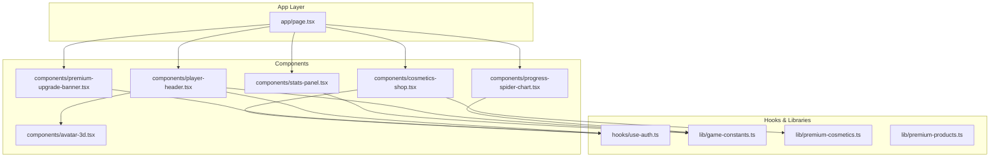
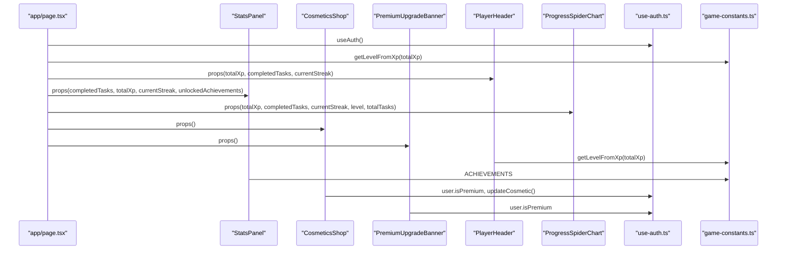
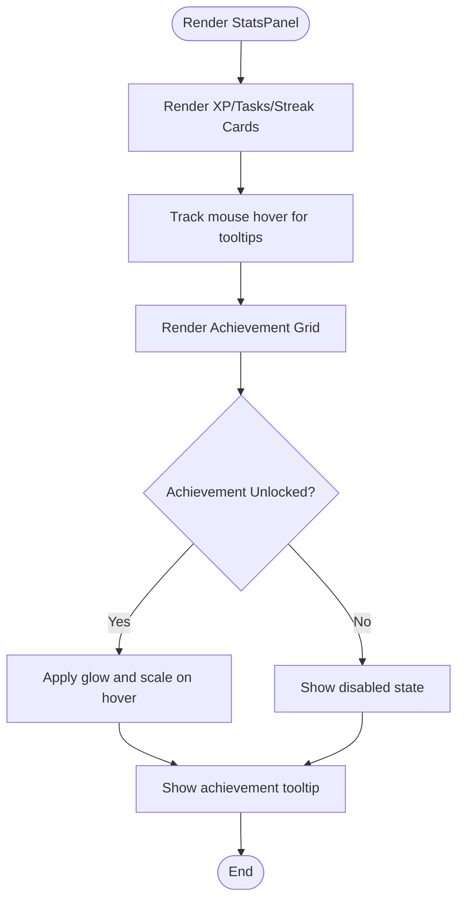
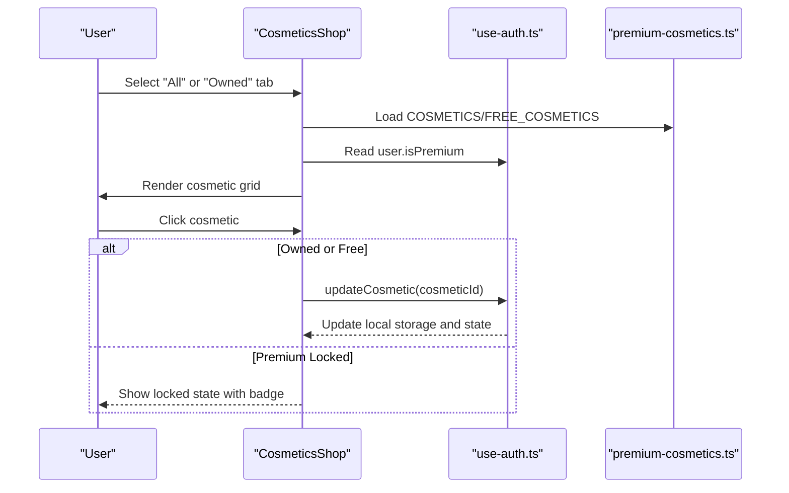
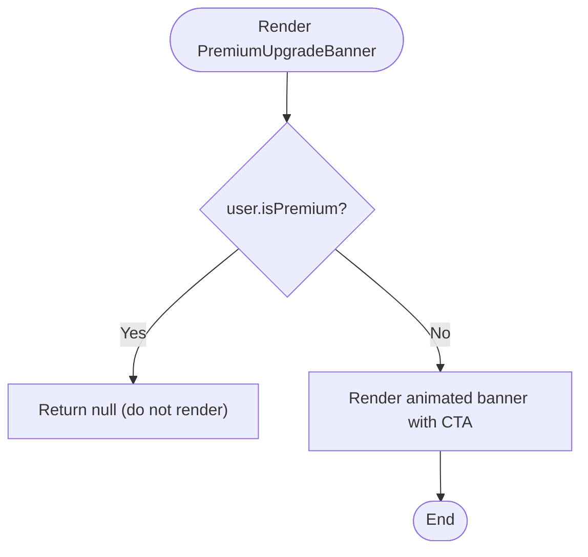
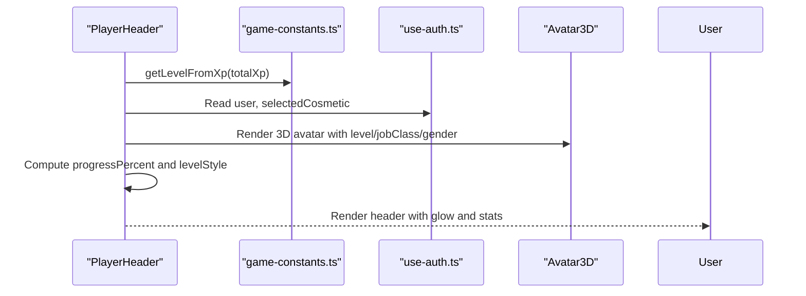
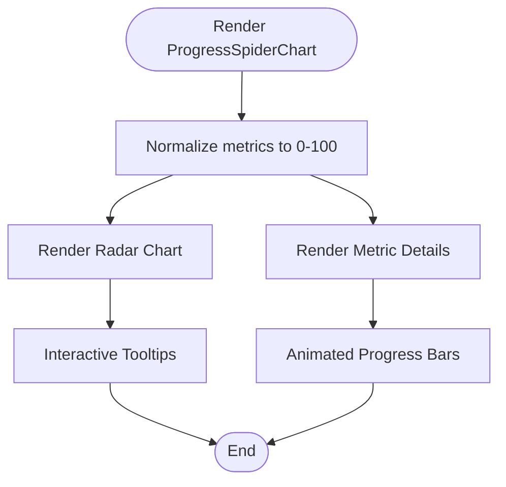
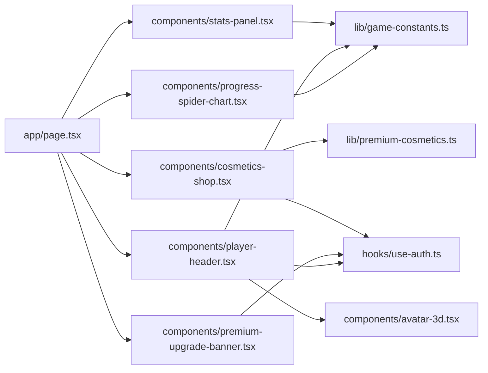

# Specialized Game Components

<cite>
**Referenced Files in This Document**
- [stats-panel.tsx](file://components/stats-panel.tsx)
- [cosmetics-shop.tsx](file://components/cosmetics-shop.tsx)
- [premium-upgrade-banner.tsx](file://components/premium-upgrade-banner.tsx)
- [player-header.tsx](file://components/player-header.tsx)
- [progress-spider-chart.tsx](file://components/progress-spider-chart.tsx)
- [avatar-3d.tsx](file://components/avatar-3d.tsx)
- [use-auth.ts](file://hooks/use-auth.ts)
- [game-constants.ts](file://lib/game-constants.ts)
- [premium-cosmetics.ts](file://lib/premium-cosmetics.ts)
- [premium-products.ts](file://lib/premium-products.ts)
- [page.tsx](file://app/page.tsx)
- [ui-effects.tsx](file://components/ui-effects.tsx)
</cite>

## Table of Contents
1. [Introduction](#introduction)
2. [Project Structure](#project-structure)
3. [Core Components](#core-components)
4. [Architecture Overview](#architecture-overview)
5. [Detailed Component Analysis](#detailed-component-analysis)
6. [Dependency Analysis](#dependency-analysis)
7. [Performance Considerations](#performance-considerations)
8. [Troubleshooting Guide](#troubleshooting-guide)
9. [Conclusion](#conclusion)
10. [Appendices](#appendices)

## Introduction
This document provides comprehensive technical and practical documentation for specialized game components that implement core gameplay features. It focuses on:
- StatsPanel: XP tracking cards, streak visualization, and achievement display with 3D glow effects and hover interactions
- CosmeticsShop: Premium cosmetic selection, purchase mechanisms, visual customization options, and integration with the premium gate system
- PremiumUpgradeBanner: Feature promotion and upsell functionality
- PlayerHeader: User profile display with avatar 3D preview and progress visualization
- ProgressSpiderChart: Visualizing skill distributions and progress metrics

The guide covers component props, state management, event handlers, integration patterns with the game state system, practical usage examples, customization techniques, and responsive design implementations.

## Project Structure
The components are organized under the components directory and integrate with hooks and libraries for authentication, game constants, and premium cosmetics. The main application page orchestrates these components and passes game state-derived props.

**Diagram sources**
- [page.tsx:24-384](file://app/page.tsx#L24-L384)
- [stats-panel.tsx:13-145](file://components/stats-panel.tsx#L13-L145)
- [cosmetics-shop.tsx:7-178](file://components/cosmetics-shop.tsx#L7-L178)
- [premium-upgrade-banner.tsx:7-89](file://components/premium-upgrade-banner.tsx#L7-L89)
- [player-header.tsx:16-183](file://components/player-header.tsx#L16-L183)
- [progress-spider-chart.tsx:14-218](file://components/progress-spider-chart.tsx#L14-L218)
- [avatar-3d.tsx:1304-1361](file://components/avatar-3d.tsx#L1304-L1361)
- [use-auth.ts:28-167](file://hooks/use-auth.ts#L28-L167)
- [game-constants.ts:29-42](file://lib/game-constants.ts#L29-L42)
- [premium-cosmetics.ts:12-77](file://lib/premium-cosmetics.ts#L12-L77)
- [premium-products.ts:13-76](file://lib/premium-products.ts#L13-L76)

**Section sources**
- [page.tsx:24-384](file://app/page.tsx#L24-L384)

## Core Components
This section summarizes the purpose, props, state, and integration patterns for each specialized component.

- StatsPanel
  - Purpose: Displays XP, tasks completed, current streak, and achievements with animated 3D glow and hover interactions
  - Props: completedTasks, totalXp, currentStreak, unlockedAchievements
  - State: hoveredId for achievement tooltips
  - Integration: Uses ACHIEVEMENTS from game-constants and displays unlock status

- CosmeticsShop
  - Purpose: Allows users to browse and select avatar cosmetics; integrates with premium gate
  - Props: None (uses useAuth hook)
  - State: selectedTab ("all" | "owned"), ownedCosmetics derived from user premium status
  - Integration: Uses COSMETICS and FREE_COSMETICS from premium-cosmetics; updates user selectedCosmetic via useAuth

- PremiumUpgradeBanner
  - Purpose: Promotes premium membership with animated visuals and upgrade call-to-action
  - Props: None (uses useAuth hook)
  - State: None (conditional rendering)
  - Integration: Renders only for non-premium users; links to pricing page

- PlayerHeader
  - Purpose: Shows user profile, level, XP progress, and avatar preview with 3D model
  - Props: totalXp, completedTasks, currentStreak
  - State: isHovered for header glow; derives level and progress from totalXp
  - Integration: Uses Avatar3D for 3D preview; uses game-constants for level calculation

- ProgressSpiderChart
  - Purpose: Visualizes progress across multiple metrics (level, completion rate, streak, XP, mastery)
  - Props: totalXp, completedTasks, currentStreak, level, totalTasks
  - State: None (pure visualization)
  - Integration: Uses Recharts for radar visualization; calculates normalized scores

**Section sources**
- [stats-panel.tsx:6-18](file://components/stats-panel.tsx#L6-L18)
- [cosmetics-shop.tsx:7-17](file://components/cosmetics-shop.tsx#L7-L17)
- [premium-upgrade-banner.tsx:7-12](file://components/premium-upgrade-banner.tsx#L7-L12)
- [player-header.tsx:10-27](file://components/player-header.tsx#L10-L27)
- [progress-spider-chart.tsx:6-20](file://components/progress-spider-chart.tsx#L6-L20)

## Architecture Overview
The components are orchestrated by the main page, which retrieves game state and user data, then passes computed props to specialized components. Authentication state drives premium features and cosmetic availability. Game constants define XP-to-level calculations and achievement definitions.

**Diagram sources**
- [page.tsx:34-384](file://app/page.tsx#L34-L384)
- [player-header.tsx:21-27](file://components/player-header.tsx#L21-L27)
- [stats-panel.tsx:19-19](file://components/stats-panel.tsx#L19-L19)
- [cosmetics-shop.tsx:8-8](file://components/cosmetics-shop.tsx#L8-L8)
- [premium-upgrade-banner.tsx:8-8](file://components/premium-upgrade-banner.tsx#L8-L8)
- [use-auth.ts:28-167](file://hooks/use-auth.ts#L28-L167)
- [game-constants.ts:29-42](file://lib/game-constants.ts#L29-L42)

## Detailed Component Analysis

### StatsPanel Component
- Purpose: Centralized stats display with animated cards and achievement gallery
- Props
  - completedTasks: number
  - totalXp: number
  - currentStreak: number
  - unlockedAchievements: string[]
- State
  - hoveredId: string | null for tooltip management
- Key Behaviors
  - 3D glow cards with hover animations and gradient borders
  - XP, tasks, and streak cards with animated bottom bars
  - Achievement grid with unlock status, glow effects, and tooltips
  - Responsive grid layout (1 column on small screens, 2 on medium+)
- Integration
  - Uses ACHIEVEMENTS constant for definitions
  - Reads user progress from game state props
  - No external hooks required (self-contained)

**Diagram sources**
- [stats-panel.tsx:13-145](file://components/stats-panel.tsx#L13-L145)

**Section sources**
- [stats-panel.tsx:6-18](file://components/stats-panel.tsx#L6-L18)
- [stats-panel.tsx:13-145](file://components/stats-panel.tsx#L13-L145)
- [game-constants.ts:50-94](file://lib/game-constants.ts#L50-L94)

### CosmeticsShop Component
- Purpose: Premium cosmetic shop with tabbed browsing and selection
- Props: None
- State
  - selectedTab: "all" | "owned"
  - derived ownedCosmetics based on user.isPremium
- Key Behaviors
  - Tabbed interface: "All Cosmetics" and "My Collection" (only for premium)
  - Grid of cosmetic cards with preview, badges, and glow effects
  - Premium gating: locked cosmetics show "PREMIUM" badge and are disabled
  - Selected cosmetic shows ring and radial glow
  - Clicking a cosmetic triggers updateCosmetic via useAuth
- Integration
  - Uses COSMETICS and FREE_COSMETICS from premium-cosmetics
  - Uses useAuth for user state and updateCosmetic
  - Applies cosmetic styles (color, border, glow) dynamically

**Diagram sources**
- [cosmetics-shop.tsx:7-178](file://components/cosmetics-shop.tsx#L7-L178)
- [use-auth.ts:111-120](file://hooks/use-auth.ts#L111-L120)
- [premium-cosmetics.ts:12-77](file://lib/premium-cosmetics.ts#L12-L77)

**Section sources**
- [cosmetics-shop.tsx:7-178](file://components/cosmetics-shop.tsx#L7-L178)
- [premium-cosmetics.ts:12-77](file://lib/premium-cosmetics.ts#L12-L77)
- [use-auth.ts:111-120](file://hooks/use-auth.ts#L111-L120)

### PremiumUpgradeBanner Component
- Purpose: Promote premium membership with animated visuals and clear call-to-action
- Props: None
- State: None
- Key Behaviors
  - Conditional rendering: hidden for premium users
  - Animated gradient border and floating particle effects
  - Feature highlights list with animated dots
  - Primary action links to pricing page
- Integration
  - Uses useAuth to detect premium status
  - Uses Lucide icons for visual enhancement

**Diagram sources**
- [premium-upgrade-banner.tsx:7-89](file://components/premium-upgrade-banner.tsx#L7-L89)
- [use-auth.ts:28-167](file://hooks/use-auth.ts#L28-L167)

**Section sources**
- [premium-upgrade-banner.tsx:7-89](file://components/premium-upgrade-banner.tsx#L7-L89)
- [use-auth.ts:28-167](file://hooks/use-auth.ts#L28-L167)

### PlayerHeader Component
- Purpose: User profile header with avatar preview, level, XP progress, and quick actions
- Props
  - totalXp: number
  - completedTasks: number
  - currentStreak: number
- State
  - isHovered: boolean for header glow animation
  - derived level, currentXp, nextLevelXp from totalXp
- Key Behaviors
  - Dynamic level-based styling (gradient colors, glow, border)
  - Animated 3D avatar preview via Avatar3D
  - XP progress bar with shimmer and glow effects
  - Premium badge or upgrade button depending on status
  - Hover effects on stats cards and edit avatar link
- Integration
  - Uses getLevelFromXp from game-constants
  - Uses Avatar3D for 3D rendering
  - Uses useAuth for user state and premium status
  - Uses premium-cosmetics for selected cosmetic styling

**Diagram sources**
- [player-header.tsx:16-183](file://components/player-header.tsx#L16-L183)
- [game-constants.ts:29-42](file://lib/game-constants.ts#L29-L42)
- [avatar-3d.tsx:1304-1361](file://components/avatar-3d.tsx#L1304-L1361)

**Section sources**
- [player-header.tsx:10-27](file://components/player-header.tsx#L10-L27)
- [player-header.tsx:16-183](file://components/player-header.tsx#L16-L183)
- [game-constants.ts:29-42](file://lib/game-constants.ts#L29-L42)
- [avatar-3d.tsx:1304-1361](file://components/avatar-3d.tsx#L1304-L1361)

### ProgressSpiderChart Component
- Purpose: Multi-metric progress visualization using a radar/spider chart
- Props
  - totalXp: number
  - completedTasks: number
  - currentStreak: number
  - level: number
  - totalTasks: number
- State: None
- Key Behaviors
  - Normalizes metrics to 0–100 scale for radar chart
  - Renders radar chart with polar grid and tooltips
  - Provides detailed progress bars for each metric
  - Responsive layout with chart and details side-by-side
- Integration
  - Uses Recharts for visualization
  - Uses game-constants for level calculation

**Diagram sources**
- [progress-spider-chart.tsx:14-218](file://components/progress-spider-chart.tsx#L14-L218)

**Section sources**
- [progress-spider-chart.tsx:6-20](file://components/progress-spider-chart.tsx#L6-L20)
- [progress-spider-chart.tsx:14-218](file://components/progress-spider-chart.tsx#L14-L218)
- [game-constants.ts:29-42](file://lib/game-constants.ts#L29-L42)

## Dependency Analysis
The components depend on shared hooks and libraries for authentication, game constants, and premium cosmetics. The main page coordinates data flow and prop passing.

**Diagram sources**
- [page.tsx:34-384](file://app/page.tsx#L34-L384)
- [stats-panel.tsx:3-3](file://components/stats-panel.tsx#L3-L3)
- [cosmetics-shop.tsx:3-4](file://components/cosmetics-shop.tsx#L3-L4)
- [premium-upgrade-banner.tsx:3-8](file://components/premium-upgrade-banner.tsx#L3-L8)
- [player-header.tsx:3-7](file://components/player-header.tsx#L3-L7)
- [progress-spider-chart.tsx:3-4](file://components/progress-spider-chart.tsx#L3-L4)
- [use-auth.ts:28-167](file://hooks/use-auth.ts#L28-L167)
- [game-constants.ts:29-42](file://lib/game-constants.ts#L29-L42)
- [premium-cosmetics.ts:12-77](file://lib/premium-cosmetics.ts#L12-L77)
- [avatar-3d.tsx:1304-1361](file://components/avatar-3d.tsx#L1304-L1361)

**Section sources**
- [page.tsx:34-384](file://app/page.tsx#L34-L384)

## Performance Considerations
- StatsPanel
  - Uses lightweight state for hover tooltips; minimal re-renders
  - Achievements grid scales well with responsive grid classes
- CosmeticsShop
  - Tabs and cosmetic filtering are client-side; keep lists manageable
  - updateCosmetic triggers localStorage writes; batch updates if needed
- PremiumUpgradeBanner
  - Minimal DOM; relies on CSS animations and gradients
- PlayerHeader
  - Avatar3D is resource-intensive; ensure it is mounted only when visible
  - Consider lazy loading the canvas for initial page load
- ProgressSpiderChart
  - Recharts renders efficiently; avoid frequent prop changes
  - Normalize data once per render cycle

[No sources needed since this section provides general guidance]

## Troubleshooting Guide
- StatsPanel achievement tooltips not appearing
  - Verify achievement ids match unlockedAchievements prop
  - Ensure ACHIEVEMENTS constant is imported and consistent
- CosmeticsShop locked items remain disabled
  - Confirm user.isPremium is true for premium unlocks
  - Check updateCosmetic is invoked on click for owned items
- PremiumUpgradeBanner still visible for premium users
  - Verify useAuth.user.isPremium is set correctly
- PlayerHeader avatar not updating
  - Ensure selectedCosmetic changes trigger re-render
  - Check Avatar3D receives updated props (level, jobClass, gender)
- ProgressSpiderChart data not rendering
  - Validate totalTasks > 0 to prevent division by zero
  - Ensure normalized values are within 0–100 range

**Section sources**
- [stats-panel.tsx:97-139](file://components/stats-panel.tsx#L97-L139)
- [cosmetics-shop.tsx:72-163](file://components/cosmetics-shop.tsx#L72-L163)
- [premium-upgrade-banner.tsx:10-12](file://components/premium-upgrade-banner.tsx#L10-L12)
- [player-header.tsx:24-26](file://components/player-header.tsx#L24-L26)
- [progress-spider-chart.tsx:21-26](file://components/progress-spider-chart.tsx#L21-L26)

## Conclusion
These specialized components deliver immersive, interactive gameplay experiences through polished UI patterns, responsive layouts, and seamless integration with the authentication and game state systems. They leverage reusable utilities for 3D rendering, animations, and visual effects, enabling consistent theming and performance across the application.

[No sources needed since this section summarizes without analyzing specific files]

## Appendices

### Component Props Reference
- StatsPanel
  - completedTasks: number
  - totalXp: number
  - currentStreak: number
  - unlockedAchievements: string[]
- CosmeticsShop
  - None (uses useAuth internally)
- PremiumUpgradeBanner
  - None (uses useAuth internally)
- PlayerHeader
  - totalXp: number
  - completedTasks: number
  - currentStreak: number
- ProgressSpiderChart
  - totalXp: number
  - completedTasks: number
  - currentStreak: number
  - level: number
  - totalTasks: number

**Section sources**
- [stats-panel.tsx:6-18](file://components/stats-panel.tsx#L6-L18)
- [cosmetics-shop.tsx:7-17](file://components/cosmetics-shop.tsx#L7-L17)
- [premium-upgrade-banner.tsx:7-12](file://components/premium-upgrade-banner.tsx#L7-L12)
- [player-header.tsx:10-27](file://components/player-header.tsx#L10-L27)
- [progress-spider-chart.tsx:6-20](file://components/progress-spider-chart.tsx#L6-L20)

### Integration Patterns
- Game state orchestration
  - app/page.tsx computes derived values (level, progress) and passes to components
- Authentication-driven features
  - useAuth manages premium status and cosmetic selection
- Data normalization
  - game-constants provides XP-to-level conversion and achievement definitions
- Visual customization
  - premium-cosmetics defines cosmetic attributes and tiers
  - ui-effects offers reusable animated components (GlassCard, GlowButton, etc.)

**Section sources**
- [page.tsx:34-384](file://app/page.tsx#L34-L384)
- [use-auth.ts:28-167](file://hooks/use-auth.ts#L28-L167)
- [game-constants.ts:29-42](file://lib/game-constants.ts#L29-L42)
- [premium-cosmetics.ts:12-77](file://lib/premium-cosmetics.ts#L12-L77)
- [ui-effects.tsx:13-65](file://components/ui-effects.tsx#L13-L65)