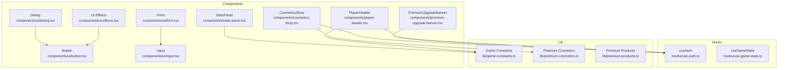
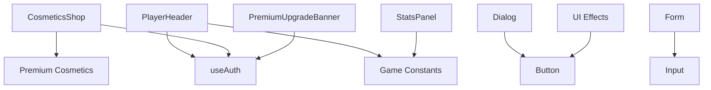
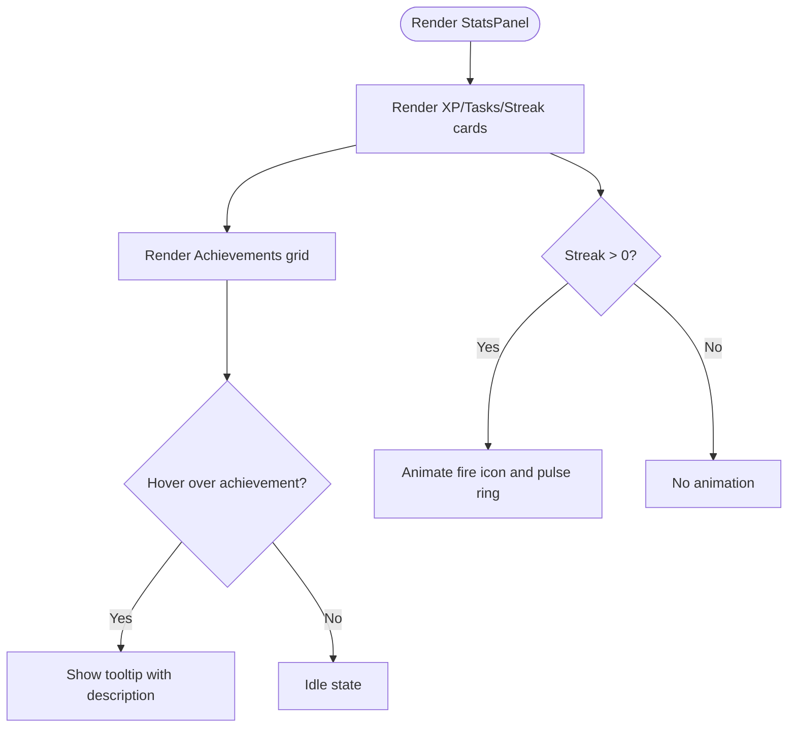
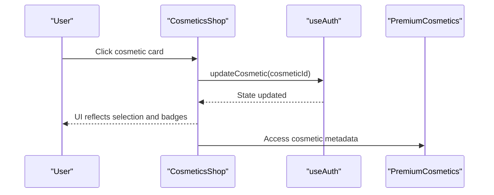
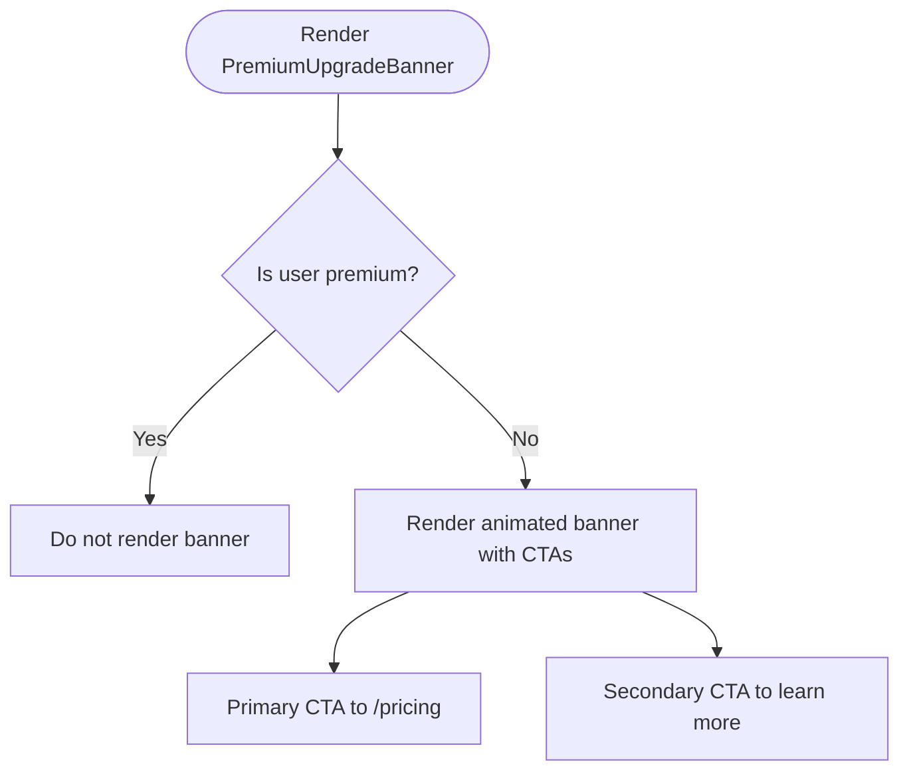
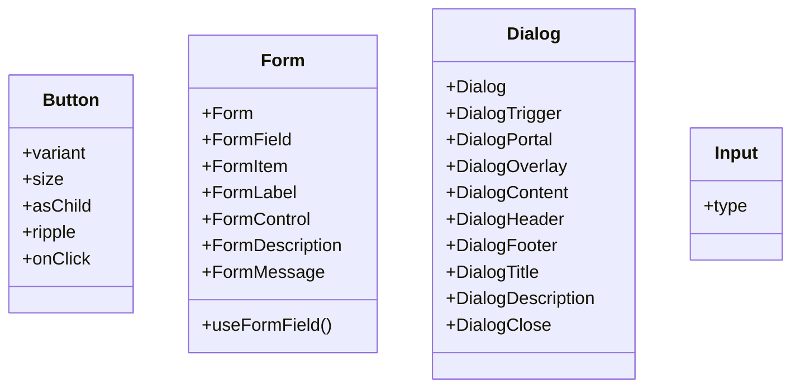
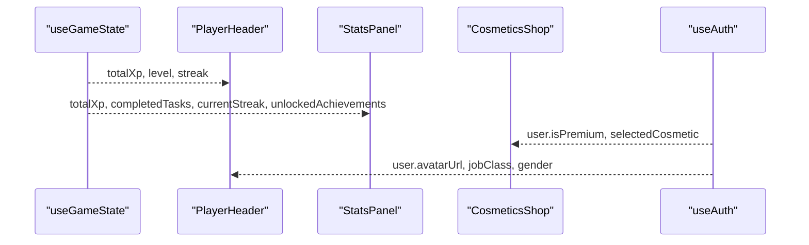
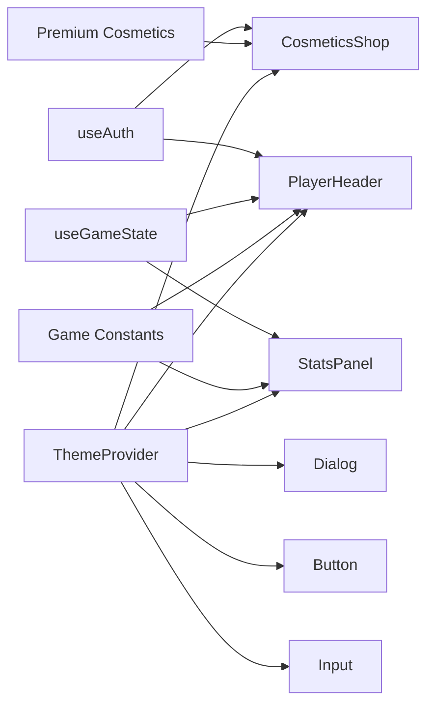

# UI Components

<cite>
**Referenced Files in This Document**
- [stats-panel.tsx](file://components/stats-panel.tsx)
- [cosmetics-shop.tsx](file://components/cosmetics-shop.tsx)
- [premium-upgrade-banner.tsx](file://components/premium-upgrade-banner.tsx)
- [button.tsx](file://components/ui/button.tsx)
- [form.tsx](file://components/ui/form.tsx)
- [dialog.tsx](file://components/ui/dialog.tsx)
- [input.tsx](file://components/ui/input.tsx)
- [ui-effects.tsx](file://components/ui-effects.tsx)
- [premium-cosmetics.ts](file://lib/premium-cosmetics.ts)
- [premium-products.ts](file://lib/premium-products.ts)
- [game-constants.ts](file://lib/game-constants.ts)
- [use-auth.ts](file://hooks/use-auth.ts)
- [use-game-state.ts](file://hooks/use-game-state.ts)
- [theme-provider.tsx](file://components/theme-provider.tsx)
- [player-header.tsx](file://components/player-header.tsx)
</cite>

## Table of Contents
1. [Introduction](#introduction)
2. [Project Structure](#project-structure)
3. [Core Components](#core-components)
4. [Architecture Overview](#architecture-overview)
5. [Detailed Component Analysis](#detailed-component-analysis)
6. [Dependency Analysis](#dependency-analysis)
7. [Performance Considerations](#performance-considerations)
8. [Troubleshooting Guide](#troubleshooting-guide)
9. [Conclusion](#conclusion)
10. [Appendices](#appendices)

## Introduction
This document describes the UI component library and specialized components for a game-like productivity application. It focuses on:
- StatsPanel: 3D-inspired cards, XP tracking, streak display, and achievements grid
- CosmeticsShop: premium cosmetic selection, ownership gating, and visual preview
- PremiumUpgradeBanner: promotional upsell with animated effects
- UI primitives: Button, Form, Dialog, Modal, Input with variants, accessibility, and theming
- Composition patterns, prop interfaces, and integration with the game state system

## Project Structure
The UI layer is organized into:
- Specialized components under components/: StatsPanel, CosmeticsShop, PremiumUpgradeBanner, PlayerHeader
- Primitive UI components under components/ui/: Button, Form, Dialog, Input
- Shared utilities and effects under components/ui-effects.tsx
- Game state and auth hooks under hooks/
- Game constants and premium data under lib/

**Diagram sources**
- [stats-panel.tsx:1-145](file://components/stats-panel.tsx#L1-L145)
- [cosmetics-shop.tsx:1-178](file://components/cosmetics-shop.tsx#L1-L178)
- [premium-upgrade-banner.tsx:1-89](file://components/premium-upgrade-banner.tsx#L1-L89)
- [player-header.tsx:1-183](file://components/player-header.tsx#L1-L183)
- [button.tsx:1-101](file://components/ui/button.tsx#L1-L101)
- [form.tsx:1-168](file://components/ui/form.tsx#L1-L168)
- [dialog.tsx:1-144](file://components/ui/dialog.tsx#L1-L144)
- [input.tsx:1-22](file://components/ui/input.tsx#L1-L22)
- [ui-effects.tsx:1-284](file://components/ui-effects.tsx#L1-L284)
- [use-auth.ts:1-167](file://hooks/use-auth.ts#L1-L167)
- [use-game-state.ts:1-252](file://hooks/use-game-state.ts#L1-L252)
- [game-constants.ts:1-95](file://lib/game-constants.ts#L1-L95)
- [premium-cosmetics.ts:1-77](file://lib/premium-cosmetics.ts#L1-L77)
- [premium-products.ts:1-76](file://lib/premium-products.ts#L1-L76)

**Section sources**
- [stats-panel.tsx:1-145](file://components/stats-panel.tsx#L1-L145)
- [cosmetics-shop.tsx:1-178](file://components/cosmetics-shop.tsx#L1-L178)
- [premium-upgrade-banner.tsx:1-89](file://components/premium-upgrade-banner.tsx#L1-L89)
- [button.tsx:1-101](file://components/ui/button.tsx#L1-L101)
- [form.tsx:1-168](file://components/ui/form.tsx#L1-L168)
- [dialog.tsx:1-144](file://components/ui/dialog.tsx#L1-L144)
- [input.tsx:1-22](file://components/ui/input.tsx#L1-L22)
- [ui-effects.tsx:1-284](file://components/ui-effects.tsx#L1-L284)
- [use-auth.ts:1-167](file://hooks/use-auth.ts#L1-L167)
- [use-game-state.ts:1-252](file://hooks/use-game-state.ts#L1-L252)
- [game-constants.ts:1-95](file://lib/game-constants.ts#L1-L95)
- [premium-cosmetics.ts:1-77](file://lib/premium-cosmetics.ts#L1-L77)
- [premium-products.ts:1-76](file://lib/premium-products.ts#L1-L76)

## Core Components
This section documents the specialized components and the primitive UI library.

### StatsPanel
Purpose: Display player stats with animated 3D-inspired cards, XP totals, task counts, streaks, and achievements grid.

Key props:
- completedTasks: number
- totalXp: number
- currentStreak: number
- unlockedAchievements: string[]

Behavior highlights:
- Gradient borders and inner glows on hover
- Animated pulse effects for active streaks
- Achievements grid with tooltips and unlock state
- Responsive grid layout

Accessibility and responsiveness:
- Uses semantic text sizes and contrast classes
- Hover/focus states rely on group utilities; ensure keyboard focus visibility via parent theme

Integration:
- Consumes game constants for achievements
- Works with game state totals

**Section sources**
- [stats-panel.tsx:6-18](file://components/stats-panel.tsx#L6-L18)
- [stats-panel.tsx:22-143](file://components/stats-panel.tsx#L22-L143)
- [game-constants.ts:50-94](file://lib/game-constants.ts#L50-L94)

### CosmeticsShop
Purpose: Allow players to browse and equip avatar cosmetics; gate premium items behind membership.

Key props: None (consumes auth state)

Behavior highlights:
- Tabs: All Cosmetics vs My Collection (only visible for premium)
- Grid of cosmetic cards with preview, badges, and glow styling
- Ownership gating: premium-only items disabled for non-premium
- Selection feedback: selected cosmetic has a ring and radial glow
- Updates user’s selected cosmetic via auth hook

Integration:
- Uses premium cosmetics definitions
- Integrates with auth hook for user state and updates

**Section sources**
- [cosmetics-shop.tsx:7-17](file://components/cosmetics-shop.tsx#L7-L17)
- [cosmetics-shop.tsx:70-164](file://components/cosmetics-shop.tsx#L70-L164)
- [premium-cosmetics.ts:1-77](file://lib/premium-cosmetics.ts#L1-L77)
- [use-auth.ts:111-120](file://hooks/use-auth.ts#L111-L120)

### PremiumUpgradeBanner
Purpose: Promote premium upgrades with animated visuals and clear CTAs.

Key props: None (consumes auth state)

Behavior highlights:
- Animated gradient border and floating particles
- Feature highlights list
- Primary CTA links to pricing page
- Hidden for premium users

Integration:
- Uses auth hook to detect premium status
- Uses icons from lucide-react

**Section sources**
- [premium-upgrade-banner.tsx:7-12](file://components/premium-upgrade-banner.tsx#L7-L12)
- [premium-upgrade-banner.tsx:14-87](file://components/premium-upgrade-banner.tsx#L14-L87)
- [use-auth.ts:154-166](file://hooks/use-auth.ts#L154-L166)

### UI Primitive Library

#### Button
Props:
- variant: default | destructive | outline | secondary | ghost | link
- size: default | sm | lg | icon | icon-sm | icon-lg
- asChild: boolean (renders as child slot)
- ripple: boolean (enable click ripple effect)
- Additional button HTML attributes

Behavior:
- Ripple effect on click (unless disabled or asChild)
- Focus-visible ring and shadow transitions
- Supports SVG sizing and alignment

Accessibility:
- Proper focus-visible ring and aria-invalid handling
- Disabled state prevents interactions

**Section sources**
- [button.tsx:38-52](file://components/ui/button.tsx#L38-L52)
- [button.tsx:44-98](file://components/ui/button.tsx#L44-L98)

#### Form
Exports:
- Form, FormItem, FormLabel, FormControl, FormDescription, FormMessage, FormField
- useFormField hook for field-level state and accessibility attributes

Behavior:
- Provides context for field IDs and error state
- Connects labels, controls, and messages for screen readers
- Supports react-hook-form integration

Accessibility:
- Auto-assigns aria-describedby and aria-invalid based on field state
- Ensures label association via htmlFor

**Section sources**
- [form.tsx:19-167](file://components/ui/form.tsx#L19-L167)

#### Dialog
Exports:
- Dialog, DialogTrigger, DialogPortal, DialogOverlay, DialogContent, DialogHeader, DialogFooter, DialogTitle, DialogDescription, DialogClose

Behavior:
- Portal-based overlay with fade/zoom animations
- Optional close button with hidden “Close” label for assistive tech
- Responsive max-width and padding

Accessibility:
- Proper semantics via radix-ui
- Focus trapping and escape behavior handled by underlying library

**Section sources**
- [dialog.tsx:9-81](file://components/ui/dialog.tsx#L9-L81)
- [dialog.tsx:83-130](file://components/ui/dialog.tsx#L83-L130)

#### Input
Props:
- type: input type
- Additional input HTML attributes

Behavior:
- Focus-visible ring and selection highlighting
- Support for aria-invalid and disabled states
- Consistent height and padding across sizes

Accessibility:
- Inherits native input semantics
- Use with FormLabel/FormMessage for accessible forms

**Section sources**
- [input.tsx:5-19](file://components/ui/input.tsx#L5-L19)

### UI Effects Library
Reusable visual effects used across components:
- GlassCard: 3D hover tilt with glow and shine
- GlowButton: gradient borders and animated shine
- AnimatedCounter: animated number transitions
- GlowingText: drop-shadow glow text
- FloatingElement: float animation with configurable duration/distance
- PulsingDot: animated pulsing dot
- EnergyBar: gradient-filled bar with optional labels
- NeonBorder: animated conic border

Usage patterns:
- Pass color variants or custom gradients
- Combine with layout utilities for consistent spacing

**Section sources**
- [ui-effects.tsx:13-65](file://components/ui-effects.tsx#L13-L65)
- [ui-effects.tsx:77-136](file://components/ui-effects.tsx#L77-L136)
- [ui-effects.tsx:146-154](file://components/ui-effects.tsx#L146-L154)
- [ui-effects.tsx:163-172](file://components/ui-effects.tsx#L163-L172)
- [ui-effects.tsx:182-194](file://components/ui-effects.tsx#L182-L194)
- [ui-effects.tsx:197-204](file://components/ui-effects.tsx#L197-L204)
- [ui-effects.tsx:215-262](file://components/ui-effects.tsx#L215-L262)
- [ui-effects.tsx:271-283](file://components/ui-effects.tsx#L271-L283)

## Architecture Overview
The specialized components integrate with hooks and libraries to deliver cohesive gameplay UI.

**Diagram sources**
- [player-header.tsx:23-26](file://components/player-header.tsx#L23-L26)
- [stats-panel.tsx:3-19](file://components/stats-panel.tsx#L3-L19)
- [cosmetics-shop.tsx:8-15](file://components/cosmetics-shop.tsx#L8-L15)
- [premium-upgrade-banner.tsx:8-12](file://components/premium-upgrade-banner.tsx#L8-L12)
- [dialog.tsx:1-13](file://components/ui/dialog.tsx#L1-L13)
- [button.tsx:1-3](file://components/ui/button.tsx#L1-L3)
- [form.tsx:1-17](file://components/ui/form.tsx#L1-L17)
- [input.tsx:1-3](file://components/ui/input.tsx#L1-L3)
- [ui-effects.tsx:1-3](file://components/ui-effects.tsx#L1-L3)
- [use-auth.ts:1-13](file://hooks/use-auth.ts#L1-L13)
- [game-constants.ts:1-11](file://lib/game-constants.ts#L1-L11)
- [premium-cosmetics.ts:1-10](file://lib/premium-cosmetics.ts#L1-L10)

## Detailed Component Analysis

### StatsPanel: 3D Visualization and XP Tracking
- 3D-inspired cards with gradient borders and inner glow
- Animated pulse for active streaks
- Achievements grid with hover tooltips and unlock state
- Responsive grid layout for small and medium screens

**Diagram sources**
- [stats-panel.tsx:22-82](file://components/stats-panel.tsx#L22-L82)
- [stats-panel.tsx:84-141](file://components/stats-panel.tsx#L84-L141)

**Section sources**
- [stats-panel.tsx:22-143](file://components/stats-panel.tsx#L22-L143)
- [game-constants.ts:50-94](file://lib/game-constants.ts#L50-L94)

### CosmeticsShop: Premium Cosmetic Selection
- Tabs: All Cosmetics and My Collection (premium-only)
- Grid of cosmetic cards with preview, badges, and glow styling
- Ownership gating: premium-only items disabled for non-premium
- Selection feedback: selected cosmetic has a ring and radial glow

**Diagram sources**
- [cosmetics-shop.tsx:79-84](file://components/cosmetics-shop.tsx#L79-L84)
- [use-auth.ts:111-120](file://hooks/use-auth.ts#L111-L120)
- [premium-cosmetics.ts:1-77](file://lib/premium-cosmetics.ts#L1-L77)

**Section sources**
- [cosmetics-shop.tsx:7-17](file://components/cosmetics-shop.tsx#L7-L17)
- [cosmetics-shop.tsx:70-164](file://components/cosmetics-shop.tsx#L70-L164)
- [use-auth.ts:111-120](file://hooks/use-auth.ts#L111-L120)
- [premium-cosmetics.ts:1-77](file://lib/premium-cosmetics.ts#L1-L77)

### PremiumUpgradeBanner: Upsell Promotion
- Animated gradient border and floating particles
- Feature highlights list
- Primary CTA links to pricing page
- Hidden for premium users

**Diagram sources**
- [premium-upgrade-banner.tsx:7-12](file://components/premium-upgrade-banner.tsx#L7-L12)
- [premium-upgrade-banner.tsx:14-87](file://components/premium-upgrade-banner.tsx#L14-L87)

**Section sources**
- [premium-upgrade-banner.tsx:7-12](file://components/premium-upgrade-banner.tsx#L7-L12)
- [premium-upgrade-banner.tsx:14-87](file://components/premium-upgrade-banner.tsx#L14-L87)
- [use-auth.ts:154-166](file://hooks/use-auth.ts#L154-L166)

### UI Primitives: Props, Variants, and Accessibility
- Button: variant and size variants, ripple, focus-visible ring, disabled state
- Form: field context, label association, aria-invalid, description/message
- Dialog: portal-based overlay, animations, optional close button
- Input: focus-visible ring, selection, disabled state

**Diagram sources**
- [button.tsx:38-52](file://components/ui/button.tsx#L38-L52)
- [form.tsx:19-167](file://components/ui/form.tsx#L19-L167)
- [dialog.tsx:9-130](file://components/ui/dialog.tsx#L9-L130)
- [input.tsx:5-19](file://components/ui/input.tsx#L5-L19)

**Section sources**
- [button.tsx:38-98](file://components/ui/button.tsx#L38-L98)
- [form.tsx:45-167](file://components/ui/form.tsx#L45-L167)
- [dialog.tsx:9-130](file://components/ui/dialog.tsx#L9-L130)
- [input.tsx:5-19](file://components/ui/input.tsx#L5-L19)

### Integration with Game State and Auth
- StatsPanel consumes game constants for achievements
- PlayerHeader computes level and progress from XP and renders themed visuals
- CosmeticsShop and PremiumUpgradeBanner consume auth state for premium gating
- use-game-state manages tasks, XP, streaks, and unlocks

**Diagram sources**
- [use-game-state.ts:51-251](file://hooks/use-game-state.ts#L51-L251)
- [player-header.tsx:21-27](file://components/player-header.tsx#L21-L27)
- [stats-panel.tsx:18-19](file://components/stats-panel.tsx#L18-L19)
- [cosmetics-shop.tsx:8-9](file://components/cosmetics-shop.tsx#L8-L9)
- [use-auth.ts:28-58](file://hooks/use-auth.ts#L28-L58)

**Section sources**
- [use-game-state.ts:51-251](file://hooks/use-game-state.ts#L51-L251)
- [player-header.tsx:21-27](file://components/player-header.tsx#L21-L27)
- [stats-panel.tsx:18-19](file://components/stats-panel.tsx#L18-L19)
- [cosmetics-shop.tsx:8-9](file://components/cosmetics-shop.tsx#L8-L9)
- [use-auth.ts:28-58](file://hooks/use-auth.ts#L28-L58)

## Dependency Analysis
- Components depend on:
  - Hooks for state (useAuth, useGameState)
  - Libraries for constants and data (game-constants, premium-cosmetics, premium-products)
  - UI primitives for base building blocks
- Theming and provider:
  - ThemeProvider wraps the app for light/dark mode

**Diagram sources**
- [use-auth.ts:1-167](file://hooks/use-auth.ts#L1-L167)
- [use-game-state.ts:1-252](file://hooks/use-game-state.ts#L1-L252)
- [game-constants.ts:1-95](file://lib/game-constants.ts#L1-L95)
- [premium-cosmetics.ts:1-77](file://lib/premium-cosmetics.ts#L1-L77)
- [theme-provider.tsx:9-11](file://components/theme-provider.tsx#L9-L11)
- [cosmetics-shop.tsx:1-178](file://components/cosmetics-shop.tsx#L1-L178)
- [player-header.tsx:1-183](file://components/player-header.tsx#L1-L183)
- [stats-panel.tsx:1-145](file://components/stats-panel.tsx#L1-L145)
- [dialog.tsx:1-144](file://components/ui/dialog.tsx#L1-L144)
- [button.tsx:1-101](file://components/ui/button.tsx#L1-L101)
- [input.tsx:1-22](file://components/ui/input.tsx#L1-L22)

**Section sources**
- [use-auth.ts:1-167](file://hooks/use-auth.ts#L1-L167)
- [use-game-state.ts:1-252](file://hooks/use-game-state.ts#L1-L252)
- [game-constants.ts:1-95](file://lib/game-constants.ts#L1-L95)
- [premium-cosmetics.ts:1-77](file://lib/premium-cosmetics.ts#L1-L77)
- [theme-provider.tsx:9-11](file://components/theme-provider.tsx#L9-L11)

## Performance Considerations
- Minimize re-renders by passing memoized callbacks from useGameState
- Prefer grid layouts for collections (achievements, cosmetics) to leverage CSS Grid performance
- Use CSS animations and transitions for hover effects; avoid heavy JavaScript animations
- Debounce or throttle frequent UI updates (e.g., counters) when integrating with real-time data
- Keep dialogs and modals portal-based to avoid layout thrashing

## Troubleshooting Guide
Common issues and resolutions:
- Dialog not closing or focus trapped unexpectedly:
  - Ensure DialogClose is present and accessible
  - Verify DialogPortal wraps DialogContent
- Button ripple not appearing:
  - Confirm ripple prop is enabled and asChild is false
- Form field not accessible:
  - Pair FormLabel with FormControl and include FormDescription/FormMessage
- Premium content not visible:
  - Check user.isPremium flag and tab visibility logic
- Streak calculation anomalies:
  - Validate date normalization and time zone handling in useGameState

**Section sources**
- [dialog.tsx:56-81](file://components/ui/dialog.tsx#L56-L81)
- [button.tsx:56-75](file://components/ui/button.tsx#L56-L75)
- [form.tsx:90-123](file://components/ui/form.tsx#L90-L123)
- [use-auth.ts:154-166](file://hooks/use-auth.ts#L154-L166)
- [use-game-state.ts:84-125](file://hooks/use-game-state.ts#L84-L125)

## Conclusion
The UI component library combines specialized gameplay-focused components with a robust set of primitives. By leveraging hooks for state, libraries for constants and data, and a shared effects library, the system achieves a cohesive, accessible, and visually engaging interface. Following the composition patterns and integration guidelines ensures consistent behavior and easy customization.

## Appendices

### Props Reference Summary
- StatsPanel
  - completedTasks: number
  - totalXp: number
  - currentStreak: number
  - unlockedAchievements: string[]
- CosmeticsShop
  - none (consumes auth state)
- PremiumUpgradeBanner
  - none (consumes auth state)
- Button
  - variant, size, asChild, ripple, plus button props
- Form
  - Form, FormItem, FormLabel, FormControl, FormDescription, FormMessage, FormField, useFormField
- Dialog
  - Dialog, DialogTrigger, DialogPortal, DialogOverlay, DialogContent(showCloseButton), DialogHeader, DialogFooter, DialogTitle, DialogDescription, DialogClose
- Input
  - type, plus input props

**Section sources**
- [stats-panel.tsx:6-18](file://components/stats-panel.tsx#L6-L18)
- [cosmetics-shop.tsx:7-17](file://components/cosmetics-shop.tsx#L7-L17)
- [premium-upgrade-banner.tsx:7-12](file://components/premium-upgrade-banner.tsx#L7-L12)
- [button.tsx:38-52](file://components/ui/button.tsx#L38-L52)
- [form.tsx:19-167](file://components/ui/form.tsx#L19-L167)
- [dialog.tsx:9-130](file://components/ui/dialog.tsx#L9-L130)
- [input.tsx:5-19](file://components/ui/input.tsx#L5-L19)

### Theming and Accessibility Notes
- Theming:
  - Provider configured via ThemeProvider
  - Components use gradient and glass classes; ensure consistent palette
- Accessibility:
  - Buttons include focus-visible rings and aria-invalid handling
  - Forms connect labels and controls for assistive technologies
  - Dialogs provide close button with hidden label for screen readers

**Section sources**
- [theme-provider.tsx:9-11](file://components/theme-provider.tsx#L9-L11)
- [button.tsx:6-7](file://components/ui/button.tsx#L6-L7)
- [form.tsx:90-123](file://components/ui/form.tsx#L90-L123)
- [dialog.tsx:69-77](file://components/ui/dialog.tsx#L69-L77)