# UI Primitive Library

<cite>
**Referenced Files in This Document**
- [button.tsx](file://components/ui/button.tsx)
- [form.tsx](file://components/ui/form.tsx)
- [dialog.tsx](file://components/ui/dialog.tsx)
- [input.tsx](file://components/ui/input.tsx)
- [input-otp.tsx](file://components/ui/input-otp.tsx)
- [input-group.tsx](file://components/ui/input-group.tsx)
- [select.tsx](file://components/ui/select.tsx)
- [checkbox.tsx](file://components/ui/checkbox.tsx)
- [radio-group.tsx](file://components/ui/radio-group.tsx)
- [tabs.tsx](file://components/ui/tabs.tsx)
- [card.tsx](file://components/ui/card.tsx)
- [alert.tsx](file://components/ui/alert.tsx)
- [alert-dialog.tsx](file://components/ui/alert-dialog.tsx)
- [button-group.tsx](file://components/ui/button-group.tsx)
- [field.tsx](file://components/ui/field.tsx)
- [label.tsx](file://components/ui/label.tsx)
</cite>

## Table of Contents
1. [Introduction](#introduction)
2. [Project Structure](#project-structure)
3. [Core Components](#core-components)
4. [Architecture Overview](#architecture-overview)
5. [Detailed Component Analysis](#detailed-component-analysis)
6. [Dependency Analysis](#dependency-analysis)
7. [Performance Considerations](#performance-considerations)
8. [Troubleshooting Guide](#troubleshooting-guide)
9. [Conclusion](#conclusion)
10. [Appendices](#appendices)

## Introduction
This document describes the UI primitive component library used across the application. It focuses on the Button, Form system, Dialogs, Inputs, Select, Checkbox/RadioGroup, Tabs, Card, Alert, and related primitives. For each component, we outline variants, sizes, states, accessibility attributes, prop interfaces, usage patterns, and integration points with the form system and broader application state.

## Project Structure
The UI primitives live under components/ui and are built with:
- Radix UI primitives for accessible base behaviors
- Class Variance Authority (CVA) for variant sizing
- Tailwind-based composition via cn
- react-hook-form for form integration

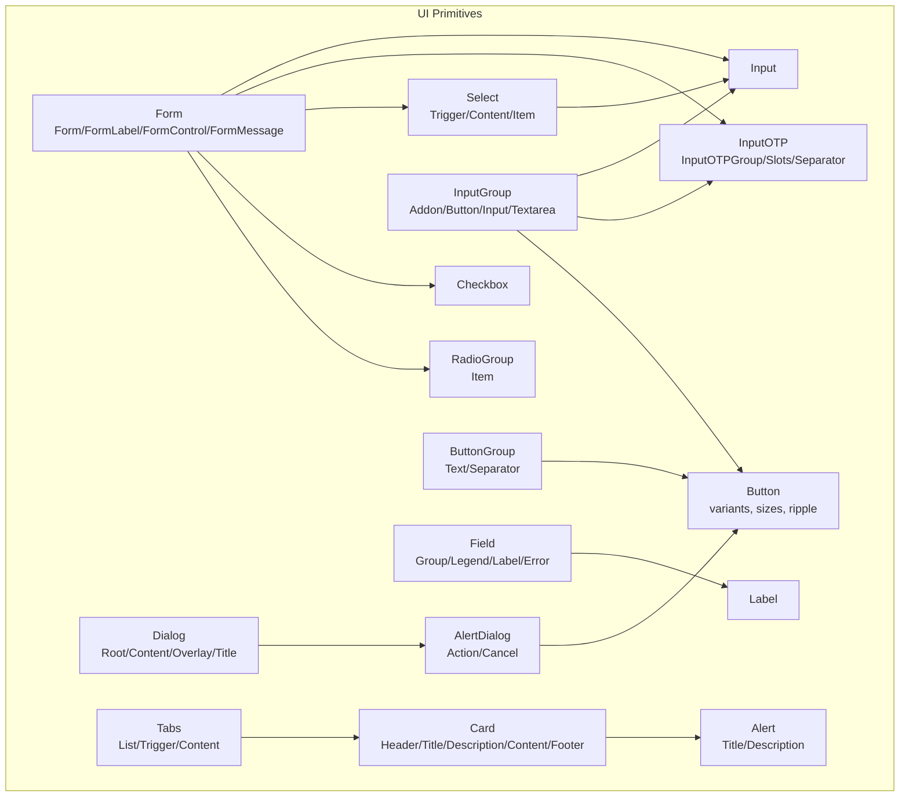

**Diagram sources**
- [button.tsx:1-101](file://components/ui/button.tsx#L1-L101)
- [form.tsx:1-168](file://components/ui/form.tsx#L1-L168)
- [dialog.tsx:1-144](file://components/ui/dialog.tsx#L1-L144)
- [alert-dialog.tsx:1-158](file://components/ui/alert-dialog.tsx#L1-L158)
- [input.tsx:1-22](file://components/ui/input.tsx#L1-L22)
- [input-otp.tsx:1-78](file://components/ui/input-otp.tsx#L1-L78)
- [input-group.tsx:1-170](file://components/ui/input-group.tsx#L1-L170)
- [select.tsx:1-186](file://components/ui/select.tsx#L1-L186)
- [checkbox.tsx:1-33](file://components/ui/checkbox.tsx#L1-L33)
- [radio-group.tsx:1-46](file://components/ui/radio-group.tsx#L1-L46)
- [tabs.tsx:1-67](file://components/ui/tabs.tsx#L1-L67)
- [card.tsx:1-93](file://components/ui/card.tsx#L1-L93)
- [alert.tsx:1-67](file://components/ui/alert.tsx#L1-L67)
- [button-group.tsx:1-84](file://components/ui/button-group.tsx#L1-L84)
- [field.tsx:1-245](file://components/ui/field.tsx#L1-L245)
- [label.tsx:1-25](file://components/ui/label.tsx#L1-L25)

**Section sources**
- [button.tsx:1-101](file://components/ui/button.tsx#L1-L101)
- [form.tsx:1-168](file://components/ui/form.tsx#L1-L168)
- [dialog.tsx:1-144](file://components/ui/dialog.tsx#L1-L144)
- [input.tsx:1-22](file://components/ui/input.tsx#L1-L22)
- [input-otp.tsx:1-78](file://components/ui/input-otp.tsx#L1-L78)
- [input-group.tsx:1-170](file://components/ui/input-group.tsx#L1-L170)
- [select.tsx:1-186](file://components/ui/select.tsx#L1-L186)
- [checkbox.tsx:1-33](file://components/ui/checkbox.tsx#L1-L33)
- [radio-group.tsx:1-46](file://components/ui/radio-group.tsx#L1-L46)
- [tabs.tsx:1-67](file://components/ui/tabs.tsx#L1-L67)
- [card.tsx:1-93](file://components/ui/card.tsx#L1-L93)
- [alert.tsx:1-67](file://components/ui/alert.tsx#L1-L67)
- [alert-dialog.tsx:1-158](file://components/ui/alert-dialog.tsx#L1-L158)
- [button-group.tsx:1-84](file://components/ui/button-group.tsx#L1-L84)
- [field.tsx:1-245](file://components/ui/field.tsx#L1-L245)
- [label.tsx:1-25](file://components/ui/label.tsx#L1-L25)

## Core Components
This section summarizes the primary primitives and their roles.

- Button: Base interactive element with variants, sizes, and optional ripple effect. Supports asChild passthrough and integrates focus-visible ring behavior.
- Form: Provides FormProvider, FormField, FormLabel, FormControl, FormDescription, and FormMessage for accessible, validated forms with react-hook-form.
- Dialog: Modal overlay system with portal, overlay animation, close button, header/footer/title/description slots.
- Input: Text input with focus-visible ring, disabled states, and aria-invalid integration.
- InputOTP: OTP input with grouped slots, separators, and active/fake caret states.
- InputGroup: Composite input group supporting addons, buttons, and aligned inputs/textareas with focus/error states.
- Select: Dropdown with trigger, content, viewport, items, separators, and scroll controls; supports size and invalid states.
- Checkbox: Accessible checkbox with indicator and invalid state styling.
- RadioGroup: Accessible radio group with indicator and invalid state styling.
- Tabs: Content organization with list, triggers, and content areas.
- Card: Content container with header/title/description/content/footer slots.
- Alert: Notification container with title and description; supports default and destructive variants.
- AlertDialog: Confirmation dialog using alert-specific primitives and button variants.
- ButtonGroup: Horizontal/vertical grouping of buttons with separators and text segments.
- Field: Layout primitives for form fields including legends, labels, descriptions, separators, and error rendering.
- Label: Accessible label component.

**Section sources**
- [button.tsx:1-101](file://components/ui/button.tsx#L1-L101)
- [form.tsx:1-168](file://components/ui/form.tsx#L1-L168)
- [dialog.tsx:1-144](file://components/ui/dialog.tsx#L1-L144)
- [input.tsx:1-22](file://components/ui/input.tsx#L1-L22)
- [input-otp.tsx:1-78](file://components/ui/input-otp.tsx#L1-L78)
- [input-group.tsx:1-170](file://components/ui/input-group.tsx#L1-L170)
- [select.tsx:1-186](file://components/ui/select.tsx#L1-L186)
- [checkbox.tsx:1-33](file://components/ui/checkbox.tsx#L1-L33)
- [radio-group.tsx:1-46](file://components/ui/radio-group.tsx#L1-L46)
- [tabs.tsx:1-67](file://components/ui/tabs.tsx#L1-L67)
- [card.tsx:1-93](file://components/ui/card.tsx#L1-L93)
- [alert.tsx:1-67](file://components/ui/alert.tsx#L1-L67)
- [alert-dialog.tsx:1-158](file://components/ui/alert-dialog.tsx#L1-L158)
- [button-group.tsx:1-84](file://components/ui/button-group.tsx#L1-L84)
- [field.tsx:1-245](file://components/ui/field.tsx#L1-L245)
- [label.tsx:1-25](file://components/ui/label.tsx#L1-L25)

## Architecture Overview
The primitives layer composes:
- Radix UI for accessible semantics and keyboard handling
- CVA for variant/state composition
- Tailwind classes via cn for styling
- react-hook-form for form state and validation

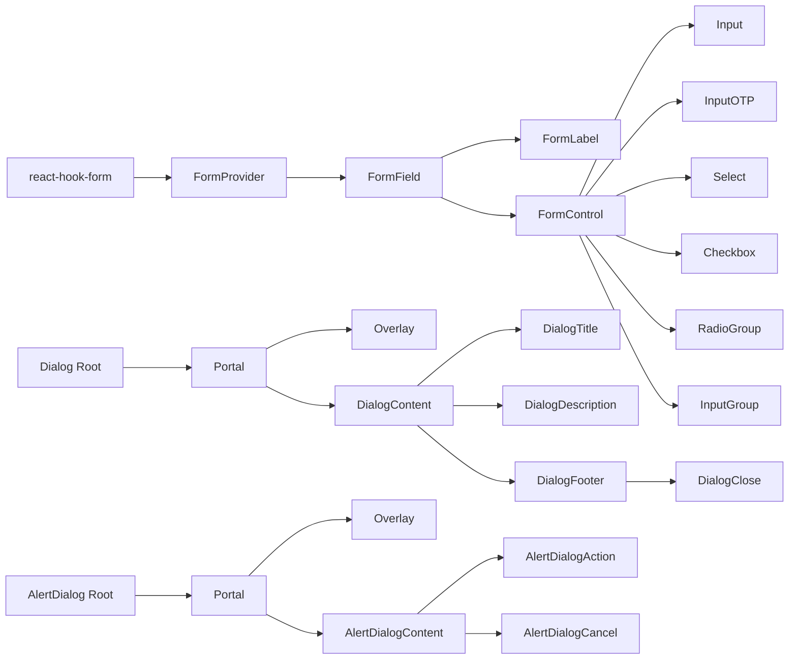

**Diagram sources**
- [form.tsx:1-168](file://components/ui/form.tsx#L1-L168)
- [input.tsx:1-22](file://components/ui/input.tsx#L1-L22)
- [input-otp.tsx:1-78](file://components/ui/input-otp.tsx#L1-L78)
- [input-group.tsx:1-170](file://components/ui/input-group.tsx#L1-L170)
- [select.tsx:1-186](file://components/ui/select.tsx#L1-L186)
- [checkbox.tsx:1-33](file://components/ui/checkbox.tsx#L1-L33)
- [radio-group.tsx:1-46](file://components/ui/radio-group.tsx#L1-L46)
- [dialog.tsx:1-144](file://components/ui/dialog.tsx#L1-L144)
- [alert-dialog.tsx:1-158](file://components/ui/alert-dialog.tsx#L1-L158)

## Detailed Component Analysis

### Button
- Variants: default, destructive, outline, secondary, ghost, link
- Sizes: default, sm, lg, icon, icon-sm, icon-lg
- States: disabled, focus-visible ring, aria-invalid integration, active scale
- Accessibility: focus-visible ring, aria-invalid styling, role and labeling via parent contexts
- Props:
  - className: string
  - variant: one of the variants
  - size: one of the sizes
  - asChild: boolean (passthrough to Slot)
  - ripple: boolean (enable/disable ripple effect)
  - onClick: mouse event handler
- Implementation highlights:
  - Ripple effect via local state and animated spans
  - Uses Slot when asChild is true
  - Focus and invalid states via Tailwind utilities and aria-* attributes

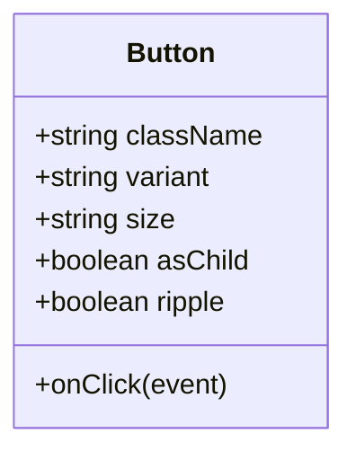

**Diagram sources**
- [button.tsx:38-52](file://components/ui/button.tsx#L38-L52)

**Section sources**
- [button.tsx:1-101](file://components/ui/button.tsx#L1-L101)

### Form System
- Components:
  - Form: re-exports FormProvider
  - FormField: wraps Controller with context
  - useFormField: resolves ids and error state
  - FormItem: grid wrapper with generated id
  - FormLabel: accessible label bound to item id
  - FormControl: slot for inputs with aria-describedby and aria-invalid
  - FormDescription: helper text
  - FormMessage: renders error message or children
- Accessibility:
  - Associates labels with inputs via id
  - Sets aria-invalid on controls
  - Composes aria-describedby for assistive tech
- Integration:
  - Works with react-hook-form’s useFormContext/useFormState
  - Exposes field state (error, isDirty, etc.) via useFormField

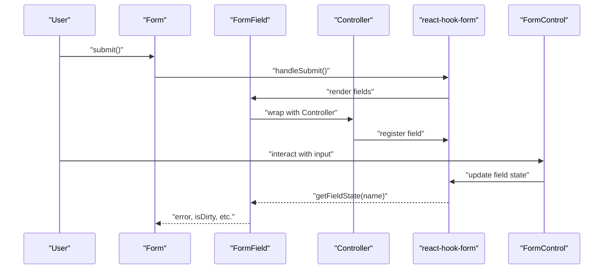

**Diagram sources**
- [form.tsx:32-66](file://components/ui/form.tsx#L32-L66)

**Section sources**
- [form.tsx:1-168](file://components/ui/form.tsx#L1-L168)

### Dialog
- Components:
  - Dialog: root wrapper
  - DialogTrigger, DialogPortal, DialogOverlay
  - DialogContent: supports showCloseButton flag
  - DialogHeader, DialogFooter, DialogTitle, DialogDescription
- Behavior:
  - Overlay animates in/out
  - Close button hidden text for screen readers
  - Portal ensures proper stacking context
- Props:
  - DialogContent: className, children, showCloseButton

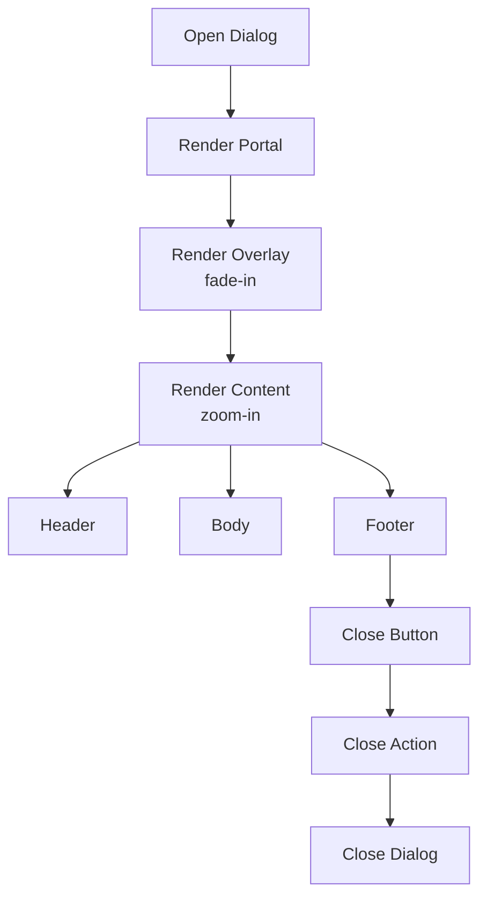

**Diagram sources**
- [dialog.tsx:56-81](file://components/ui/dialog.tsx#L56-L81)

**Section sources**
- [dialog.tsx:1-144](file://components/ui/dialog.tsx#L1-L144)

### AlertDialog
- Components:
  - AlertDialog: root
  - AlertDialogTrigger, AlertDialogPortal, AlertDialogOverlay
  - AlertDialogContent
  - AlertDialogHeader, AlertDialogFooter, AlertDialogTitle, AlertDialogDescription
  - AlertDialogAction, AlertDialogCancel: use buttonVariants
- Behavior:
  - Same overlay/content animations as Dialog
  - AlertDialogAction defaults to primary variant; AlertDialogCancel to outline

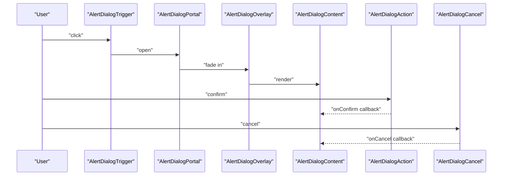

**Diagram sources**
- [alert-dialog.tsx:11-143](file://components/ui/alert-dialog.tsx#L11-L143)

**Section sources**
- [alert-dialog.tsx:1-158](file://components/ui/alert-dialog.tsx#L1-L158)

### Input
- Features:
  - Focus-visible ring and ring on invalid state
  - Disabled state handling
  - aria-invalid integration
- Props:
  - className: string
  - type: input type
  - ...rest: native input props

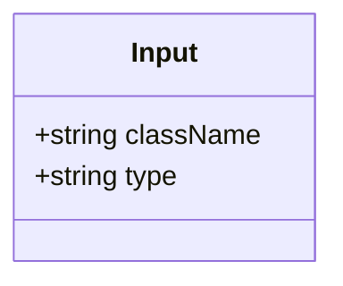

**Diagram sources**
- [input.tsx:5-19](file://components/ui/input.tsx#L5-L19)

**Section sources**
- [input.tsx:1-22](file://components/ui/input.tsx#L1-L22)

### InputOTP
- Components:
  - InputOTP: thin wrapper around OTPInput
  - InputOTPGroup: groups slots
  - InputOTPSlot: individual slot with active/fake caret states
  - InputOTPSeparator: visual separator
- Props:
  - InputOTP: className, containerClassName, ...OTPInput props
  - InputOTPSlot: index, className
- Behavior:
  - Active slot receives focus ring and invalid styling
  - Fake caret animation for active slot

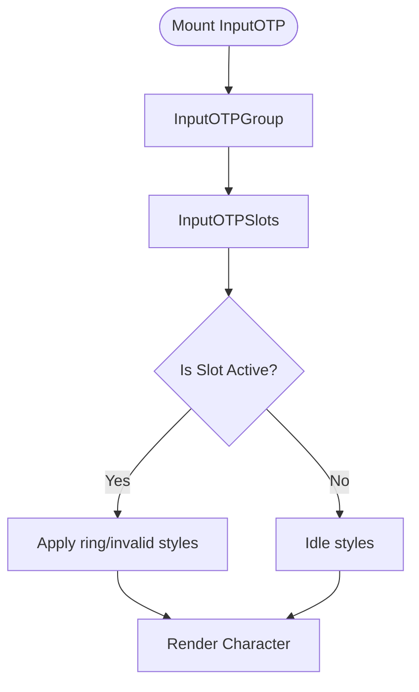

**Diagram sources**
- [input-otp.tsx:39-67](file://components/ui/input-otp.tsx#L39-L67)

**Section sources**
- [input-otp.tsx:1-78](file://components/ui/input-otp.tsx#L1-L78)

### InputGroup
- Purpose: composite input with addons, buttons, and aligned inputs/textareas
- Variants:
  - Alignment: inline-start, inline-end, block-start, block-end
  - Focus and error states propagate to group
- Components:
  - InputGroup: group container
  - InputGroupAddon: static content or clickable label
  - InputGroupButton: small button variant sized via CVA
  - InputGroupText: static text
  - InputGroupInput: internal input
  - InputGroupTextarea: internal textarea
- Props:
  - InputGroupAddon: className, align
  - InputGroupButton: type, variant, size (mapped from CVA), className
  - InputGroupInput/Textarea: className
- Behavior:
  - Clicking addon focuses the input unless target is a button
  - Focus and invalid states applied to group for visual feedback

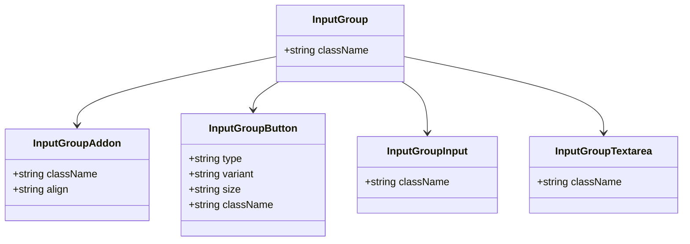

**Diagram sources**
- [input-group.tsx:10-160](file://components/ui/input-group.tsx#L10-L160)

**Section sources**
- [input-group.tsx:1-170](file://components/ui/input-group.tsx#L1-L170)

### Select
- Components:
  - Select: root
  - SelectGroup, SelectValue
  - SelectTrigger: supports size 'sm'/'default'
  - SelectContent: supports position 'popper'
  - SelectLabel, SelectItem, SelectSeparator
  - SelectScrollUpButton, SelectScrollDownButton
- Props:
  - SelectTrigger: className, size, children
  - SelectContent: className, children, position
- Behavior:
  - Scroll buttons visible when content overflows
  - Item indicators show selection
  - Focus-visible ring and invalid state styling

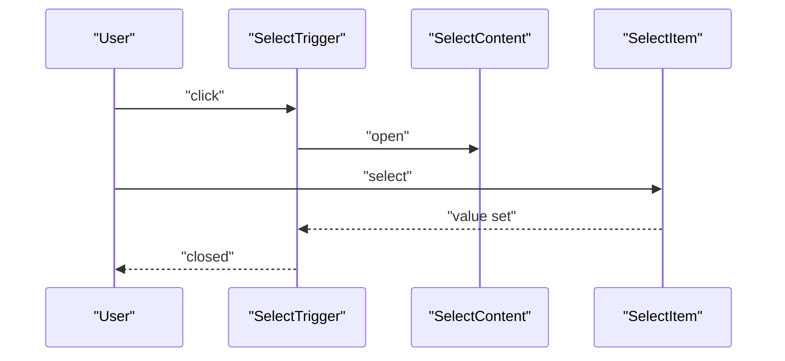

**Diagram sources**
- [select.tsx:27-51](file://components/ui/select.tsx#L27-L51)

**Section sources**
- [select.tsx:1-186](file://components/ui/select.tsx#L1-L186)

### Checkbox
- Features:
  - Accessible via Radix UI
  - Indicator icon
  - Checked state styling and focus-visible ring
  - Invalid state styling via aria-invalid
- Props:
  - className: string
  - ...rest: native checkbox props

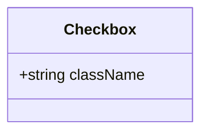

**Diagram sources**
- [checkbox.tsx:9-29](file://components/ui/checkbox.tsx#L9-L29)

**Section sources**
- [checkbox.tsx:1-33](file://components/ui/checkbox.tsx#L1-L33)

### RadioGroup
- Features:
  - Accessible via Radix UI
  - Indicator dot
  - Focus-visible ring and invalid state styling
- Props:
  - RadioGroup: className
  - RadioGroupItem: className

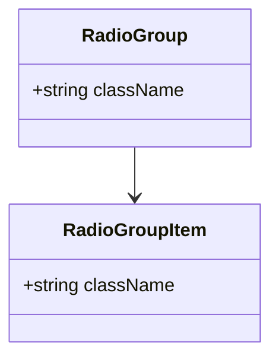

**Diagram sources**
- [radio-group.tsx:9-43](file://components/ui/radio-group.tsx#L9-L43)

**Section sources**
- [radio-group.tsx:1-46](file://components/ui/radio-group.tsx#L1-L46)

### Tabs
- Components:
  - Tabs: root
  - TabsList: tab bar
  - TabsTrigger: per-tab trigger
  - TabsContent: associated content
- Props:
  - Tabs/TabsList/TabsTrigger/TabsContent: className
- Behavior:
  - Active trigger gets shadow and foreground color changes
  - Focus-visible ring and disabled states

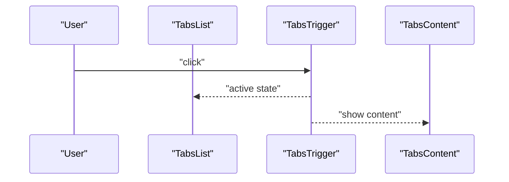

**Diagram sources**
- [tabs.tsx:21-51](file://components/ui/tabs.tsx#L21-L51)

**Section sources**
- [tabs.tsx:1-67](file://components/ui/tabs.tsx#L1-L67)

### Card
- Components:
  - Card: container
  - CardHeader/CardTitle/CardDescription/CardAction/CardContent/CardFooter
- Props:
  - All accept className and native div props
- Behavior:
  - Structured layout with optional action column
  - Responsive grid in header for action placement

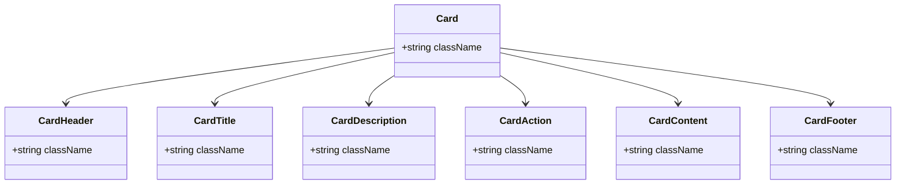

**Diagram sources**
- [card.tsx:5-82](file://components/ui/card.tsx#L5-L82)

**Section sources**
- [card.tsx:1-93](file://components/ui/card.tsx#L1-L93)

### Alert
- Variants:
  - default: neutral card-like
  - destructive: red-based with description tint
- Components:
  - Alert: container with role="alert"
  - AlertTitle: title
  - AlertDescription: description
- Props:
  - Alert: className, variant
  - AlertTitle/AlertDescription: className

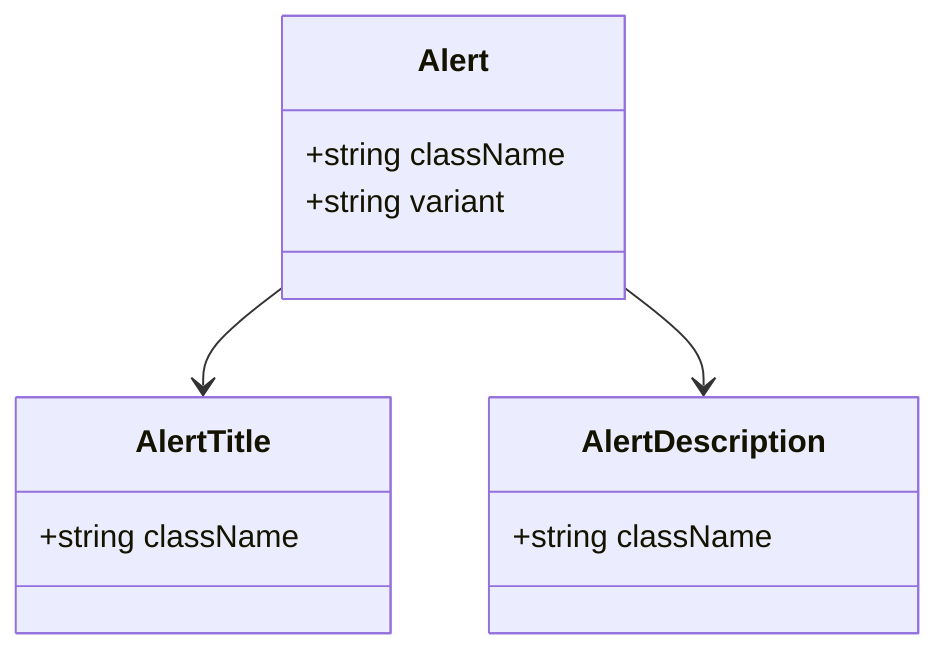

**Diagram sources**
- [alert.tsx:22-35](file://components/ui/alert.tsx#L22-L35)

**Section sources**
- [alert.tsx:1-67](file://components/ui/alert.tsx#L1-L67)

### ButtonGroup
- Components:
  - ButtonGroup: container with orientation
  - ButtonGroupText: static text segment
  - ButtonGroupSeparator: visual divider
- Props:
  - ButtonGroup: className, orientation ('horizontal' | 'vertical')
  - ButtonGroupText: className, asChild
  - ButtonGroupSeparator: className, orientation
- Behavior:
  - Shared focus ring stacking via z-index
  - Rounded edges handled per orientation

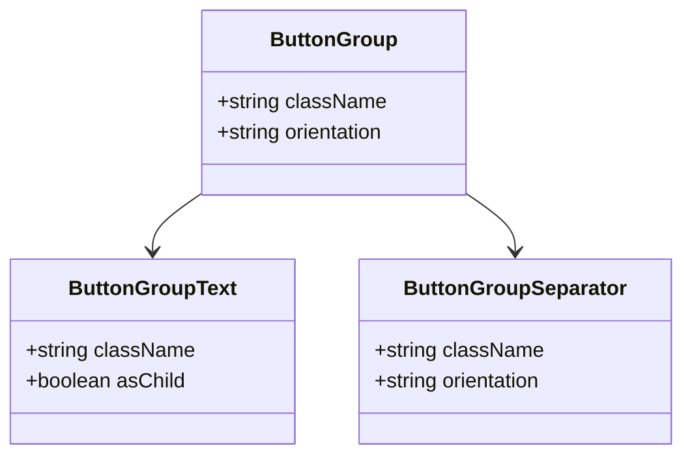

**Diagram sources**
- [button-group.tsx:24-76](file://components/ui/button-group.tsx#L24-L76)

**Section sources**
- [button-group.tsx:1-84](file://components/ui/button-group.tsx#L1-L84)

### Field
- Purpose: layout and semantic primitives for form fields
- Components:
  - FieldSet: fieldset wrapper
  - FieldLegend: legend/label variant
  - FieldGroup: container with responsive variants
  - Field: field group with orientation
  - FieldContent: content area
  - FieldLabel: accessible label
  - FieldTitle: short title
  - FieldDescription: helper text
  - FieldSeparator: divider with optional label
  - FieldError: error display with single/multi-error support
- Props:
  - Field: className, orientation ('vertical' | 'horizontal' | 'responsive')
  - FieldLegend: variant ('legend' | 'label')
  - FieldError: className, children, errors
- Behavior:
  - Orientation affects layout and alignment
  - Error variant toggles text color

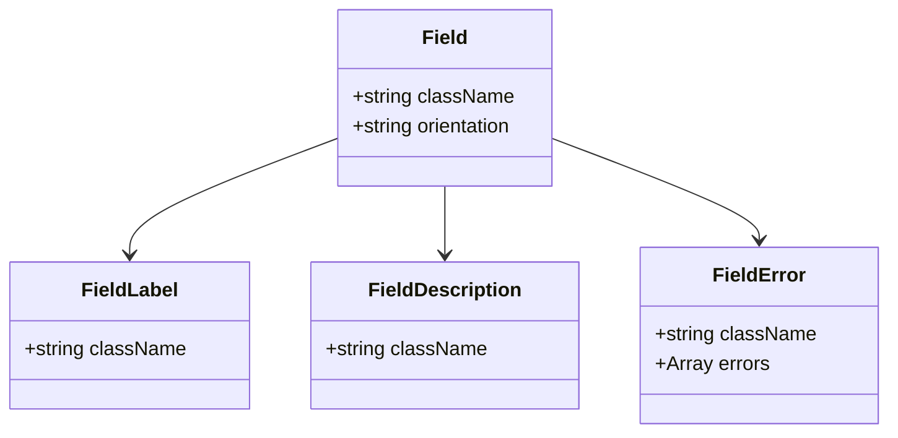

**Diagram sources**
- [field.tsx:81-126](file://components/ui/field.tsx#L81-L126)

**Section sources**
- [field.tsx:1-245](file://components/ui/field.tsx#L1-L245)

### Label
- Purpose: accessible label for form controls
- Props:
  - className: string
  - ...rest: native label props

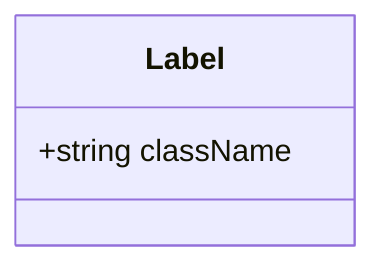

**Diagram sources**
- [label.tsx:8-22](file://components/ui/label.tsx#L8-L22)

**Section sources**
- [label.tsx:1-25](file://components/ui/label.tsx#L1-L25)

## Dependency Analysis
- Composition model:
  - Form components depend on react-hook-form and Radix UI labels
  - Dialog and AlertDialog depend on Radix UI dialog/alert-dialog
  - Select depends on Radix UI select
  - Checkbox and RadioGroup depend on Radix UI primitives
  - Input/InputOTP/InputGroup compose Button/Input/Textarea
  - Tabs depend on Radix UI tabs
  - Card composes Alert
  - ButtonGroup composes Button and Separator
  - Field composes Label and Separator
- Coupling:
  - Low coupling via Slot and CVA
  - Cohesion within each primitive module
- External dependencies:
  - @radix-ui/react-* for accessible primitives
  - class-variance-authority for variants
  - lucide-react icons
  - input-otp for OTP inputs
  - react-hook-form for form integration

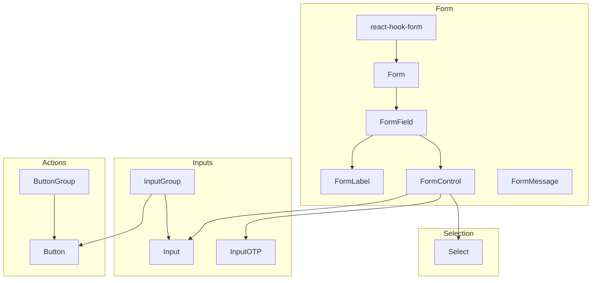

**Diagram sources**
- [form.tsx:1-168](file://components/ui/form.tsx#L1-L168)
- [input.tsx:1-22](file://components/ui/input.tsx#L1-L22)
- [input-otp.tsx:1-78](file://components/ui/input-otp.tsx#L1-L78)
- [input-group.tsx:1-170](file://components/ui/input-group.tsx#L1-L170)
- [select.tsx:1-186](file://components/ui/select.tsx#L1-L186)
- [button.tsx:1-101](file://components/ui/button.tsx#L1-L101)
- [button-group.tsx:1-84](file://components/ui/button-group.tsx#L1-L84)

**Section sources**
- [form.tsx:1-168](file://components/ui/form.tsx#L1-L168)
- [input.tsx:1-22](file://components/ui/input.tsx#L1-L22)
- [input-otp.tsx:1-78](file://components/ui/input-otp.tsx#L1-L78)
- [input-group.tsx:1-170](file://components/ui/input-group.tsx#L1-L170)
- [select.tsx:1-186](file://components/ui/select.tsx#L1-L186)
- [button.tsx:1-101](file://components/ui/button.tsx#L1-L101)
- [button-group.tsx:1-84](file://components/ui/button-group.tsx#L1-L84)

## Performance Considerations
- Prefer CVA variants over dynamic class concatenation for predictable hashing and fewer re-renders.
- Use asChild where appropriate to avoid unnecessary DOM wrappers.
- Limit heavy animations in overlays; keep transitions minimal for mobile devices.
- Debounce or throttle input handlers in OTP and free-text inputs to reduce re-renders.
- Use portals judiciously to avoid stacking context issues and excessive DOM nodes.

## Troubleshooting Guide
- Form accessibility:
  - Ensure every FormLabel is associated with a control via htmlFor/id resolved by useFormField.
  - Verify aria-invalid is set on FormControl when errors exist.
- Dialog focus trapping:
  - Confirm DialogContent is rendered inside a Portal to maintain focus order.
  - Provide DialogTitle and DialogDescription for screen reader context.
- Select scrolling:
  - Use SelectScrollUpButton/SelectScrollDownButton when viewport overflows.
  - Ensure SelectTrigger width/height are computed for popper positioning.
- Input states:
  - For InputGroup, clicking an addon focuses the nearest input unless the click target is a button.
  - For InputOTP, active slot receives focus ring; ensure fake caret does not interfere with user input.
- Checkbox/RadioGroup:
  - Invalid state styling applies when aria-invalid is present; ensure parent contexts propagate this state.
- Button ripple:
  - Ripple effect is disabled when asChild is true; confirm intended behavior.

**Section sources**
- [form.tsx:90-123](file://components/ui/form.tsx#L90-L123)
- [dialog.tsx:56-81](file://components/ui/dialog.tsx#L56-L81)
- [select.tsx:53-86](file://components/ui/select.tsx#L53-L86)
- [input-group.tsx:69-78](file://components/ui/input-group.tsx#L69-L78)
- [input-otp.tsx:39-67](file://components/ui/input-otp.tsx#L39-L67)
- [checkbox.tsx:9-29](file://components/ui/checkbox.tsx#L9-L29)
- [radio-group.tsx:9-43](file://components/ui/radio-group.tsx#L9-L43)
- [button.tsx:56-75](file://components/ui/button.tsx#L56-L75)

## Conclusion
The UI primitive library offers a cohesive, accessible, and customizable foundation for building forms, dialogs, inputs, selections, and content containers. By leveraging Radix UI, CVA, and react-hook-form, components remain consistent, testable, and easy to extend. Integrations with the form system and game state can be achieved through controlled/uncontrolled patterns and context-aware helpers.

## Appendices
- Prop interface summaries:
  - Button: variant, size, asChild, ripple, onClick, className
  - Form components: Form, FormField, FormLabel, FormControl, FormDescription, FormMessage; useFormField returns ids and field state
  - Dialog: Dialog, DialogTrigger, DialogPortal, DialogOverlay, DialogContent (showCloseButton), DialogHeader, DialogFooter, DialogTitle, DialogDescription
  - AlertDialog: AlertDialog, AlertDialogTrigger, AlertDialogPortal, AlertDialogOverlay, AlertDialogContent, AlertDialogHeader, AlertDialogFooter, AlertDialogTitle, AlertDialogDescription, AlertDialogAction, AlertDialogCancel
  - Input: type, className
  - InputOTP: containerClassName, className
  - InputGroup: InputGroupAddon (align), InputGroupButton (type, variant, size), InputGroupInput/Textarea
  - Select: SelectTrigger (size), SelectContent (position), SelectItem, SelectLabel, SelectSeparator, SelectScrollUp/DownButton
  - Checkbox: className
  - RadioGroup: RadioGroup, RadioGroupItem
  - Tabs: Tabs, TabsList, TabsTrigger, TabsContent
  - Card: Card, CardHeader, CardTitle, CardDescription, CardAction, CardContent, CardFooter
  - Alert: Alert (variant), AlertTitle, AlertDescription
  - ButtonGroup: ButtonGroup (orientation), ButtonGroupText (asChild), ButtonGroupSeparator (orientation)
  - Field: Field (orientation), FieldLabel, FieldDescription, FieldError (errors), FieldGroup, FieldLegend (variant), FieldSeparator, FieldSet, FieldContent, FieldTitle